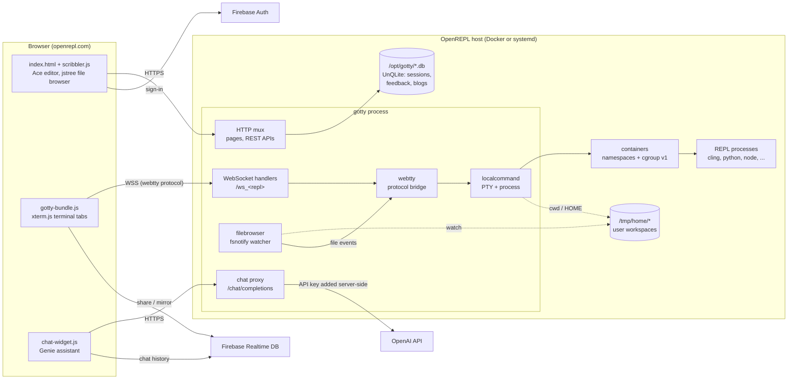
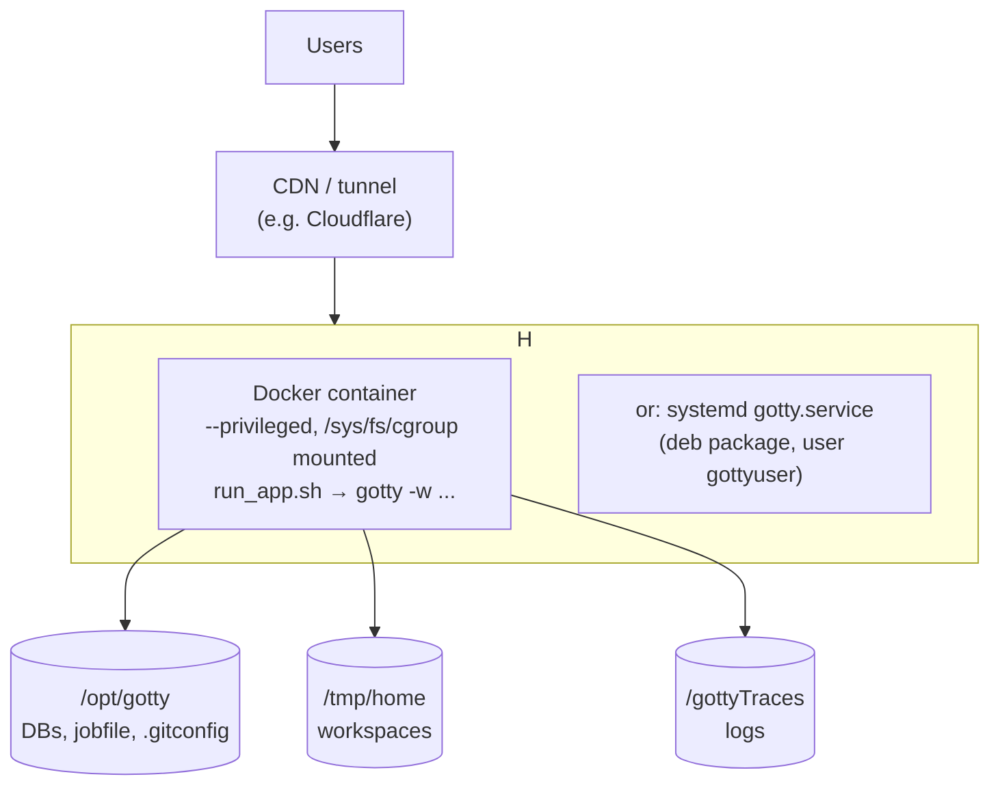

<p align="center">

</p>


#  OpenREPL

    
[][docker-image]
[][license]

[docker-image]: https://github.com/vickeykumar/openrepl/actions/workflows/docker-image.yml
[license]: https://github.com/vickeykumar/openrepl/blob/master/LICENSE

OpenREPL initially Forked from [gotty](https://github.com/yudai/gotty.git). GoTTY is a simple command line tool that turns your CLI tools into web applications. 

 This Fork is intended to create web based REPL services for various programming languages using gotty and containers.
You can checkout on our website for more info on REPL playgrounds and try them as well: [openrepl.com](http://openrepl.com) (earlier [gorepl.com](http://gorepl.com))


> **Run it locally:** see [Run locally on macOS (Colima)](#run-locally-on-macos-colima).
>
> **Design docs:** see [Architecture (High-Level Design)](#architecture-high-level-design) below and the low-level designs in [`docs/`](docs/README.md).


# Installation

Fork openrepl to start the REPL servers in your local system, Please make sure all pre-requisites are installed.

(Files named with `darwin_amd64` are for Mac OS X users)

You can install GoTTY REPL server as shown below:

## Non-debian:
```sh
$ cd src
$ make all
$ ../bin/gotty -w
```

## debian:
```sh
$ cd src
$ make buildgo GOROOT_BOOTSTRAP=/usr/lib/go-x.xx/     (non x86_64 machines)
$ make deb
$ sudo dpkg -i ../deb/gotty.deb
```

# Pre-Requisites

* GoTTY requires go1.9 or later.
* npm
* webpack
* [cling](https://github.com/root-project/cling)
* [gointerpreter](https://github.com/vickeykumar/Go-interpreter)
* python2.7
* xterm
* all requisites can be installed using ./install_prerequisite.sh	

# Deploy

To deploy and run a local copy of openrepl :

1. Pull the Docker image
    - `docker pull vickeykumar/openrepl:latest`

2. Run the image

    -  without nested containers.
        ```bash
        docker run -itd --name openrepl \
          -p 8080:8080 vickeykumar/openrepl:latest \
          -p 8080
        ```

   -  with nested containers (containerized REPLs inside docker, nested containers)
      ```bash
      docker run -itd --name openrepl \
        -v /sys/fs/cgroup:/sys/fs/cgroup:rw --privileged \
        -p 8080:8080 vickeykumar/openrepl:latest \
        -p 8080
      ```

3. open localhost:8080 in your browser to check repls offline


## CLI Options

     ```bash
      docker run -itd --name openrepl \
        -v /sys/fs/cgroup:/sys/fs/cgroup:rw --privileged \
        -p 8080:8080 vickeykumar/openrepl:latest \
        -p 8080 [ <other CLI Options>]
      ```


# Run locally on macOS (Colima)

The OpenREPL image is **amd64 only**: the bundled Go toolchain, `go-bindata`, cling, evcxr and gdb are x86-64 binaries. On an Apple Silicon Mac, run it in a [Colima](https://github.com/abiosoft/colima) VM that uses Rosetta to emulate x86-64.

> Paste the commands without comments. zsh does not treat `#` as a comment when you paste commands.

### One-time setup

```bash
brew install colima docker docker-buildx
mkdir -p ~/.docker/cli-plugins
ln -sfn "$(brew --prefix)/opt/docker-buildx/bin/docker-buildx" ~/.docker/cli-plugins/docker-buildx
softwareupdate --install-rosetta --agree-to-license
colima start openrepl --vm-type vz --vz-rosetta --cpu 4 --memory 8 --disk 80 --kubernetes=false
docker context use colima-openrepl
docker run --rm --platform linux/amd64 ubuntu:22.04 uname -m
```

The last command should print `x86_64`. The build needs at least 8 GB of VM memory and 80 GB of disk.

On an Intel Mac, leave out `--vm-type vz --vz-rosetta`, and leave out every `--platform linux/amd64` in this section.

### Build and run the full image

Use this the first time, after changing the `Dockerfile` or `install_prerequisite.sh`, or to test the exact image you deploy. The first build is slow because it installs every language toolchain. Later builds reuse that layer.

```bash
cd ~/Documents/openrepl/openrepl
docker build --platform linux/amd64 -t openrepl:dev .
docker run -d --name openrepl-dev --platform linux/amd64 -p 8080:80 openrepl:dev
open http://localhost:8080
```

To view the server logs, run `docker exec openrepl-dev tail -f /gottyTraces/gotty.log`.

To pick up changes, rebuild the image and replace the container:

```bash
docker build --platform linux/amd64 -t openrepl:dev .
docker rm -f openrepl-dev
docker run -d --name openrepl-dev --platform linux/amd64 -p 8080:80 openrepl:dev
```

### Fast edit-and-test loop (dev container)

For day-to-day changes to HTML, CSS, JS, TypeScript, `demos.xml` or Go code, mount the repo into the build stage instead of rebuilding the whole image. Stop `openrepl-dev` first (`docker rm -f openrepl-dev`), because both use port 8080.

Start the dev container once, in its own terminal tab:

```bash
cd ~/Documents/openrepl/openrepl
docker build --platform linux/amd64 --target build-image -t openrepl:build .
docker run -it --rm --name openrepl-devbox --platform linux/amd64 -p 8080:8080 -v "$PWD":/opt/openrepl -w /opt/openrepl/src openrepl:build bash
```

Inside the container, build everything once:

```bash
make all
```

The build finds the repo root on its own, even though git inside the container refuses the mounted folder (it belongs to your Mac user, and the container runs as root). To use git commands inside the container, run `git config --global --add safe.directory /opt/openrepl` each time you start it. The container is started with `--rm`, so the setting doesn't survive a restart.

After each change, press Ctrl+C in the container, run the line below, then hard-refresh the browser (Cmd+Shift+R):

```bash
rm -rf bindata && make gotty && ../bin/gotty -w -p 8080 --title-format '<fmt><title>{{ .command }}</title><jid>{{ encodePID .pid }}</jid></fmt>'
```

`rm -rf bindata` forces every web asset to be re-embedded. Without it, the Makefile misses edits inside existing files under `src/resources/js/`.

### Tests

Run the Go unit tests inside the dev container:

```bash
GO111MODULE=off GOPATH=/opt/openrepl ../go_1.19/go/bin/go test -race gateway tunnel trusted
```

Then do a quick manual check at `localhost:8080`:

1. Open a Python REPL.
2. Run code from the editor, and debug a C file.
3. In the file browser, create, upload and download a file.
4. Add a terminal tab and fork a REPL.
5. Open the share link in a second browser.
6. Sign in.

### Notes

- **No per-REPL sandboxing locally.** Colima's VM uses cgroup v2, so the log shows `Unable to create Container` and REPLs run without their own namespaces or memory limits. Test sandboxing on a cgroup v1 host.
- **Don't commit `bin/gotty`.** The dev container rebuilds this tracked file. Restore it before committing with `git checkout -- bin/gotty`, and don't commit `node_modules` or `dist` folders.
- **Genie and Practice question generation need an OpenAI key.** Set `OPENREPL_OPENAI_API_KEY` (see [Settings and secrets](#settings-and-secrets)), then restart the server.
- **Stopping and restarting the VM:** `colima stop openrepl` and `colima start openrepl`. `colima delete openrepl` removes the VM and its images.


# Distributed mode (gateway and workers)

One public server, the **gateway**, serves the site and hands REPL sessions to **workers**. A worker needs no public port: it connects out to the gateway. Same binary, same URLs for the browser.

**1. Create a shared token**

```bash
openssl rand -hex 32
```

**2. Start the gateway** (the public server)

```bash
GOTTY_WORKER_TOKEN=<token> gotty -w --mode=gateway --port 80
```

**3. Start each worker**

```bash
GOTTY_WORKER_TOKEN=<token> gotty -w --mode=worker --worker-server wss://gateway.example.com/api/tunnel
```

New visitors are now spread over the gateway and the workers at random, in proportion to each node's weight, and each visitor stays on one node. Check the fleet in the [admin dashboard](#admin-dashboard), under *Workers*: it also shows how many sessions the random choice has given each node, next to the share its weight should give it.

**4. Keep a copy of the users' files on the gateway** (optional). Restart the gateway with `--workspace-sync`. Workers reconnect by themselves and need no option, only the same version of the binary.

```bash
GOTTY_WORKER_TOKEN=<token> gotty -w --mode=gateway --port 80 --workspace-sync
```

Each user's files are now kept in step, both ways, between the worker that runs them and the gateway. If a worker stops, the file browser, downloads, saves and uploads keep working from the gateway's copy. From the moment the worker drops, the page shows a countdown and keeps Reconnect and Run disabled until it ends. After 2 minutes without the worker (`--relocate-after` changes this), the session continues on the gateway or another worker with all its files; a program that was running is lost. A home is copied the first time its session is used after the option is on, so start it before you need it. Without the option the gateway holds no copy, and a stopped worker means "execution node unavailable". Details in the [operator guide](docs/distributed-mode.md#keeping-the-users-files-safe-workspace-sync).

A worker opens no port. Add `--port 9090` if people on the same network should also be able to open it directly (see the [operator guide](docs/distributed-mode.md#the-workers-own-port)).

Useful options:

| Option | Where | Effect |
|---|---|---|
| `--local-weight 0` | gateway | The gateway only routes; all sessions run on workers. |
| `--workspace-sync` | gateway | Keep a copy of every home on the gateway (step 4). |
| `--worker-weight 30` | worker | Three times the share of a worker with the default 10. |
| `--worker-id worker-01` | worker | A name for the worker; defaults to its host name. |

## In production

**1. Keep the token in a file**, readable only by the service user, with the same content on the gateway and every worker. Use a new token, not one from a test run.

```bash
umask 077
echo "GOTTY_WORKER_TOKEN=$(openssl rand -hex 32)" > /etc/openrepl/tunnel.env
```

**2. Run the gateway with HTTPS**, either in the gateway itself or in a proxy (nginx, a load balancer) in front of it.

```bash
set -a; . /etc/openrepl/tunnel.env; set +a
gotty -w --mode=gateway --port 443 --max-connection 2564 \
  --tls --tls-crt /etc/openrepl/fullchain.pem --tls-key /etc/openrepl/privkey.pem
```

**3. Connect workers with `wss://`** and the gateway's public name. Never use `ws://` outside a test: it sends the token in clear text.

```bash
set -a; . /etc/openrepl/tunnel.env; set +a
gotty -w --mode=worker --worker-id worker-01 --worker-server wss://openrepl.example.com/api/tunnel
```

**4. No HTTPS between worker and gateway?** Use SSH instead of `ws://`. It is encrypted, and the worker checks the gateway's key before it sends the token. Start the gateway with `--tunnel-addr 0.0.0.0:2222` (open that port to the workers only), and the worker with:

```bash
set -a; . /etc/openrepl/tunnel.env; set +a
gotty -w --mode=worker --worker-id worker-01 \
  --worker-server ssh://10.0.0.5:2222 --worker-hostkey 'SHA256:<fingerprint>'
```

The fingerprint is in the gateway's `/gottyTraces/gotty.log` (`tunnel host key SHA256:...`), or run `ssh-keygen -lf ~/.gotty.tunnel_key` on the gateway. The gateway creates that key on first start; keep the file, or the fingerprint changes.

**5. Run both as services** that restart on failure (systemd `EnvironmentFile=/etc/openrepl/tunnel.env`, or `docker run --env-file`). A worker reconnects by itself when the gateway restarts.

**6. Before stopping a worker**, drain it (*Workers*, then *Drain*) and wait for its terminals to finish. From a script:

```bash
curl -b "user-session=<admin session cookie>" -H 'X-Requested-With: openrepl-admin' -X POST https://openrepl.example.com/admin/workers/worker-01/drain
```

Every worker needs the same REPLs and sandbox setup as a normal OpenREPL server (the same image). Users' files live on the node that runs their sessions, and with `--workspace-sync` on the gateway too. Give `/tmp/home` durable storage on the nodes whose loss you cannot accept, and with `--workspace-sync` give `/opt/gotty/wsync` (`--sync-state-dir`) durable storage on the gateway and every worker: it holds the records that tell a deleted file from a new one.

## Testing on one machine

With two containers, use `ws://` (the test gateway has no HTTPS) and the gateway container's address and port as the worker sees them, not `localhost`, which is the worker itself:

```bash
GOTTY_WORKER_TOKEN=<token> gotty -w --mode=worker --worker-server ws://<gateway container IP>:<gateway port>/api/tunnel
```

Everything else (config files, private certificates, the nginx, Docker and systemd examples, every option, troubleshooting) is in the [operator guide](docs/distributed-mode.md).

# Admin dashboard

Sign in with an account listed in `OPENREPL_ADMIN_EMAILS` and open `/admin` (an *Admin* link appears in the account menu). One page shows how the site is doing and lets you run it:

- **Overview, Health, Parameters, Log, Audit log**: counts, charts of terminals per day and language, health checks, how the server was started (secrets are never shown), the end of the log with credentials masked, and every change an admin made.
- **Workers and Sessions** (gateway mode): drain, undrain or reconnect a worker, see who is on which node, end a session or move it to another node, and the command line for adding a worker.
- **Site settings**: colour of the day, an announcement banner, maintenance mode, switching off a broken language, and the Genie switch and its rate limits.
- **Feedback, Shared code, Users**: read and clear feedback (export as CSV), remove a shared snippet, sign a user out everywhere or block them.

The design and the API behind it are in [LLD 13](docs/lld/13-admin-dashboard.md).

# What Genie knows about the site

Genie in the chat panel, and Ask Genie in the blog editor, can answer from the site's own notes so that they do not invent features. The notes are short Markdown files in [`src/resources/knowledge/`](src/resources/knowledge), one topic each, compiled into the binary; the blog posts are searched too, from the blog store. A note starts with a header:

```
---
title: Sharing a live session
keywords: share, send, link, friend, teammate
link: /about.html
---
The text, 80 to 220 words, public.
```

The server picks the notes that match a question by words (no extra service or cost) and adds them to the request, and the chat panel shows which ones it used. To fix a missed question, add the word people used to the note's `keywords`, and rebuild. Keep to text that could be on a public page: notes are sent to the model. Details in [LLD 07](docs/lld/07-ai-features.md), section 3a.

# Usage

```
Usage: gotty [options] <command> [<arguments...>]
```

Run `gotty` with your preferred command as its arguments (e.g. `gotty top`).

By default, GoTTY starts a web server at port 8080. Open the URL on your web browser and you can see the running command as if it were running on your terminal.

## Options

```
--address value, -a value     IP address to listen (default: "0.0.0.0") [$GOTTY_ADDRESS]
--port value, -p value        Port number to liten (default: "8080") [$GOTTY_PORT]
--permit-write, -w            Permit clients to write to the TTY (BE CAREFUL) [$GOTTY_PERMIT_WRITE]
--credential value, -c value  Credential for Basic Authentication (ex: user:pass, default disabled) [$GOTTY_CREDENTIAL]
--random-url, -r              Add a random string to the URL [$GOTTY_RANDOM_URL]
--random-url-length value     Random URL length (default: 8) [$GOTTY_RANDOM_URL_LENGTH]
--tls, -t                     Enable TLS/SSL [$GOTTY_TLS]
--tls-crt value               TLS/SSL certificate file path (default: "~/.gotty.crt") [$GOTTY_TLS_CRT]
--tls-key value               TLS/SSL key file path (default: "~/.gotty.key") [$GOTTY_TLS_KEY]
--tls-ca-crt value            TLS/SSL CA certificate file for client certifications (default: "~/.gotty.ca.crt") [$GOTTY_TLS_CA_CRT]
--index value                 Custom index.html file [$GOTTY_INDEX]
--title-format value          Title format of browser window (default: "<fmt><title>{{ .command }}</title><jid>{{ encodePID .pid }}</jid></fmt>") [$GOTTY_TITLE_FORMAT]
--reconnect                   Enable reconnection [$GOTTY_RECONNECT]
--reconnect-time value        Time to reconnect (default: 10) [$GOTTY_RECONNECT_TIME]
--max-connection value        Maximum connection to gotty (default: 0) [$GOTTY_MAX_CONNECTION]
--once                        Accept only one client and exit on disconnection [$GOTTY_ONCE]
--timeout value               Timeout seconds for waiting a client(0 to disable) (default: 0) [$GOTTY_TIMEOUT]
--permit-arguments            Permit clients to send command line arguments in URL (e.g. http://example.com:8080/?arg=AAA&arg=BBB) [$GOTTY_PERMIT_ARGUMENTS]
--width value                 Static width of the screen, 0(default) means dynamically resize (default: 0) [$GOTTY_WIDTH]
--height value                Static height of the screen, 0(default) means dynamically resize (default: 0) [$GOTTY_HEIGHT]
--ws-origin value             A regular expression that matches origin URLs to be accepted by WebSocket. No cross origin requests are acceptable by default [$GOTTY_WS_ORIGIN]
--term value                  Terminal name to use on the browser, one of xterm or hterm. (default: "xterm") [$GOTTY_TERM]
--mode value                  Run mode: standalone, gateway or worker (default: "standalone") [$GOTTY_MODE]
--worker-token value          Shared secret between the gateway and its workers (prefer the GOTTY_WORKER_TOKEN environment variable) [$GOTTY_WORKER_TOKEN]
--local-weight value          Gateway: its own share of new sessions next to the workers, 0 makes it routing-only (default: 10) [$GOTTY_LOCAL_WEIGHT]
--tunnel-path value           Gateway: path of the WebSocket endpoint workers connect to (default: "/api/tunnel") [$GOTTY_TUNNEL_PATH]
--tunnel-addr value           Gateway: also accept workers over raw SSH on this address (e.g. 0.0.0.0:2222), disabled when empty [$GOTTY_TUNNEL_ADDR]
--tunnel-hostkey value        Gateway: SSH host key file for the worker tunnel, created if missing (default: "~/.gotty.tunnel_key") [$GOTTY_TUNNEL_HOSTKEY]
--worker-server value         Worker: gateway URL, wss://host/api/tunnel or ssh://host:port [$GOTTY_WORKER_SERVER]
--worker-hostkey value        Worker: SHA256 fingerprint of the gateway tunnel host key (required for ssh://) [$GOTTY_WORKER_HOSTKEY]
--worker-id value             Worker: unique id, defaults to the hostname [$GOTTY_WORKER_ID]
--worker-weight value         Worker: relative share of new sessions (default: 10) [$GOTTY_WORKER_WEIGHT]
--worker-languages value      Worker: comma separated REPL commands it can run (e.g. python,bash,cling), empty means all [$GOTTY_WORKER_LANGUAGES]
--workspace-sync              Gateway: keep a copy of every worker's homes on the gateway, in step with the worker [$GOTTY_WORKSPACE_SYNC]
--sync-state-dir value        Gateway and worker: where workspace sync keeps its records, keep it on durable storage (default: "/opt/gotty/wsync") [$GOTTY_SYNC_STATE_DIR]
--relocate-after value        Gateway with --workspace-sync: how long a worker may be away before its sessions are placed elsewhere, e.g. 30s or 2m (default: "2m") [$GOTTY_RELOCATE_AFTER]
--worker-capacity value       Worker: memory budget in MB for sessions, 0 derives it from RAM (default: 0) [$GOTTY_WORKER_CAPACITY]
--close-signal value          Signal sent to the command process when gotty close it (default: SIGHUP) (default: 1) [$GOTTY_CLOSE_SIGNAL]
--close-timeout value         Time in seconds to force kill process after client is disconnected (default: -1) (default: -1) [$GOTTY_CLOSE_TIMEOUT]
--config value                Config file path (default: "~/.gotty") [$GOTTY_CONFIG]
--env-file value              File of OPENREPL_* and GOTTY_* settings, loaded before anything else (a default that does not exist is ignored, one you name must) (default: "~/.env") [$GOTTY_ENV_FILE]
--version, -v                 print the version
```

### Config File

You can customize default options and your terminal (hterm) by providing a config file to the `gotty` command. GoTTY loads a profile file at `~/.gotty` by default when it exists.

```
// Listen at port 9000 by default
port = "9000"

// Enable TSL/SSL by default
enable_tls = true

// hterm preferences
// Smaller font and a little bit bluer background color
preferences {
    font_size = 5
    background_color = "rgb(16, 16, 32)"
}
```

See the [`.gotty`](https://github.com/yudai/gotty/blob/master/.gotty) file in this repository for the list of configuration options.

### Security Options

By default, GoTTY doesn't allow clients to send any keystrokes or commands except terminal window resizing. When you want to permit clients to write input to the TTY, add the `-w` option. However, accepting input from remote clients is dangerous for most commands. When you need interaction with the TTY for some reasons, consider starting GoTTY with tmux or GNU Screen and run your command on it (see "Sharing with Multiple Clients" section for detail).

To restrict client access, you can use the `-c` option to enable the basic authentication. With this option, clients need to input the specified username and password to connect to the GoTTY server. Note that the credentical will be transmitted between the server and clients in plain text. For more strict authentication, consider the SSL/TLS client certificate authentication described below.

The `-r` option is a little bit casualer way to restrict access. With this option, GoTTY generates a random URL so that only people who know the URL can get access to the server.  

All traffic between the server and clients are NOT encrypted by default. When you send secret information through GoTTY, we strongly recommend you use the `-t` option which enables TLS/SSL on the session. By default, GoTTY loads the crt and key files placed at `~/.gotty.crt` and `~/.gotty.key`. You can overwrite these file paths with the `--tls-crt` and `--tls-key` options. When you need to generate a self-signed certification file, you can use the `openssl` command.

```sh
openssl req -x509 -nodes -days 9999 -newkey rsa:2048 -keyout ~/.gotty.key -out ~/.gotty.crt
```

(NOTE: For Safari uses, see [how to enable self-signed certificates for WebSockets](http://blog.marcon.me/post/24874118286/secure-websockets-safari) when use self-signed certificates)

For additional security, you can use the SSL/TLS client certificate authentication by providing a CA certificate file to the `--tls-ca-crt` option (this option requires the `-t` or `--tls` to be set). This option requires all clients to send valid client certificates that are signed by the specified certification authority.


To build the frontend part (JS files and other static files), you need `npm`.

## Architecture (High-Level Design)

This section gives the big picture. Each component has a low-level design (LLD) in [`docs/`](docs/README.md).

### Overview

OpenREPL is one Go binary (`bin/gotty`, a fork of GoTTY). The same binary does three jobs:

1. **Serves the web app.** The HTML, CSS, JS and images are compiled into the binary with `go-bindata`.
2. **Starts a REPL for each browser terminal.** Each REPL runs as a child process on a pseudo-terminal (PTY), inside a lightweight container made of Linux namespaces and a cgroup v1 memory limit.
3. **Streams the terminal over a WebSocket.** It relays PTY output to the browser (xterm.js) and keystrokes back to the REPL.

Two external services sit around the core:

- **Firebase:** Authentication (sign-in) and the Realtime Database (live sharing of a REPL, and Genie chat history).
- **OpenAI:** reached only through a server-side proxy, for the *Genie* assistant and *Practice* question generation.

### System context



### Components

| Component | Source | Responsibility |
|---|---|---|
| Entrypoint and config | `src/gotty/main.go`, `src/utils/flags.go`, `.gotty` | Loads settings in this order: defaults, then the HCL config file, then CLI flags. Opens the databases, creates the containers, starts the server and handles graceful shutdown. |
| HTTP server | `src/server/` | Routing, middleware (logging, gzip, basic auth), pages, and the REST APIs: login, profile, feedback, blog, demo, file browser, upload, chat proxy. |
| WebTTY | `src/webtty/` | Transport-agnostic bridge between a *master* (the browser connection) and a *slave* (the PTY), using GoTTY's single-byte message protocol. |
| Local command backend | `src/backend/localcommand/`, `src/github.com/kr/pty/` (patched) | Builds the REPL command line and environment, starts it on a PTY, handles resize and close. |
| Containers | `src/containers/` | One parent cgroup per REPL type and one child cgroup per process with a memory limit. Also sets up the namespaces (UTS, PID, mount, net, user) and joins forked sessions through `nsenter`. |
| File browser | `src/filebrowser/` | Workspace tree, a 50 MB quota, and fsnotify events pushed to the browser. |
| Users and sessions | `src/user/`, `src/cookie/`, `src/cachedb/` | Firebase-backed login sessions and the signed session cookie. Maps each user to a home directory. Storage is UnQLite with a freecache read cache. |
| Utilities | `src/utils/`, `src/encoder/` | Constants, the job scheduler (removes guest workspaces), `demos.xml` types, AES-GCM helpers, and the process-id encoding used for fork links. |
| REPL catalog | `src/resources/meta/demos.xml` | One `<Demo>` per REPL: the demo animation, usage, docs link, starter code, and the `<Compiler>` script used by **Run**. |
| Web frontend | `src/resources/`, `src/js/` | Landing page and IDE (`index.html`, and `scribbler.js` built from `js/src/page/`), terminal engine (`js/src/*.ts` → `gotty-bundle.js`), Genie chat widget, Practice pages, and the JavaScript console (`jsconsole`). |

### Key flows

1. **Open a REPL.** The user picks a language. The browser opens `wss://…/ws_<repl>` and sends an init message: `{Arguments, AuthToken, Payload}`. The server resolves the user's home directory, starts the REPL on a PTY inside new namespaces and its own memory cgroup, and pipes I/O through WebTTY. Output is base64-encoded, and file-system changes arrive as `Event` messages.
2. **Run or debug editor code.** **Run** reconnects the terminal with the editor content in the init payload (`IdeLang`, `IdeContent`, `IdeFileName`, flags). The server writes the content to the selected file, then runs `/bin/bash -c <Compiler script from demos.xml>` in the same sandbox, with 3× the memory limit.
3. **Fork a REPL and add terminal tabs.** The window title carries a `jid`, an encoded PID. **Fork REPL** and every extra tab open `?jid=<id>`, and the server `nsenter`s the new shell into the parent's namespaces and working directory. This lets two terminals talk to each other, for example for socket programming.
4. **Share a REPL.** The owner's browser (the *master*) mirrors terminal output, language changes and file events to Firebase RTDB under `openrepl/<id>`. A viewer who opens `…/#<id>` renders that stream, and their keystrokes are relayed to the master's WebSocket. The viewer never starts a REPL of their own.
5. **Sign in.** FirebaseUI, in a dialog over the home page (Google, GitHub or email, with email verification), signs the user in. The browser then posts the user to `/login`. The server stores the session in `user_sessions.db` and sets the `user-session` cookie. Signed-in users get a stable home directory. Guest directories are deleted 60 minutes after last use.
6. **Ask Genie or generate a practice question.** The browser calls `/chat/completions` with a per-session access token. The server checks the origin, the token and a cookie-based rate limit, then forwards the request to OpenAI with the server's API key.

### Deployment view



- **Image:** the multi-stage `Dockerfile` builds on Ubuntu 22.04. `install_prerequisite.sh` installs every REPL toolchain, and `make all` builds the binary. CI builds the image on every PR and push to `master`. Pushes to `master` also publish `:<sha>` and `:latest`.
- **Sandboxing needs cgroup v1.** With `--privileged` and `/sys/fs/cgroup` mounted, each REPL gets its own namespaces and memory cgroup. Without them, REPLs still run but share the container.
- **Server-side secrets** come from the environment (see [Settings and secrets](#settings-and-secrets)). The older git-config file, `/opt/gotty/.gitconfig`, still works as a fallback.

### Settings and secrets

The server-side settings come from environment variables, and gotty can load them from an env file (`--env-file`, `~/.env` by default). [`.env.example`](.env.example) is a template: copy it, fill it in, and keep it out of git. See [Loading `.env`](#loading-env-and-where-to-keep-it).

| Variable | Meaning | Older file key |
|---|---|---|
| `OPENREPL_ADMIN_EMAILS` | Owner accounts, comma-separated. Owners are admins and the only ones who can add or remove other admins in the dashboard. With none set, nobody is an admin. | `user.email` |
| `OPENREPL_OPENAI_API_KEY` | The OpenAI key, as it is (not base64). | `user.OpenaiAPIKey` (base64) |
| `OPENREPL_MONGODB_URI` | Optional. Keeps the admin settings and every database (sessions, feedback, blog, snippets, practice) in MongoDB (for example an Atlas `mongodb+srv://` URI) instead of files under `/opt/gotty`, so they survive deploys that wipe the disk. The first start copies the existing files in, once. A secret. Gateway and standalone only; a worker keeps files. | |
| `OPENREPL_FIRESTORE_CREDENTIALS` | Optional. A Google service account key (the JSON, its base64, or a file path) for the Firebase project's Firestore. Used when `OPENREPL_MONGODB_URI` is not set and Firestore answers; otherwise the server uses files. Keep the security rules of `kv_*` and `settings` closed. | |
| `OPENREPL_FIRESTORE_PROJECT` | The project, when the key does not name it (the emulator). | |
| `OPENREPL_MONGODB_DB` | The MongoDB database for it. Default `openrepl`. | |
| `OPENREPL_SECRET` | Optional. A long random secret for the server's own use: it signs the session cookies and encrypts the API keys an admin saves in the dashboard (a key saved there wins over the two above). When set, it is not saved anywhere (the cookie key is derived from it); when not set, the server makes one and saves it in its database. A worker takes its gateway's. If it changes, everybody is signed out once and saved keys must be entered again. | |
| `OPENREPL_OPENROUTER_API_KEY` | Optional. The OpenRouter key, as it is. Without it the Gemma 4 31B choice is not offered. | |
| `OPENREPL_HOST` | The origin the chat proxy accepts. Default `localhost`. | `user.host` |
| `OPENREPL_FIREBASE_CONFIG` | The Firebase project the page signs in with, as JSON or base64 of JSON. Default: the built-in production project. See below. | |
| `OPENREPL_ENV` | `dev` or `production` (the default). Dev shows the values of these settings in the start-up log; production only says which are set. | |

The environment wins over the file. A variable that is empty counts as not set, so a half-filled `.env` does not switch the file off. The file is looked for in `/opt/gotty/.gitconfig`, then `~/.gitconfig`, then `/etc/.gitconfig`, and only the first one that exists is read.

#### Loading `.env`, and where to keep it

gotty loads an env file when it starts. The flag is `--env-file`, and it defaults to `~/.env`:

```bash
gotty -w                              # reads ~/.env if there is one
gotty -w --env-file /etc/openrepl.env # reads that file instead
```

A file you name with `--env-file` (or `GOTTY_ENV_FILE`) has to exist and has to be readable, or gotty stops and says why. The default `~/.env` may be missing, and then gotty simply goes on.

Rules for what is in the file:

- **One `NAME=value` per line.** `#` starts a comment, `export NAME=value` is accepted, and a value can be unquoted, in `'single quotes'` (taken literally) or in `"double quotes"` (`\n`, `\"`, `\\` and `\$` are understood). There is no `$VAR` expansion, and a value cannot run over more than one line.
- **Only `OPENREPL_*` and `GOTTY_*` names are used.** Anything else in the file is ignored and named in the log, so a `~/.env` that other tools share cannot change `PATH` or `LD_PRELOAD` for the server. `GOTTY_*` means every gotty flag can be set in the file too: `GOTTY_PORT=8081`, `GOTTY_WORKER_TOKEN=...` and so on.
- **The real environment wins.** A variable that is already set keeps its value, so `OPENREPL_ENV=production gotty` overrides the file. The order is: the environment, then the env file, then the git-config file.
- **It is read once.** Edit the file and restart gotty.
- **Keep it private.** `chmod 600` it. gotty warns in its log if other users can read it. `.env` is in `.gitignore`; keep it out of git.
- **A bad line stops a named file** and gotty reports the line number (never the text). In the default `~/.env` a bad line is skipped with a warning.

To see what gotty picked up, look at the `config:` line it writes at start-up. It says which settings are set and where each comes from, what the env file did (how many loaded, kept or ignored; never the values), and with `OPENREPL_ENV=dev` it shows the values:

```bash
grep config: /gottyTraces/gotty.log | tail -1
```

Where to keep the file depends on how you run gotty:

| How you run gotty | Where to keep the file | How it is loaded |
|---|---|---|
| Standalone on your own machine or a server | `~/.env`, the default; or anywhere, with `--env-file` | gotty reads it |
| The dev container | `.env` in the repo root. Inside the container `~` is `/root`, which is lost when the container stops, but the repo is mounted at `/opt/openrepl`, so the file survives | `../bin/gotty -w -p 8080 --env-file /opt/openrepl/.env` |
| The Docker image | Outside the image, for example next to the repo | `docker run --env-file .env ...`, which is Docker's own flag and goes before the image name, or mount the file and pass gotty's `--env-file` after the image name |
| A systemd service | `/etc/openrepl/openrepl.env`, owned by root, `chmod 600` | `EnvironmentFile=/etc/openrepl/openrepl.env` in the unit, or `--env-file` on the `ExecStart` line |

Standalone, step by step:

```bash
cd ~/Documents/openrepl/openrepl   # on your Mac: the repo root
cp .env.example ~/.env             # once; edit it afterwards
chmod 600 ~/.env
cd src && ../bin/gotty -w -p 8080  # picks up ~/.env
```

Docker and systemd read an env file themselves, with their own rules: `docker run --env-file` keeps quotes as part of the value and expands nothing, so give the Firebase config as base64 there (see below). systemd accepts quotes, but not `export`. Setting the variables by hand also works: `set -a; . ./.env; set +a` before starting gotty. `set -a` is what exports them; with only `. ./.env` gotty does not inherit them.

#### What the programs users run can see

The REPLs do not get these settings. gotty starts every REPL without its own `OPENREPL_*` and `GOTTY_*` variables (which includes `GOTTY_WORKER_TOKEN` and `GOTTY_CREDENTIAL`), and without any variable whose name contains `TOKEN`, `SECRET`, `PASSWORD`, `PASSWD`, `CREDENTIAL`, `API_KEY`, `APIKEY`, `ACCESS_KEY` or `PRIVATE_KEY`. So `env` in a user's bash does not show them. The IDE's environment-variables box is expanded against that same filtered environment, so `$OPENREPL_OPENAI_API_KEY` typed in it comes out empty, while `$PATH` and `$HOME` work as before. This only controls what is passed on to the REPLs. How far a REPL is isolated from the server's files and processes is a separate matter; see [LLD 03](docs/lld/03-sandboxing-and-resources.md).

#### Signing in on localhost with your own Firebase project

Sign-in goes through Firebase, so to test it without touching the production project, use a development project of your own:

1. In the [Firebase console](https://console.firebase.google.com), add a project, for example `my-openrepl-dev`.
2. **Authentication**, then **Sign-in method**: enable *Email/Password* and *Google*, and *GitHub* if you want that button to work. Under **Settings**, then **Authorized domains**, `localhost` is already listed. Add any other host you open the site on. Google sign-in only works on `localhost` or over HTTPS; email and password works on any listed host.
3. **Realtime Database**: create a database (test mode is fine for development). The app uses it for shared sessions, and its URL is the `databaseURL` below.
4. **Project settings**, **General**, **Your apps**: add a *Web* app and copy the `firebaseConfig` object it shows you.
5. Put it in your env file, and make your own address the admin. `OPENREPL_FIREBASE_CONFIG` takes the config in any of three forms:

   - **The snippet exactly as the console shows it** (`const firebaseConfig = { apiKey: "...", ... };`, with or without the first line). Nothing in it is run; only the `key: "value"` pairs are read.
   - **JSON on one line:** `{"apiKey":"AIza...","authDomain":"my-openrepl-dev.firebaseapp.com","projectId":"my-openrepl-dev","databaseURL":"https://my-openrepl-dev-default-rtdb.firebaseio.com"}`.
   - **The base64 of either**, which has no quotes in it. The server's own built-in config is kept in this form, base64 of the snippet, so the same text works here. To make it, paste the snippet into a file and run `base64 < firebase-dev.txt | tr -d '\n'`.

   ```bash
   # ~/.env
   OPENREPL_ENV=dev
   OPENREPL_ADMIN_EMAILS=you@example.com
   OPENREPL_FIREBASE_CONFIG=eyJhcGlLZXkiOiJBSXphLi4uIiwiYXV0aERvbWFpbiI6Ii4uLiIsInByb2plY3RJZCI6Ii4uLiJ9
   ```

   In an env file that gotty reads, quotes around the value work (`'...'` or `"..."`). With `docker run --env-file` they would become part of the value, so use the base64 form there.
6. Restart the server and open `http://localhost:8080`. The users are those of the development project, so create your account there (or sign in with Google), and use the same address in `OPENREPL_ADMIN_EMAILS` to be the admin.

Only `apiKey`, `authDomain` and `projectId` are required, and fields that are not part of a Firebase web config are ignored. A wrong value stops the server at start-up and names the field, so a typo cannot quietly send a development machine to the production project. In dev mode the start-up log shows which project is in use.

### Supported REPLs

| UI option | WebSocket path | Backend command | Memory limit (MB) |
|---|---|---|---|
| C / C++ | `/ws_c`, `/ws_cpp` | `cling` (C adds `-xc -noruntime`) | 22 |
| Go / Go-yaegi | `/ws_go`, `/ws_yaegi` | `gointerpreter`, `yaegi` | 45, 10 |
| Java | `/ws_java`: a tuned single-JVM `jshell`; **Run** compiles the file | `jshell` (REPL), `javac` and `java` (Run) | 192 |
| JavaScript | iframe to `jsconsole.html` (runs in the browser) | n/a | n/a |
| TypeScript, NodeJS | `/ws_ts-node`, `/ws_node` | `ts-node`, `node` | 50, 10 |
| Python, Python2.7, IPython3 | `/ws_python`, `/ws_python2.7`, `/ws_ipython3` | same names | 2, 2, 20 |
| Ruby, Perl, Tcl, bash | `/ws_irb`, `/ws_perli`, `/ws_tclsh`, `/ws_bash` | same names | 10, 3, 2, 10 |
| Rust, SQLite, JSON, Assembly x86 | `/ws_evcxr`, `/ws_sqlite3`, `/ws_jq-repl`, `/ws_rappel` | same names | 50, 10, 2, 2 |

The memory limits come from `Commands2memLimitMap`. They double as admission-control weights: a new connection is refused when either the number of connections or the total weight exceeds `--max-connection`. See [docs/lld/09-adding-a-repl.md](docs/lld/09-adding-a-repl.md) to add a language.

GoTTY's original design notes still apply to the terminal core. It uses [xterm.js](https://xtermjs.org/) and [hterm](https://groups.google.com/a/chromium.org/forum/#!forum/chromium-hterm), and the hterm + websocket idea was inspired by [Wetty](https://github.com/krishnasrinivas/wetty).

## Alternatives

### Command line client

* [gotty-client](https://github.com/moul/gotty-client): If you want to connect to GoTTY server from your terminal

### Terminal/SSH on Web Browsers

* [Secure Shell (Chrome App)](https://chrome.google.com/webstore/detail/secure-shell/pnhechapfaindjhompbnflcldabbghjo): If you are a chrome user and need a "real" SSH client on your web browser, perhaps the Secure Shell app is what you want
* [Wetty](https://github.com/krishnasrinivas/wetty): Node based web terminal (SSH/login)
* [ttyd](https://tsl0922.github.io/ttyd): C port of GoTTY with CJK and IME support

### Terminal Sharing

* [tmate](http://tmate.io/): Forked-Tmux based Terminal-Terminal sharing
* [termshare](https://termsha.re): Terminal-Terminal sharing through a HTTP server
* [tmux](https://tmux.github.io/): Tmux itself also supports TTY sharing through SSH)

# License

The MIT License
