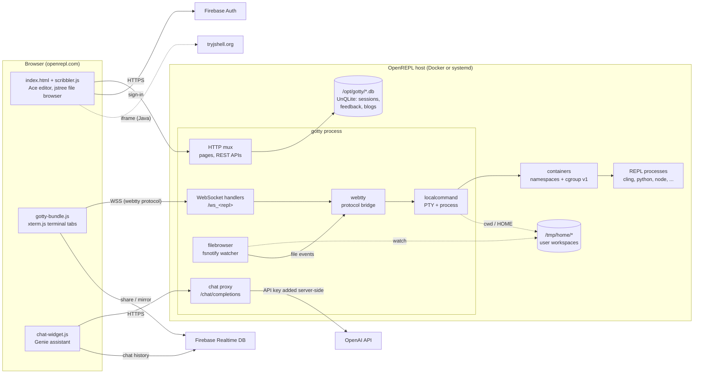
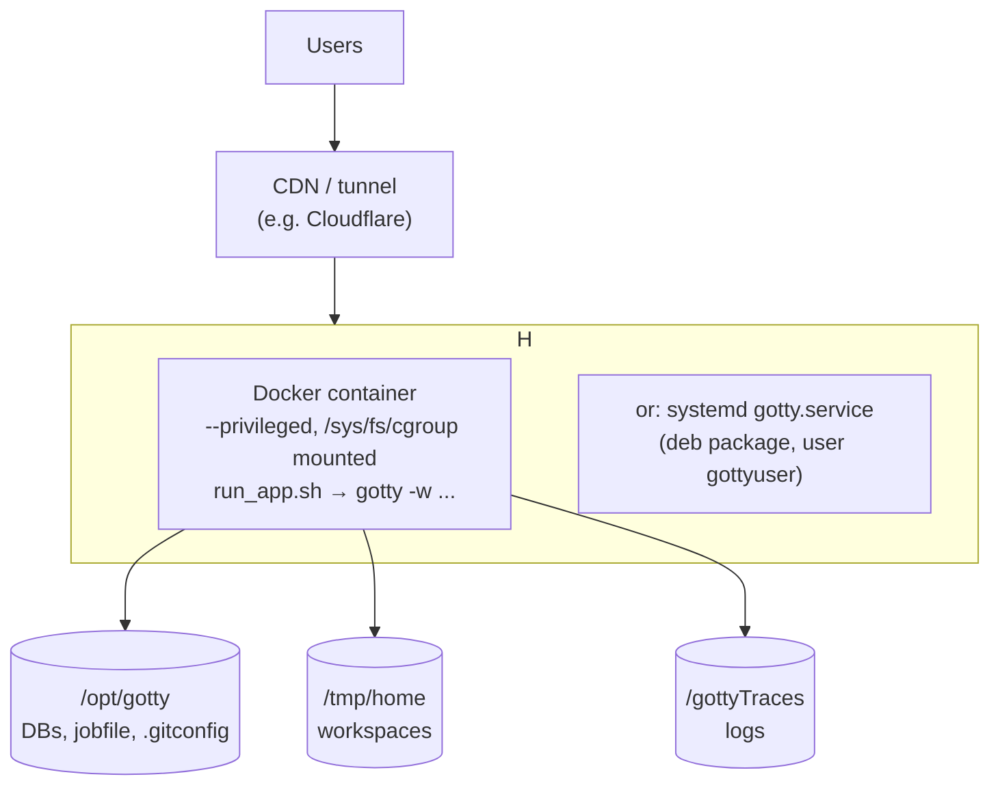

<p align="center">

</p>


#  OpenREPL

    
[][docker-image]
[][license]

[docker-image]: https://github.com/vickeykumar/openrepl/actions/workflows/docker-image.yml
[license]: https://github.com/vickeykumar/openrepl/blob/master/LICENSE

OpenREPL initially Forked from [gotty](https://github.com/yudai/gotty.git). GoTTY is a simple command line tool that turns your CLI tools into web applications. 

 This Fork is intended to create web based REPL services for various programming languages using gotty and containers.
You can checkout on our website for more info on REPL playgrounds and try them as well: [openrepl.com](http://openrepl.com) (earlier [gorepl.com](http://gorepl.com))


> **Design docs:** see [Architecture (High-Level Design)](#architecture-high-level-design) below and the low-level designs in [`docs/`](docs/README.md).


# Installation

Fork openrepl to start the REPL servers in your local system, Please make sure all pre-requisites are installed.

(Files named with `darwin_amd64` are for Mac OS X users)

You can install GoTTY REPL server as shown below:

## Non-debian:
```sh
$ cd src
$ make all
$ ../bin/gotty -w
```

## debian:
```sh
$ cd src
$ make buildgo GOROOT_BOOTSTRAP=/usr/lib/go-x.xx/     (non x86_64 machines)
$ make deb
$ sudo dpkg -i ../deb/gotty.deb
```

# Pre-Requisites

* GoTTY requires go1.9 or later.
* npm
* webpack
* [cling](https://github.com/root-project/cling)
* [gointerpreter](https://github.com/vickeykumar/Go-interpreter)
* python2.7
* xterm
* all requisites can be installed using ./install_prerequisite.sh	

# Deploy

To deploy and run a local copy of openrepl :

1. Pull the Docker image
    - `docker pull vickeykumar/openrepl:latest`

2. Run the image

    -  without nested containers.
        ```bash
        docker run -itd --name openrepl \
          -p 8080:8080 vickeykumar/openrepl:latest \
          -p 8080
        ```

   -  with nested containers (containerized REPLs inside docker, nested containers)
      ```bash
      docker run -itd --name openrepl \
        -v /sys/fs/cgroup:/sys/fs/cgroup:rw --privileged \
        -p 8080:8080 vickeykumar/openrepl:latest \
        -p 8080
      ```

3. open localhost:8080 in your browser to check repls offline


## CLI Options

     ```bash
      docker run -itd --name openrepl \
        -v /sys/fs/cgroup:/sys/fs/cgroup:rw --privileged \
        -p 8080:8080 vickeykumar/openrepl:latest \
        -p 8080 [ <other CLI Options>]
      ```


# Usage

```
Usage: gotty [options] <command> [<arguments...>]
```

Run `gotty` with your preferred command as its arguments (e.g. `gotty top`).

By default, GoTTY starts a web server at port 8080. Open the URL on your web browser and you can see the running command as if it were running on your terminal.

## Options

```
--address value, -a value     IP address to listen (default: "0.0.0.0") [$GOTTY_ADDRESS]
--port value, -p value        Port number to liten (default: "8080") [$GOTTY_PORT]
--permit-write, -w            Permit clients to write to the TTY (BE CAREFUL) [$GOTTY_PERMIT_WRITE]
--credential value, -c value  Credential for Basic Authentication (ex: user:pass, default disabled) [$GOTTY_CREDENTIAL]
--random-url, -r              Add a random string to the URL [$GOTTY_RANDOM_URL]
--random-url-length value     Random URL length (default: 8) [$GOTTY_RANDOM_URL_LENGTH]
--tls, -t                     Enable TLS/SSL [$GOTTY_TLS]
--tls-crt value               TLS/SSL certificate file path (default: "~/.gotty.crt") [$GOTTY_TLS_CRT]
--tls-key value               TLS/SSL key file path (default: "~/.gotty.key") [$GOTTY_TLS_KEY]
--tls-ca-crt value            TLS/SSL CA certificate file for client certifications (default: "~/.gotty.ca.crt") [$GOTTY_TLS_CA_CRT]
--index value                 Custom index.html file [$GOTTY_INDEX]
--title-format value          Title format of browser window (default: "{{ .command }}@{{ .hostname }}") [$GOTTY_TITLE_FORMAT]
--reconnect                   Enable reconnection [$GOTTY_RECONNECT]
--reconnect-time value        Time to reconnect (default: 10) [$GOTTY_RECONNECT_TIME]
--max-connection value        Maximum connection to gotty (default: 0) [$GOTTY_MAX_CONNECTION]
--once                        Accept only one client and exit on disconnection [$GOTTY_ONCE]
--timeout value               Timeout seconds for waiting a client(0 to disable) (default: 0) [$GOTTY_TIMEOUT]
--permit-arguments            Permit clients to send command line arguments in URL (e.g. http://example.com:8080/?arg=AAA&arg=BBB) [$GOTTY_PERMIT_ARGUMENTS]
--width value                 Static width of the screen, 0(default) means dynamically resize (default: 0) [$GOTTY_WIDTH]
--height value                Static height of the screen, 0(default) means dynamically resize (default: 0) [$GOTTY_HEIGHT]
--ws-origin value             A regular expression that matches origin URLs to be accepted by WebSocket. No cross origin requests are acceptable by default [$GOTTY_WS_ORIGIN]
--term value                  Terminal name to use on the browser, one of xterm or hterm. (default: "xterm") [$GOTTY_TERM]
--close-signal value          Signal sent to the command process when gotty close it (default: SIGHUP) (default: 1) [$GOTTY_CLOSE_SIGNAL]
--close-timeout value         Time in seconds to force kill process after client is disconnected (default: -1) (default: -1) [$GOTTY_CLOSE_TIMEOUT]
--config value                Config file path (default: "~/.gotty") [$GOTTY_CONFIG]
--version, -v                 print the version
```

### Config File

You can customize default options and your terminal (hterm) by providing a config file to the `gotty` command. GoTTY loads a profile file at `~/.gotty` by default when it exists.

```
// Listen at port 9000 by default
port = "9000"

// Enable TSL/SSL by default
enable_tls = true

// hterm preferences
// Smaller font and a little bit bluer background color
preferences {
    font_size = 5
    background_color = "rgb(16, 16, 32)"
}
```

See the [`.gotty`](https://github.com/yudai/gotty/blob/master/.gotty) file in this repository for the list of configuration options.

### Security Options

By default, GoTTY doesn't allow clients to send any keystrokes or commands except terminal window resizing. When you want to permit clients to write input to the TTY, add the `-w` option. However, accepting input from remote clients is dangerous for most commands. When you need interaction with the TTY for some reasons, consider starting GoTTY with tmux or GNU Screen and run your command on it (see "Sharing with Multiple Clients" section for detail).

To restrict client access, you can use the `-c` option to enable the basic authentication. With this option, clients need to input the specified username and password to connect to the GoTTY server. Note that the credentical will be transmitted between the server and clients in plain text. For more strict authentication, consider the SSL/TLS client certificate authentication described below.

The `-r` option is a little bit casualer way to restrict access. With this option, GoTTY generates a random URL so that only people who know the URL can get access to the server.  

All traffic between the server and clients are NOT encrypted by default. When you send secret information through GoTTY, we strongly recommend you use the `-t` option which enables TLS/SSL on the session. By default, GoTTY loads the crt and key files placed at `~/.gotty.crt` and `~/.gotty.key`. You can overwrite these file paths with the `--tls-crt` and `--tls-key` options. When you need to generate a self-signed certification file, you can use the `openssl` command.

```sh
openssl req -x509 -nodes -days 9999 -newkey rsa:2048 -keyout ~/.gotty.key -out ~/.gotty.crt
```

(NOTE: For Safari uses, see [how to enable self-signed certificates for WebSockets](http://blog.marcon.me/post/24874118286/secure-websockets-safari) when use self-signed certificates)

For additional security, you can use the SSL/TLS client certificate authentication by providing a CA certificate file to the `--tls-ca-crt` option (this option requires the `-t` or `--tls` to be set). This option requires all clients to send valid client certificates that are signed by the specified certification authority.


To build the frontend part (JS files and other static files), you need `npm`.

## Architecture (High-Level Design)

This section gives the big picture. Each component has a low-level design (LLD) in [`docs/`](docs/README.md).

### Overview

OpenREPL is one Go binary (`bin/gotty`, a fork of GoTTY). The same binary does three jobs:

1. **Serves the web app.** The HTML, CSS, JS and images are compiled into the binary with `go-bindata`.
2. **Starts a REPL for each browser terminal.** Each REPL runs as a child process on a pseudo-terminal (PTY), inside a lightweight container made of Linux namespaces and a cgroup v1 memory limit.
3. **Streams the terminal over a WebSocket.** It relays PTY output to the browser (xterm.js) and keystrokes back to the REPL.

Three external services sit around the core:

- **Firebase:** Authentication (sign-in) and the Realtime Database (live sharing of a REPL, and Genie chat history).
- **OpenAI:** reached only through a server-side proxy, for the *Genie* assistant and *Practice* question generation.
- **tryjshell.org:** embedded in an iframe for interactive Java.

### System context



### Components

| Component | Source | Responsibility |
|---|---|---|
| Entrypoint and config | `src/gotty/main.go`, `src/utils/flags.go`, `.gotty` | Loads settings in this order: defaults, then the HCL config file, then CLI flags. Opens the databases, creates the containers, starts the server and handles graceful shutdown. |
| HTTP server | `src/server/` | Routing, middleware (logging, gzip, basic auth), pages, and the REST APIs: login, profile, feedback, blog, demo, file browser, upload, chat proxy. |
| WebTTY | `src/webtty/` | Transport-agnostic bridge between a *master* (the browser connection) and a *slave* (the PTY), using GoTTY's single-byte message protocol. |
| Local command backend | `src/backend/localcommand/`, `src/github.com/kr/pty/` (patched) | Builds the REPL command line and environment, starts it on a PTY, handles resize and close. |
| Containers | `src/containers/` | One parent cgroup per REPL type and one child cgroup per process with a memory limit. Also sets up the namespaces (UTS, PID, mount, net, user) and joins forked sessions through `nsenter`. |
| File browser | `src/filebrowser/` | Workspace tree, a 50 MB quota, and fsnotify events pushed to the browser. |
| Users and sessions | `src/user/`, `src/cookie/`, `src/cachedb/` | Firebase-backed login sessions and the signed session cookie. Maps each user to a home directory. Storage is UnQLite with a freecache read cache. |
| Utilities | `src/utils/`, `src/encoder/` | Constants, the job scheduler (removes guest workspaces), `demos.xml` types, AES-GCM helpers, and the process-id encoding used for fork links. |
| REPL catalog | `src/resources/meta/demos.xml` | One `<Demo>` per REPL: the demo animation, usage, docs link, starter code, and the `<Compiler>` script used by **Run**. |
| Web frontend | `src/resources/`, `src/js/` | Landing page and IDE (`index.html`, `scribbler.js`), terminal engine (`js/src/*.ts` → `gotty-bundle.js`), Genie chat widget, Practice pages, and the JavaScript console (`jsconsole`). |

### Key flows

1. **Open a REPL.** The user picks a language. The browser opens `wss://…/ws_<repl>` and sends an init message: `{Arguments, AuthToken, Payload}`. The server resolves the user's home directory, starts the REPL on a PTY inside new namespaces and its own memory cgroup, and pipes I/O through WebTTY. Output is base64-encoded, and file-system changes arrive as `Event` messages.
2. **Run or debug editor code.** **Run** reconnects the terminal with the editor content in the init payload (`IdeLang`, `IdeContent`, `IdeFileName`, flags). The server writes the content to the selected file, then runs `/bin/bash -c <Compiler script from demos.xml>` in the same sandbox, with 3× the memory limit.
3. **Fork a REPL and add terminal tabs.** The window title carries a `jid`, an encoded PID. **Fork REPL** and every extra tab open `?jid=<id>`, and the server `nsenter`s the new shell into the parent's namespaces and working directory. This lets two terminals talk to each other, for example for socket programming.
4. **Share a REPL.** The owner's browser (the *master*) mirrors terminal output, language changes and file events to Firebase RTDB under `openrepl/<id>`. A viewer who opens `…/#<id>` renders that stream, and their keystrokes are relayed to the master's WebSocket. The viewer never starts a REPL of their own.
5. **Sign in.** FirebaseUI (email/password or Google, with email verification) signs the user in. The browser then posts the user to `/login`. The server stores the session in `user_sessions.db` and sets the `user-session` cookie. Signed-in users get a stable home directory. Guest directories are deleted 60 minutes after last use.
6. **Ask Genie or generate a practice question.** The browser calls `/chat/completions` with a per-session access token. The server checks the origin, the token and a cookie-based rate limit, then forwards the request to OpenAI with the server's API key.

### Deployment view



- **Image:** the multi-stage `Dockerfile` builds on Ubuntu 22.04. `install_prerequisite.sh` installs every REPL toolchain, and `make all` builds the binary. CI builds the image on every PR and push to `master`. Pushes to `master` also publish `:<sha>` and `:latest`.
- **Sandboxing needs cgroup v1.** With `--privileged` and `/sys/fs/cgroup` mounted, each REPL gets its own namespaces and memory cgroup. Without them, REPLs still run but share the container.
- **Server-side secrets** live in a git-config file, `/opt/gotty/.gitconfig` (falling back to `/etc/.gitconfig`):
  - `user.email` is the admin account.
  - `user.OpenaiAPIKey` is the OpenAI key, base64-encoded.
  - `user.host` is the origin the chat proxy accepts.

### Supported REPLs

| UI option | WebSocket path | Backend command | Memory limit (MB) |
|---|---|---|---|
| C / C++ | `/ws_c`, `/ws_cpp` | `cling` (C adds `-xc -noruntime`) | 22 |
| Go / Go-yaegi | `/ws_go`, `/ws_yaegi` | `gointerpreter`, `yaegi` | 45, 10 |
| Java | iframe to tryjshell.org; **Run** uses `/ws_java` | `java` (Run only) | 128 |
| JavaScript | iframe to `jsconsole.html` (runs in the browser) | n/a | n/a |
| TypeScript, NodeJS | `/ws_ts-node`, `/ws_node` | `ts-node`, `node` | 50, 10 |
| Python, Python2.7, IPython3 | `/ws_python`, `/ws_python2.7`, `/ws_ipython3` | same names | 2, 2, 20 |
| Ruby, Perl, Tcl, bash | `/ws_irb`, `/ws_perli`, `/ws_tclsh`, `/ws_bash` | same names | 10, 3, 2, 10 |
| Rust, SQLite, JSON, Assembly x86 | `/ws_evcxr`, `/ws_sqlite3`, `/ws_jq-repl`, `/ws_rappel` | same names | 50, 10, 2, 2 |

The memory limits come from `Commands2memLimitMap`. They double as admission-control weights: a new connection is refused when either the number of connections or the total weight exceeds `--max-connection`. See [docs/lld/09-adding-a-repl.md](docs/lld/09-adding-a-repl.md) to add a language.

GoTTY's original design notes still apply to the terminal core. It uses [xterm.js](https://xtermjs.org/) and [hterm](https://groups.google.com/a/chromium.org/forum/#!forum/chromium-hterm), and the hterm + websocket idea was inspired by [Wetty](https://github.com/krishnasrinivas/wetty).

## Alternatives

### Command line client

* [gotty-client](https://github.com/moul/gotty-client): If you want to connect to GoTTY server from your terminal

### Terminal/SSH on Web Browsers

* [Secure Shell (Chrome App)](https://chrome.google.com/webstore/detail/secure-shell/pnhechapfaindjhompbnflcldabbghjo): If you are a chrome user and need a "real" SSH client on your web browser, perhaps the Secure Shell app is what you want
* [Wetty](https://github.com/krishnasrinivas/wetty): Node based web terminal (SSH/login)
* [ttyd](https://tsl0922.github.io/ttyd): C port of GoTTY with CJK and IME support

### Terminal Sharing

* [tmate](http://tmate.io/): Forked-Tmux based Terminal-Terminal sharing
* [termshare](https://termsha.re): Terminal-Terminal sharing through a HTTP server
* [tmux](https://tmux.github.io/): Tmux itself also supports TTY sharing through SSH)

# License

The MIT License
