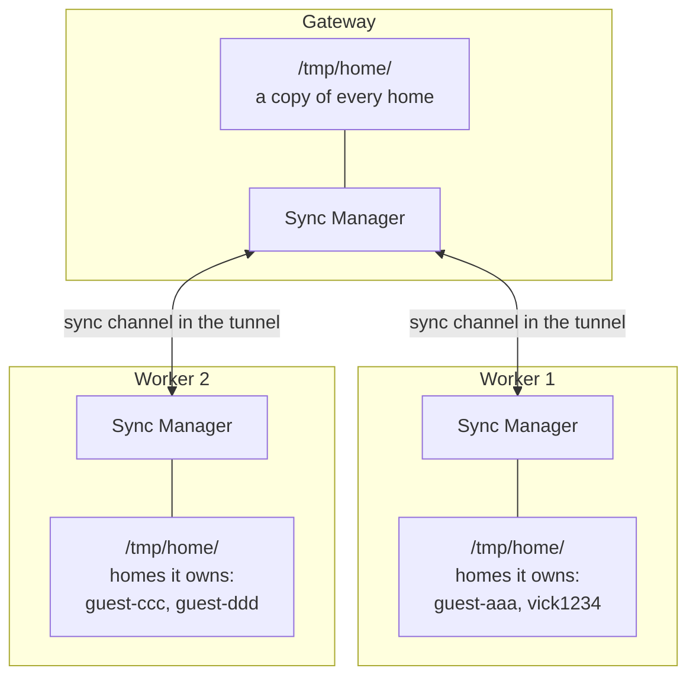
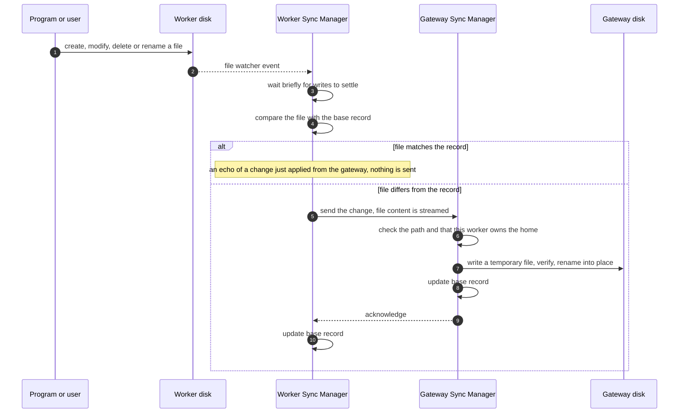
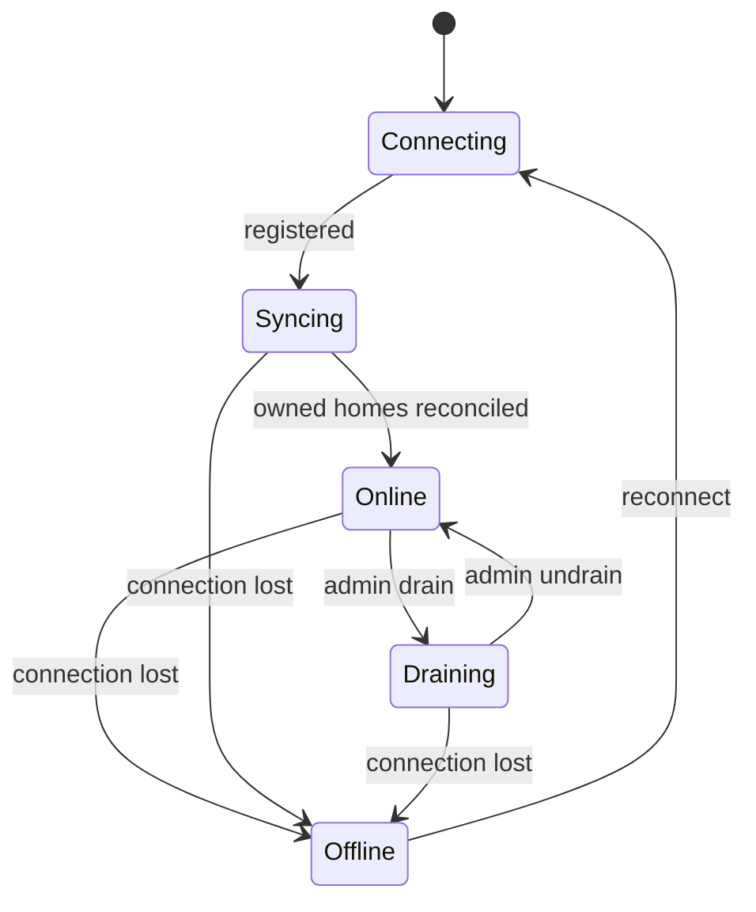

# OpenREPL Workspace Synchronization

## High-Level Design (HLD)

**Status:** Implemented on the `distributed-execution` branch, behind `--workspace-sync` (off by default).
**Depends on:** distributed execution ([hld/distributed-execution.md](distributed-execution.md), [LLD 11](../lld/11-distributed-execution.md)).
**Code-level design:** [LLD 12](../lld/12-workspace-sync.md).

---

# 1. Problem

In distributed mode a user's files exist in one place only: the `/tmp/home/<home>` directory on the node that runs their sessions. That has three consequences today:

1. If a worker is lost, the files of every user on it are lost with it.
2. While a worker is offline, its users cannot even browse or download their files.
3. A signed-in user is tied to one worker for good, so a worker cannot be retired without stranding its users.

# 2. Goal

Keep a second copy of every home on the gateway, kept in step with the node that runs the user, so that:

- losing a worker does not lose files;
- the gateway can serve the file browser, downloads, saves and uploads while a worker is away;
- a user can be moved to another worker, which then receives their files;
- a worker takes new sessions only when its copy of the homes it owns is in step.

The existing directory layout does not change. `/tmp/home/guest-3764683404/` stays exactly that, on every node.

# 3. Non-goals

- **No runtime migration.** A running program, its terminal and its memory live on one worker. If that worker dies they are gone. Only files are kept.
- **No copy of every home on every worker.** See section 5.
- **No external service is required.** It works with the nodes' own disks; no shared filesystem, object store, database or message queue is needed.
- **No change to standalone mode**, or to a gateway that runs without this feature.

# 4. Design in one sentence

Each home lives in two places, the gateway and the one node that runs that user, and the two are synchronized in both directions over the existing worker tunnel.

# 5. Design decisions

| Decision | Reason |
|---|---|
| A home is kept on the gateway and on its owning node. It is copied to another worker when a session is placed there. | Keeping every home on every worker would multiply storage and traffic by the number of workers, and put every user's files on every machine that runs user code. Copying on placement still lets a user move to any worker. |
| A reconnecting worker reconciles the homes it owns before it is `ONLINE`. A new worker owns none and is `ONLINE` at once. | Start-up time does not grow with the total data of the site. |
| When both sides changed a file while apart, the latest modification wins. | Modification times are epoch times, which mean the same instant on every machine, so the version saved last is the one the user wants. The gateway measures each worker's clock offset when it connects and corrects for it, so a worker whose clock is off cannot win by mistake. |
| A small record of the last agreed state is saved on disk, on both sides. | It is what tells "deleted here" apart from "created there" after a restart. |
| The gateway alone decides when a guest's home expires. | Each node has only its own view of activity. A node that sees no requests for a home must not delete files that are in use on another node. |
| A signed-in user can be placed on a different worker, and their files follow. | A worker can be drained and retired without stranding its users. |

# 6. Concepts

| Term | Meaning |
|---|---|
| **Home** | One directory directly under `/tmp/home/`: `guest-<id>` for a guest, the user's home id for a signed-in user. It is the unit of synchronization. |
| **Owner** | The node that runs the home's sessions: a worker, or the gateway itself. The gateway knows it from the session's execution context. |
| **Base record** | Per home and per peer, the list of files as they were when the two sides last agreed. Saved on disk. It decides what is an echo, what was deleted, and whether both sides changed a file. |
| **Reconcile** | Compare both sides against the base record and transfer the differences. Used at reconnect, on placement, and whenever an event may have been missed. |

The shared directories `/tmp/home/<command>` that the sandbox creates (for example `/tmp/home/perli`) are not homes and are never synchronized.

# 7. Flows

## 7.1 Normal operation

Sessions run on their worker exactly as today. Terminals, saves, uploads and Run all stay on that worker, so a file is always saved and run on the same disk. The gateway's copy follows a moment later.

- **Step 3.** A program usually writes a file in several pieces. Waiting until the home is quiet (about 300 ms, 2 seconds at most) sends one complete file instead of many partial ones.
- **Step 4.** This comparison is also what classifies the change: a path missing from the record is new, a path in the record but gone from disk was deleted, and a path whose size or content differs was modified.
- **Step 10.** The worker records the change as agreed only after the gateway confirms it. If the connection drops in between, the file still differs from the record and is sent again at the next reconcile.

A change made to the gateway's copy travels the other way through the same steps, with the roles swapped.

## 7.2 Worker offline

The gateway answers what it can from its own copy:

| Request from the browser | Result while the worker is offline |
|---|---|
| Terminal | "execution node unavailable": the running program is gone with the worker |
| File browser, download, save, upload | Served from the gateway's own copy of the home |

Changes made on the gateway's copy during the outage are kept and reconciled when the worker returns.

## 7.3 Worker reconnects

The worker connects, authenticates and registers, then stays in `SYNCING` while the homes it owns are reconciled, and only then becomes `ONLINE`.

For each home the worker owns, both sides compare their current files against the base record:

| Since the last agreement | Result |
|---|---|
| Changed on one side only | That change (including a delete) is applied to the other side. |
| Same change on both sides | Nothing to transfer. |
| Changed differently on both sides | The version modified last replaces the other (section 8). |
| Deleted on one side, modified on the other | The modified file is kept. |

The worker receives no new sessions until this finishes. A request for a home that is still reconciling waits briefly, then gets a clear "workspace is synchronizing" error.

## 7.4 A user is placed on a different node

When the owner of a home changes (the old worker is drained or gone, or a guest returns after their session expired), the gateway sends the home to the new node before the first terminal starts. The new node then becomes the owner and the normal flow applies.

This is what removes the permanent pin of signed-in users to one worker.

## 7.5 A guest's home expires

Only the gateway decides. Sixty idle minutes after the last request and the last open terminal, the gateway deletes its copy and tells the owner to delete its copy. Workers no longer run their own deletion timers for synchronized homes.

# 8. Rules

| Concern | Rule |
|---|---|
| **Echo loops** | A change is sent only if the file differs from the base record. A change that was just applied from the peer matches the record, so it is never sent back. No timing windows are involved. |
| **Deletes** | A path that is in the base record and missing on one side was deleted there. A path that is not in the base record and present on one side was created there. |
| **Both sides changed** | The version with the later modification time wins and replaces the other on both sides. Times are compared after correcting for the worker's measured clock offset. If the times are equal the gateway's version wins. The older version is not kept. |
| **Ownership** | The gateway accepts changes for a home only from the node that owns it. A worker cannot write into another user's home. |
| **Paths** | Every path is relative to its home, cleaned, and rejected if it is absolute, contains `..`, or passes through a symbolic link. |
| **Symbolic links** | Copied as links. Never followed, on reading or on writing. |
| **Other file types** | Sockets, FIFOs and device files are skipped. |
| **Partial files** | A received file is written under a temporary name in the same directory and renamed into place when complete and verified. |
| **Files still being written** | A file whose size or time changes during the copy is copied again. |
| **Missed events** | A watcher overflow, an error, or a reconnect marks the home as needing a reconcile. |
| **Size** | A file larger than the per-home quota is skipped and reported. |

# 9. Worker states

| State | New sessions | Existing sessions |
|---|---|---|
| `SYNCING` | No | Served once their own home is reconciled |
| `ONLINE` | Yes | Yes |
| `DRAINING` | No | Yes |
| `OFFLINE` | No | Terminals fail; file requests are served by the gateway |

# 10. Transport

A new channel type on the existing worker connection, next to the one used for proxied requests. No new port, no new connection, no new authentication. File contents are streamed in chunks and never held whole in memory.

# 11. What changes for users

| Situation | Today | With workspace sync |
|---|---|---|
| A worker dies | Its users' files are gone | The gateway has them |
| A worker is offline | File browser and downloads fail | They work, from the gateway's copy |
| A signed-in user's worker is retired | "workspace node unavailable" until it returns | Placed on another node, files follow |
| A program is running when the worker dies | Lost | Lost (unchanged) |

# 12. Risks

| Risk | Mitigation |
|---|---|
| A bug deletes files on both sides | Deletes are decided only from the saved base record; a reconcile with no base record never deletes; destructive paths are covered by tests before anything else is wired in. |
| The gateway's disk fills, since it now holds every home | Same footprint as a single server today. Guest homes still expire after an hour. |
| Heavy write load (build outputs, caches) | Writes are coalesced per path before sending; an ignore list can be added later if needed. |
| A worker with a wrong clock overwrites newer work | Its offset from the gateway is measured at every connection and applied to its file times. An offset above a limit is logged as a warning. |
| Gateway and worker disagree after a crash mid-transfer | Transfers are atomic per file, and the base record is updated only after the peer acknowledges. |

# 13. Delivery order

1. Sync engine working between two directories, with the base record, tested alone.
2. Sync channel on the tunnel, and the `SYNCING` state.
3. Gateway serves file requests when the owner is offline; the gateway becomes the only authority for guest expiry.
4. Copy on placement, then relax the permanent pin of signed-in users.

Each step is usable and testable without the next.
