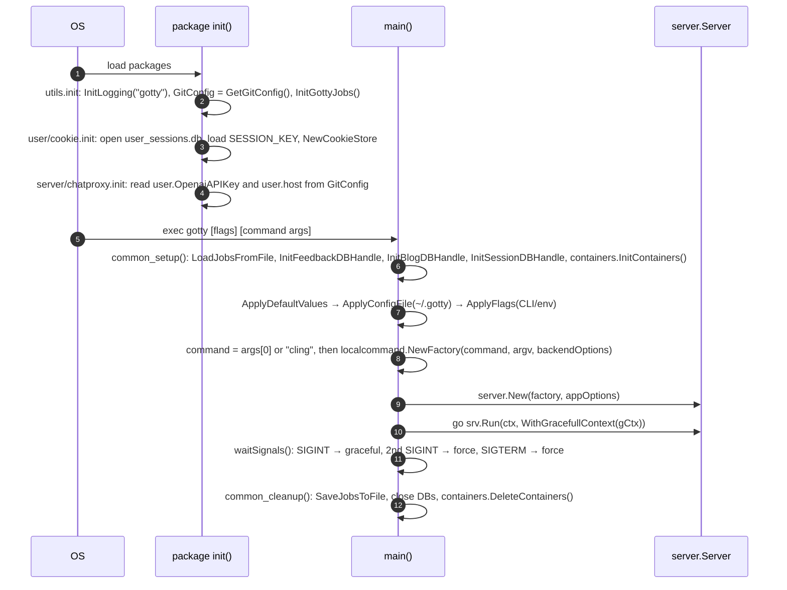
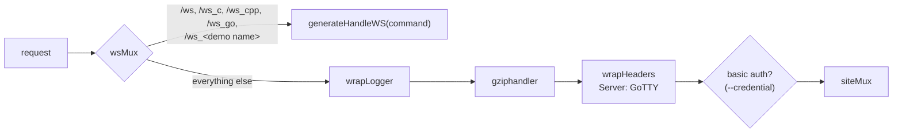

# LLD 01: Server, startup and routing

Scope: `src/gotty/main.go`, `src/utils/{flags,default,utils}.go`, `src/server/{server,options,middleware,handlers,utils,handler_atomic,run_option}.go`.

## 1. Process startup

### Configuration precedence

1. The `default:"…"` struct tags on `server.Options` and `localcommand.Options` (`utils.ApplyDefaultValues`).
2. The HCL config file (`--config`, default `~/.gotty`, `utils.ApplyConfigFile`). It is applied only if it exists or is set explicitly.
3. CLI flags and env vars. `utils.GenerateFlags` builds each flag from the `flagName`/`flagSName`/`flagDescribe` tags, and the env var is `GOTTY_<FLAG_NAME>`.

After that, `EnableBasicAuth` is set when `--credential` is given, and `EnableTLSClientAuth` when `--tls-ca-crt` is given. `Options.Validate()` rejects TLS client auth without TLS.

### Options with OpenREPL-specific meaning

| Option | Default | Notes |
|---|---|---|
| `--permit-write` / `-w` | false | Must be on for REPLs to accept input (both `run_app.sh` and `gotty.service` set it). |
| `--max-connection` | 0 (unlimited) | Compared against **both** the live connection count and the summed memory *weight* (MB) of live REPLs. See LLD 03. Production uses 2564. |
| `--title-format` | `{{ .command }}@{{ .hostname }}` | Production sets `<fmt><title>{{ .command }}</title><jid>{{ encodePID .pid }}</jid></fmt>`. The client parses this XML to get the fork `jid`. `encodePID` is registered as a template function in `server.New`. |
| `--permit-arguments` | **true** | URL `?arg=…` values are appended to the REPL argv (for example, C mode passes `arg=-xc&arg=-noruntime` to cling). |
| `--close-signal` | 1 (SIGHUP) | Sent to the REPL when the WebSocket closes. |
| `--close-timeout` | -1 | When < 0 the option is not applied, so `LocalCommand` keeps its default of 10 s before SIGKILL. |
| `--term` | xterm | Sent to the page through `config.js` (`gotty_term`); `hterm` is also supported. |
| `--index` | "" | Serve a custom `index.html` from disk instead of the embedded one. |
| `--random-url`, `--once`, `--timeout`, `--reconnect`, `--width/--height`, `--ws-origin`, TLS flags | | Inherited from GoTTY, semantics unchanged. |

## 2. Server object and handler chain

`server.New(factory, options)`:

- Loads `static/index.html` from bindata, or from `--index`, and parses it as `html/template`. `index.html` does not use any template variables today.
- Parses `TitleFormat` with `text/template` and the `encodePID` function.
- Builds a `websocket.Upgrader` with subprotocol `webtty` and an optional origin regexp (`--ws-origin`).

`Server.Run` opens the listener, serves HTTP or TLS, and blocks until the listener fails or the context is cancelled. It then waits for live WebSockets through `counter.wait()`.

WebSocket routes skip the logger, gzip and basic-auth wrappers. The init message's `AuthToken` authenticates them instead (LLD 02).

## 3. Route table

All paths are relative to `pathPrefix`: `/`, or `/<random>/` with `--random-url`.

| Path | Methods | Handler | Access | Purpose |
|---|---|---|---|---|
| `/` , `/practice` | GET | `Server.handleIndex` | public | Renders the index template. Any other unmatched path returns 404 through `errorHandler`. Also creates or refreshes the caller's home directory cookie and guest cleanup job. |
| `/practice/dsa-questions` | GET | `handlePracticeQuestions` | public | Renders `static/practice.html`. |
| `/login` | GET, POST | `handleLoginSession` | public | GET: current session status as JSON. POST: create a session from the Firebase sign-in result (LLD 05). |
| `/logout` | POST | `handleLogoutSession` | session | Deletes the session and cookie. |
| `/profile` | GET | `handleUserProfile` | session | HTML profile (`static/profile.html` template), or JSON with `?q=json`. |
| `/feedback` | POST, GET | `handleFeedback` | POST public, `?q=delete` admin; GET admin | Stores the contact form. GET renders a DataTables admin view. |
| `/blog` | GET, POST | `handleBlog` | GET public; POST admin | GET: list, `?name=` post, `?q=list` keys, `?q=json`. POST: upsert or `?q=delete`. |
| `/editblog.html` | GET | static behind `wrapAdmin` | admin | Blog editor UI. |
| `/demo?q=<command>` | GET | `handleDemo` | public | `utils.DemoResp` JSON for a REPL (LLD 04). |
| `/chat/completions` | POST | `handleChatProxy` | origin-checked, token, rate limit | OpenAI proxy (LLD 07). |
| `/ws_filebrowser` | GET, POST | `Server.handleFileBrowser` | cookie homedir | File tree, load, save, zip and file ops (LLD 04). Despite the name, this is plain HTTP. |
| `/upload_file` | POST (multipart) | `Server.handleFileUpload` | cookie homedir | Upload into the homedir (LLD 04). |
| `/auth_token.js` | GET | `handleAuthToken` | public | `var gotty_auth_token = '<--credential>'`. |
| `/config.js` | GET | `handleConfig` | public | `gotty_term`, `firebaseconfig`, `openai_access_token` (LLD 07). |
| `/js/`, `/css/`, `/images/`, `/media/`, `/docs/`, `/doc.html`, `/about.html`, `/references.html`, `/robots.txt`, `/jsconsole.html` | GET | bindata `AssetFS` | public | Static assets. |
| `/ws`, `/ws_c`, `/ws_cpp`, `/ws_go`, `/ws_<name>` | GET (Upgrade) | `generateHandleWS` | init `AuthToken` | Terminal sessions. `/ws_c` and `/ws_cpp` map to `cling`, `/ws_go` maps to `gointerpreter`, and each `demos.xml` `<Name>` gets `/ws_<Name>` (LLD 02). |

## 4. Server-rendered pages

`server/utils.go` holds inline templates:

- `CommonTemplate`: the shared page shell, used by `commonHandler` (blog, feedback) and `errorHandler` (error pages).
- `FeedbackTemplate`: the admin table with a delete button (POST `/feedback?q=delete&key=`).
- `BlogList_Template`, `Blog_Template`: the blog list and a single post (`htmlify` renders stored HTML).

`profile.html` and `practice.html` are parsed as templates at request time. `index.html` is parsed once at start-up.

## 5. Admin model

`server.IsUserAdmin(rw, req)` returns true when **all** of these hold:

1. The `user-session` cookie maps to a stored profile (`user.FetchUserProfileData(uid)`).
2. The session is not expired (`user.IsSessionExpired`).
3. The profile email equals `GitConfig["user.email"]`.

Admin unlocks feedback viewing and deletion, blog editing, unlimited chat-proxy requests, and REPLs that keep the host network namespace (`usermode=admin` in the request payload; LLD 03).

`utils.GetGitConfig()` reads the first file that exists among `/opt/gotty/.gitconfig`, `~/.gitconfig` and `/etc/.gitconfig`, and flattens it into `section.key` pairs. The `~/` entry is not expanded, so in practice only the other two are read (LLD 10, B4). Keys used: `user.email`, `user.OpenaiAPIKey` (base64), `user.host`.

## 6. Logging and observability

- `utils.InitLogging` sends the standard `log` package output to `/gottyTraces/gotty.log`, rotated by lumberjack (10 MB per file, 5 backups, 30 days).
- `wrapLogger` logs `remote status method path` for every non-WebSocket request.
- The WebSocket handler logs connect and close with the live connection count and total memory weight.
- There are no metrics endpoints.
