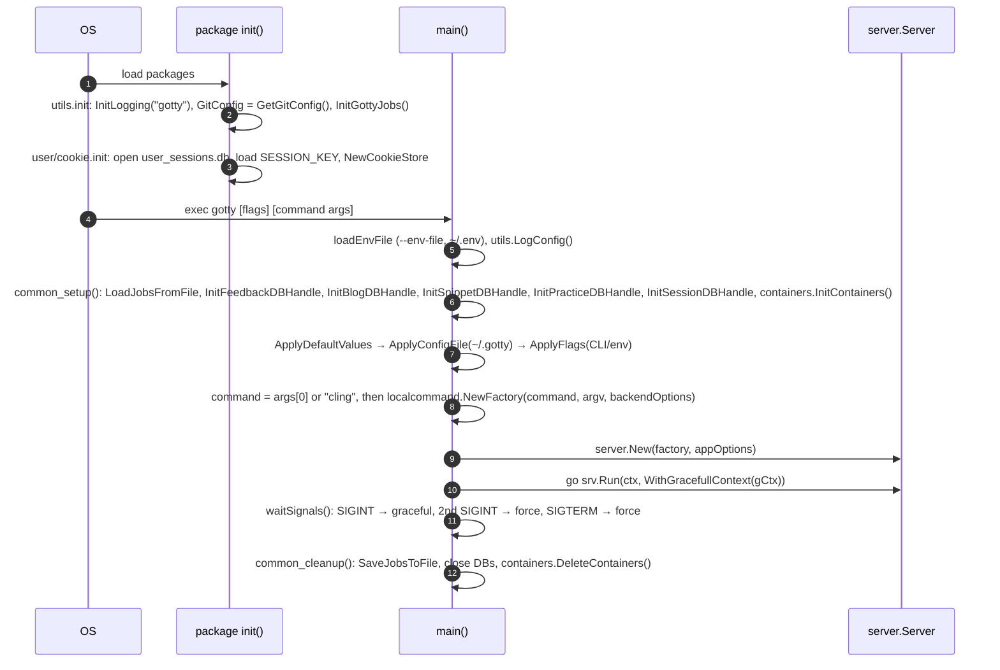
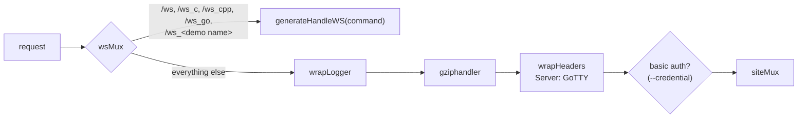

# LLD 01: Server, startup and routing

Scope: `src/gotty/main.go`, `src/utils/{flags,default,utils}.go`, `src/server/{server,options,middleware,handlers,utils,handler_atomic,run_option,langpages,snippets,practice}.go`.

## 1. Process startup

### Configuration precedence

1. The `default:"…"` struct tags on `server.Options` and `localcommand.Options` (`utils.ApplyDefaultValues`).
2. The HCL config file (`--config`, default `~/.gotty`, `utils.ApplyConfigFile`). It is applied only if it exists or is set explicitly.
3. CLI flags and env vars. `utils.GenerateFlags` builds each flag from the `flagName`/`flagSName`/`flagDescribe` tags, and the env var is `GOTTY_<FLAG_NAME>`.

After that, `EnableBasicAuth` is set when `--credential` is given, and `EnableTLSClientAuth` when `--tls-ca-crt` is given. `Options.Validate()` rejects TLS client auth without TLS.

### Options with OpenREPL-specific meaning

| Option | Default | Notes |
|---|---|---|
| `--permit-write` / `-w` | false | Must be on for REPLs to accept input (both `run_app.sh` and `gotty.service` set it). |
| `--max-connection` | 0 (unlimited) | Compared against **both** the live connection count and the summed memory *weight* (MB) of live REPLs. See LLD 03. Production uses 2564. |
| `--title-format` | `<fmt><title>{{ .command }}</title><jid>{{ encodePID .pid }}</jid></fmt>` | Built-in default (previously `{{ .command }}@{{ .hostname }}`); override with `--title-format`, `$GOTTY_TITLE_FORMAT`, or `title_format = "..."` in the config file (`~/.gotty` or `--config`). The client parses this XML to get the fork `jid`. `encodePID` is registered as a template function in `server.New`. |
| `--permit-arguments` | **true** | URL `?arg=…` values are appended to the REPL argv (for example, C mode passes `arg=-xc&arg=-noruntime` to cling). |
| `--close-signal` | 1 (SIGHUP) | Sent to the REPL when the WebSocket closes. |
| `--close-timeout` | -1 | When < 0 the option is not applied, so `LocalCommand` keeps its default of 10 s before SIGKILL. |
| `--term` | xterm | Sent to the page through `config.js` (`gotty_term`); `hterm` is also supported. |
| `--mode` | standalone | `standalone` (today's behaviour), `gateway` (puts the `gateway` router in front of every route, see below) or `worker` (dials a gateway and serves the sessions it forwards; opens a port of its own only when `--port` or `--address` is given). See LLD 11. |
| `--worker-token` | "" | Shared secret between a gateway and its workers; prefer `$GOTTY_WORKER_TOKEN`. A gateway without it accepts no workers. |
| `--workspace-sync`, `--sync-state-dir`, `--relocate-after` | false, `/opt/gotty/wsync`, `2m` | Gateway: keep a copy of every worker's homes on the gateway, in step with the worker (LLD 12). `--relocate-after` is how long a worker may be away before its sessions are placed elsewhere. `--sync-state-dir` (gateway and worker) holds the sync records and should be on durable storage. |
| `--local-weight` | 10 | Gateway: its own share of new sessions next to the workers; 0 makes it routing-only. |
| `--tunnel-path`, `--tunnel-addr`, `--tunnel-hostkey` | `/api/tunnel`, "", `~/.gotty.tunnel_key` | Gateway: the WebSocket endpoint workers connect to, an optional raw SSH listener, and the tunnel host key file (created if missing). |
| `--worker-server`, `--worker-hostkey`, `--worker-id`, `--worker-weight`, `--worker-capacity`, `--worker-languages` | "", "", hostname, 10, 0, "" | Worker: gateway URL (`wss://host/api/tunnel` or `ssh://host:port`), pinned host-key fingerprint (required for `ssh://`), id, placement weight, session budget in MB (0 = RAM), and the REPL commands it can run (empty = all). |
| `--index` | "" | Serve a custom `index.html` from disk instead of the embedded one. |
| `--random-url`, `--once`, `--timeout`, `--reconnect`, `--width/--height`, `--ws-origin`, TLS flags | | Inherited from GoTTY, semantics unchanged. |

## 2. Server object and handler chain

`server.New(factory, options)`:

- Loads `static/index.html` from bindata, or from `--index`, and parses it as `html/template`. `index.html` does not use any template variables today.
- Parses `TitleFormat` with `text/template` and the `encodePID` function.
- Builds a `websocket.Upgrader` with subprotocol `webtty` and an optional origin regexp (`--ws-origin`).

`Server.Run` opens the listener (`serveLocal`), serves HTTP or TLS, and blocks until the listener fails or the context is cancelled. It then waits for live WebSockets through `counter.wait()`. A worker calls `serveLocal` only when `Options.LocalListen` is set, and otherwise serves only the gateway's tunnel (LLD 11, 6.2a).

WebSocket routes skip the logger, gzip and basic-auth wrappers. The init message's `AuthToken` authenticates them instead (LLD 02).

### Gateway mode (`--mode=gateway`)

`setupHandlers` wraps the whole tree above in `gateway.Router` (`server/gateway.go`). In standalone mode this wrapper does not exist. The router classifies the path (relative to `pathPrefix`):

| Path | Handling |
|---|---|
| `admin`, `admin/...` | Straight to the existing handlers, never assigned a backend. In gateway mode this includes the worker and session routes (`admin/workers...`, `admin/sessions...`; `gateway/admin.go`, behind `adminAPI`; see LLD 11 and 13) |
| the tunnel path (default `api/tunnel`) | The worker tunnel endpoint (`tunnel.Server`), only when a worker token is set. It needs a Bearer token and refuses requests with an `Origin` |
| `ws`, `ws_<anything>`, `upload_file` (execution-bound) | Resolve or create the session's execution context, then serve on its backend: the local backend (the same handler tree, no proxy hop) or a worker through `gateway.RemoteBackend`. A `jid` or `homedir` query that another node announced is served by that node instead |
| `/`, `/practice`, language pages (entry pages) | Assign the session first (so the parallel requests the page makes agree on one backend), then serve normally |
| everything else | Straight to the existing handlers |

`handleIndex`, `handleFileBrowser`, `handleFileUpload` and the WebSocket handler get the user id and workspace from `Server.requestIdentity` (`server/identity.go`): the session cookie as before, or, on a worker, the gateway's `X-Openrepl-*` headers, which are honoured only on tunnel streams and stripped from every client request by the router. For a session that runs on a worker the gateway's `handleIndex` does not create a workspace.

A guest is identified by a signed `or-aff` cookie (random id, HttpOnly, one hour like the guest session); a signed-in user by `cookie.Get_Uid`. The cookie is issued on the entry page. A client that opens a WebSocket without ever loading a page is assigned a new id per connection, because `Set-Cookie` on the `101` upgrade response is dropped by the WebSocket upgrader. See LLD 11.

## 3. Route table

All paths are relative to `pathPrefix`: `/`, or `/<random>/` with `--random-url`.

| Path | Methods | Handler | Access | Purpose |
|---|---|---|---|---|
| `/` , `/practice`, `/<language>` | GET | `Server.handleIndex` | public | Renders the index template. The 16 language pages (`/python`, `/cpp`, `/rust` and so on, listed in `langPages` in `server/langpages.go`) render the same template with their own title, description, canonical URL and hero heading, and preselect that REPL (section 4). Any other unmatched path returns 404 through `errorHandler`. Also creates or refreshes the caller's home directory cookie and guest cleanup job. |
| `/practice/dsa-questions` | GET | `handlePracticeQuestions` | public | Renders `static/practice.html`. |
| `/practice/progress` | GET, PUT (POST accepted) | `handlePracticeProgress` | session | A signed-in user's practice questions and done marks (LLD 05). GET returns the stored document, or `{"signedIn": false}` for guests. PUT merges the body into the stored copy and returns the result; guests get 401. Bodies up to 2 MB, 200 questions, 1,000 marks; 240 writes per user per 10 minutes. |
| `/sitemap.xml` | GET | `handleSitemap` | public | The home page, practice list, docs, about, privacy and terms pages, and every language page. `robots.txt` points to it. |
| `/snippet` | GET, POST | `handleSnippet` | public, 30 new links per IP per 10 minutes | Share-code links. POST `{lang, code}` (code up to 64 KB) stores a snapshot and returns `{id, url}`; GET `?id=` returns `{lang, code, created}`. Errors: 400 unknown language or no code, 413 too large, 429 rate limit, 503 store unavailable. |
| `/s/<id>` | GET | `handleSnippetLink` | public | Redirects (302) to the language's page with `?s=<id>`, or to `/?repl=<lang>&s=<id>`; 404 page for an unknown id. |
| `/login` | GET, POST | `handleLoginSession` | public | GET: current session status as JSON. POST: create a session from the Firebase sign-in result (LLD 05). |
| `/logout` | POST | `handleLogoutSession` | session | Deletes the session and cookie. |
| `/profile` | GET | `handleUserProfile` | session | HTML profile (`static/profile.html` template), or JSON with `?q=json`, which also carries `isAdmin` so the account menu can offer a link to `/admin`. |
| `/feedback` | POST, GET | `handleFeedback` | POST public, `?q=delete` admin; GET admin | Stores the footer form ("Which language should we add next?" plus general feedback): `name` (optional, sent as "Anonymous" when empty), `email` and `message` (free text). GET renders a DataTables admin view. |
| `/blog` | GET, POST | `handleBlog` | GET public; POST admin | GET: list, `?name=` post, `?q=list` keys, `?q=json`. POST: upsert or `?q=delete`. |
| `/editblog.html` | GET | static behind `wrapAdmin` | admin | Blog editor UI. |
| `/demo?q=<command>` | GET | `handleDemo` | public | `utils.DemoResp` JSON for a REPL (LLD 04). |
| `/chat/completions` | POST | `handleChatProxy` | origin-checked, token, rate limit | OpenAI proxy (LLD 07). |
| `/ws_filebrowser` | GET, POST | `Server.handleFileBrowser` | cookie homedir | File tree, load, save, zip, workspace usage (`?q=usage`) and file ops (LLD 04). Despite the name, this is plain HTTP. |
| `/upload_file` | POST (multipart) | `Server.handleFileUpload` | cookie homedir | Upload into the homedir (LLD 04). |
| `/auth_token.js` | GET | `handleAuthToken` | public | `var gotty_auth_token = '<--credential>'`. |
| `/config.js` | GET | `handleConfig` | public | `gotty_term`, `firebaseconfig` (the built-in production project, or `OPENREPL_FIREBASE_CONFIG`; see section 5), `openai_access_token` (LLD 07). |
| `/settings.js` | GET | `handleSettingsJS` | public | `var site_settings = {"colorOfTheDay": <bool>}`, sent with `Cache-Control: no-store` (LLD 05, 06). |
| `/admin` | GET | `handleAdminPage` behind `wrapAdmin` | admin | The admin dashboard, a static page (`resources/admin.html`) with a restrictive Content-Security-Policy. |
| `/admin/...` | GET, POST | `adminAPI` | admin; changes need the `X-Requested-With: openrepl-admin` header | The dashboard's JSON API: settings, parameters, health, usage, audit log, log, feedback, shared code, users and, on a gateway, workers and sessions. Routes and rules in LLD 13. |
| `/js/`, `/css/`, `/images/`, `/media/`, `/docs/`, `/doc.html`, `/about.html`, `/references.html`, `/privacy.html`, `/terms.html`, `/robots.txt`, `/jsconsole.html` | GET | bindata `AssetFS` | public | Static assets. |
| `/ws`, `/ws_c`, `/ws_cpp`, `/ws_go`, `/ws_<name>` | GET (Upgrade) | `generateHandleWS` | init `AuthToken` | Terminal sessions. `/ws_c` and `/ws_cpp` map to `cling`, `/ws_go` maps to `gointerpreter`, and each `demos.xml` `<Name>` gets `/ws_<Name>` (LLD 02). |

## 4. Server-rendered pages

`server/utils.go` holds inline templates:

- `CommonTemplate`: the shared page shell, used by `commonHandler` (blog, feedback) and `errorHandler` (error pages).
- `FeedbackTemplate`: the admin table with a delete button (POST `/feedback?q=delete&key=`).
- `BlogList_Template`, `Blog_Template`: the blog list and a single post (`htmlify` renders stored HTML).

`profile.html` and `practice.html` are parsed as templates at request time. `index.html` is parsed once at start-up and executed per request with `.Page` from `indexPageFor(r)` (`server/langpages.go`): `URL`, `Title`, `Description`, `Eyebrow`, `Heading`, `HeadingColor`, `Blurb`, and `Client`, a JSON object written to `window.OPENREPL_PAGE` (`{repl, slug, pages[]}`) so the page knows its language and can move between language pages without a reload (LLD 06).

## 5. Admin model

`server.IsUserAdmin(rw, req)` returns true when **all** of these hold:

1. The `user-session` cookie maps to a stored profile (`user.FetchUserProfileData(uid)`).
2. The session is not expired (`user.IsSessionExpired`).
3. The profile email is one of the admin accounts, `utils.IsAdminEmail`: `OPENREPL_ADMIN_EMAILS` (comma-separated), or else the file's `user.email`. The comparison ignores case. With no admin configured, nobody is one.

Admin unlocks the dashboard (LLD 13), feedback viewing and deletion, blog editing, unlimited chat-proxy requests, and REPLs that keep the host network namespace (`usermode=admin` in the request payload; LLD 03).

Settings (`utils/config.go`). Each is read from the environment first and from the file second:

| Setting | Variable | File key |
|---|---|---|
| Admin accounts | `OPENREPL_ADMIN_EMAILS`, comma-separated | `user.email` |
| OpenAI key | `OPENREPL_OPENAI_API_KEY`, as it is | `user.OpenaiAPIKey`, base64 |
| OpenRouter key (optional, for Gemma) | `OPENREPL_OPENROUTER_API_KEY`, as it is | none |
| Allowed host | `OPENREPL_HOST` | `user.host` |
| Firebase web config | `OPENREPL_FIREBASE_CONFIG`: JSON, or base64 of JSON | built in (production project) |
| Mode | `OPENREPL_ENV`: `dev`, `development` or `local`; anything else is production | |

`OPENREPL_FIREBASE_CONFIG` (`utils.FirebaseConfigFromEnv`) replaces the Firebase web config that `/config.js` gives the page, so that a development project can be used. `apiKey`, `authDomain` and `projectId` are required; only the fields of a web app config are kept, and each is checked against the shape it must have (a pattern per field), because the value ends up in a script every visitor runs. `utils.FirebaseConfigJS` writes the object with `encoding/json`. A wrong value is an error that names the field, not its value, and `Options.Validate` returns it, so the server does not start; there is no quiet fall back to the built-in project. The start-up log line shows `firebase: the built-in project`, or `custom project (from env)`, and in dev mode the config itself, or a reminder that the built-in project is the production one.

An empty variable counts as not set. `utils.GetGitConfig()` reads the first file that exists among `/opt/gotty/.gitconfig`, `~/.gitconfig` (the home directory is expanded with `os.UserHomeDir`; it was a literal `~/` before) and `/etc/.gitconfig`, and flattens it into `section.key` pairs. A file that does not exist is skipped silently.

None of these variables reaches the programs users run: `utils.ChildEnviron` removes the `OPENREPL_` and `GOTTY_` ones, and any whose name looks like a secret, when a REPL is started (LLD 03).

Env file (`utils/envfile.go`, `gotty/envfile.go`). `--env-file` (default `~/.env`; also `GOTTY_ENV_FILE`) names a file of `NAME=value` lines that `loadEnvFile` puts into the environment as the first thing `main` does, before the flags are parsed, so a `GOTTY_*` line in it is seen as that flag's value. To find the flag that early, `envFileFromArgs` reads the command line with the same rules as the real parsing (a `flag.FlagSet` built from the generated flags, so it knows which flags take a value and stops at the first argument that is not a flag, leaving an `--env-file` that belongs to the command gotty runs alone). The rules: only `OPENREPL_*` and `GOTTY_*` names are taken, the rest are named in the log and ignored, so a shared `~/.env` cannot change `PATH` or `LD_PRELOAD`; a variable that is already set keeps its value (an empty one does not count as set); a file named by the operator must exist and be parseable or gotty exits with status 2 and the line numbers of the bad lines, whereas the default may be missing and its bad lines are skipped with a warning; a file that other users can read is reported. Values and the text of bad lines are never logged. Nothing may read these settings during package initialisation, which runs before `main`; the chat proxy therefore looks its key and host up when a request needs them (`openAIToken`, `chatHost`).

`main` calls `utils.LogConfig` right after the env file is loaded. It writes one line that says which settings are set and where from, and what the env file did (counts of loaded, kept and ignored names). In production it never shows a value, not even an email address, only counts; in development it shows them. It also says `nobody is an admin` when none is configured.

## 6. Logging and observability

- `utils.InitLogging` sends the standard `log` package output to `/gottyTraces/gotty.log`, rotated by lumberjack (10 MB per file, 5 backups, 30 days).
- `wrapLogger` logs `remote status method path` for every non-WebSocket request.
- The WebSocket handler logs connect and close with the live connection count and total memory weight.
- There are no metrics endpoints.
