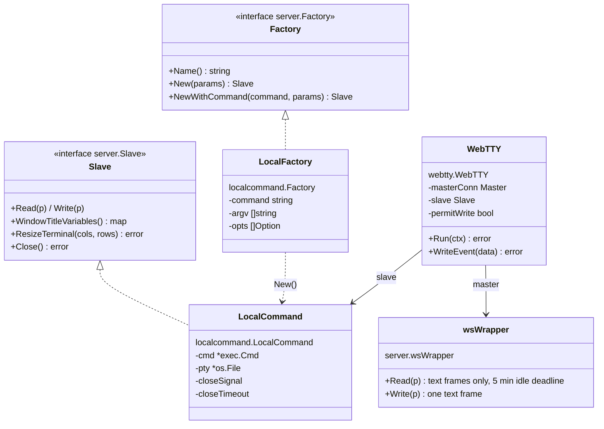
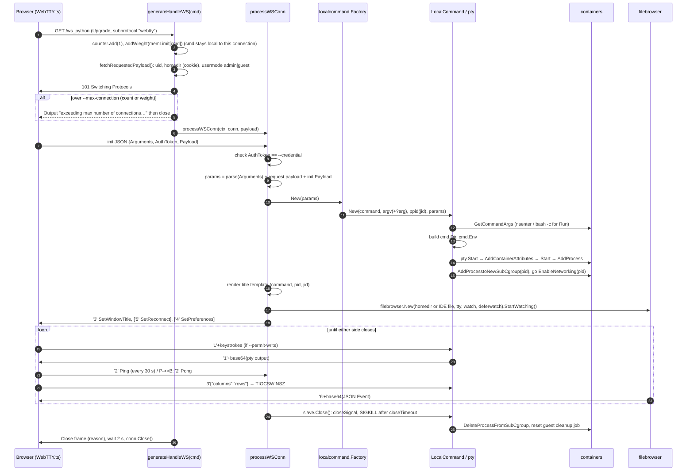

# LLD 02: Terminal sessions and the WebTTY protocol

Scope: `src/server/handlers.go` (`generateHandleWS`, `processWSConn`), `src/server/{ws_wrapper,slave,init_message,handler_atomic}.go`, `src/webtty/*`, `src/backend/localcommand/*`, `src/github.com/kr/pty/run.go`. Client side: `src/js/src/{webtty,websocket,gotty}.ts`.

## 1. Types



`webtty.Master` is just `io.ReadWriter`. `wsWrapper` adapts a gorilla `*websocket.Conn` to it.

## 2. Connection lifecycle



## 3. Wire protocol

Transport: WebSocket **text** frames, subprotocol `webtty` (`webtty.Protocols`). The first byte of each frame is the message type.

### Client → server

| Byte | Const (`webtty/message_types.go`) | Payload |
|---|---|---|
| (first frame) | n/a | JSON `server.InitMessage` (see below). |
| `'1'` | `Input` | Raw UTF-8 keystrokes. Ignored unless `--permit-write`. |
| `'2'` | `Ping` | none |
| `'3'` | `ResizeTerminal` | JSON `{"columns":n,"rows":n}`. Ignored if both `--width` and `--height` are fixed. |

### Server → client

| Byte | Const | Payload |
|---|---|---|
| `'1'` | `Output` | base64 PTY bytes. Also used by `WriteMessageToTerminal` for server notices. |
| `'2'` | `Pong` | none |
| `'3'` | `SetWindowTitle` | Rendered `--title-format` (in production an XML snippet with `<title>` and `<jid>`). |
| `'4'` | `SetPreferences` | JSON hterm preferences (from the config file). |
| `'5'` | `SetReconnect` | JSON seconds (with `--reconnect`). |
| `'6'` | `Event` | base64 JSON `filebrowser.Event` (LLD 04). This type was added by OpenREPL. |

### Init message and parameter merge

```json
{ "Arguments": "?arg=-xc&arg=-noruntime&jid=…", "AuthToken": "<gotty_auth_token>",
  "Payload": { "IdeLang": "c", "IdeContent": "<base64>", "IdeFileName": "/tmp/home/…/main.c",
               "CompilerOption": "debug", "CompilerFlags": "-O2", "EnvFlags": "FOO=1 PATH=$PATH:~/bin" } }
```

`processWSConn` builds `params` (a `url.Values`) in three steps. Later steps overwrite earlier keys:

1. The query in `Arguments`, only if `--permit-arguments` (default true).
2. The server-derived request payload: `uid`, `homedir` (from `cookie.GetOrUpdateHomeDir`), `usermode` (`admin`/`guest`).
3. The client `Payload` map.

Keys the backend reads: `arg` (extra argv), `jid` (fork parent), `uid`, `homedir`, `usermode`, `IdeLang`, `IdeContent`, `IdeFileName`, `CompilerOption`, `CompilerFlags`, `EnvFlags`. `utils.Iscompiled(params)` is true when both `IdeLang` and `IdeContent` are present. See LLD 04.

## 4. Starting the REPL (`localcommand.New`)

1. If a `jid` is given, it must decode to a PID that `containers.IsProcess` knows about. Otherwise the connection fails.
2. `containers.GetCommandArgs` builds the argv. See LLD 03 for the `nsenter` prefix and the Run form `/bin/bash -c <script> <file|content> <flags>`.
3. It sets the working directory:
   - **Fork:** the parent's `$HOME` (read from `/proc/<ppid>/environ`), falling back to its cwd.
   - **Otherwise:** `homedir`, or `user.GetHomeDir(uid)`, created with `MkdirAll`.
   - **Guest:** also schedules the `REMOVE-<dir>` cleanup job.
4. For `bash`, it writes a `.bashrc` with a coloured `PS1`.
5. It builds the environment: the gotty process environment plus `TERM=xterm`, `GOPATH=/opt/gotty/`, `GOCACHE=/tmp/go_cache/…`, `HOME=<dir>`, `HOSTNAME=<command>`, `GCC_EXEC_PREFIX`, `IdeLang`, `CompilerOption`, `IdeFileName`, and `PATH+=:/opt/gotty/bin`. After those come the client `EnvFlags` (space-separated; `$VAR` is expanded against the server environment and `~/` is replaced with `homedir/`).
6. It calls `pty.Start(command, cmd, ppid, params)`. This is the patched kr/pty: it opens the pty/tty pair, sets `Setsid` and `Setctty`, applies container attributes when not forking, starts the process and adds it to the parent cgroup.
7. It moves the PID into its own memory cgroup and brings up loopback in the new net namespace.
8. A goroutine waits for the process to exit. It then closes the PTY, deletes the sub-cgroup, and (for guests) resets the workspace cleanup job.

`LocalCommand.Close()` sends `closeSignal`, waits for the PTY to close, and escalates to SIGKILL after `closeTimeout`. `ResizeTerminal` issues `TIOCSWINSZ` on the PTY fd.

## 5. WebTTY pumps

`WebTTY.Run` sends the initialize messages and starts two goroutines:

- **slave → master:** reads up to 1 KiB from the PTY and writes `'1'+base64`.
- **master → slave:** reads a frame and dispatches on its first byte.

Writes to the WebSocket are serialized by `writeMutex`, which lets the file browser (`WriteEvent`) share the connection safely. The first goroutine to fail ends the session with `ErrSlaveClosed` or `ErrMasterClosed`, and the handler turns that into the close reason.

## 6. Timeouts and limits

| Limit | Where | Value |
|---|---|---|
| Idle read deadline | `wsWrapper.Read` | 5 min per read. The client pings every 30 s, so only dead peers hit it. |
| Hard session length | `processWSConn`: `conn.SetWriteDeadline(now + DEADLINE_MINUTES)` | 60 min. The deadline is set once, so the first write after 60 min fails and the session ends. |
| Server admission | `generateHandleWS` + `counter` | Refused if `connections > --max-connection` **or** `Σ memLimit(MB) > --max-connection` (when non-zero). |
| Client connections per browser | `js/src/cookie.ts` `maxconnections = 3` | Counted in the `Session` cookie (15 min expiry). |
| Terminal tabs per page | `js/src/main.ts` `MAX_TABS = 5` | |
| Graceful drain | `Server.Run` → `counter.wait()` | Waits for all sessions on shutdown. |
| `--once`, `--timeout` | GoTTY semantics | Single client, and exit after an idle period with zero connections. |

## 7. Client side (summary)

`GottyTerminal.spawnGotty(option, eventname)` (`gotty.ts`):

1. Chooses `Xterm` or `Hterm`. Hterm lives in `hterm.js` and is loaded first, so for it the steps below run once that file arrives.
2. Builds `wss://host/ws_<option>` + `location.search` (+ C-mode args).
3. Builds the payload through `updatePayload`.
4. Creates `WebTTY(term, ConnectionFactory, FireTTY, payload, args, gotty_auth_token)` and calls `open()`.

`WebTTY.open()` (`webtty.ts`) sends the init JSON on open, wires resize, input and ping, decodes output, and parses the XML title to learn the `jid` (primary tab only). It forwards `Event` messages to the file browser handler and to Firebase. See LLD 06 for tabs and sharing.

### Close reasons and the `ttystate` event

`generateHandleWS` puts the reason in the WebSocket close frame. When the command ends because it was killed with SIGKILL (which is how the memory cgroup stops it), `processWSConn` asks the slave for `ExitReason()` and returns `errSlaveKilled`, so the reason becomes `local command: killed` instead of `local command`. `LocalCommand` records what `cmd.Wait()` returned before it closes `ptyClosed`.

`webtty.ts` turns each connection change into a bubbling `ttystate` DOM event on the terminal element, which `scribbler.js` uses for the tab dots, footer and banner (LLD 06):

| `detail.state` | `detail.kind` | When |
|---|---|---|
| `connecting` | | Before `connection.open()`, including after a reconnect. |
| `connected` | | In `onOpen`. |
| `closed` | `exited` | Code 1000, reason `local command`: the program ended. |
| `closed` | `killed` | Code 1000, reason `local command: killed`: stopped by SIGKILL, usually the memory limit. |
| `closed` | `failed` | The reason contains `failed to create backend`: the REPL could not start, for example a missing binary or a container that could not be created. |
| `closed` | `timeout` | The reason mentions a timeout, for example the 60-minute write deadline. |
| `closed` | `closed` | Code 1000, reason `client`: the server saw the client close it. |
| `closed` | `limit` | The browser already has the maximum number of connections. |
| `closed` | `lost` | Anything else, such as a dropped network or a server restart. |

`detail.compiled` is true for Run and Debug sessions.

When the page has a `#term-banner` and the stop gets a banner, `webtty.ts` no longer prints the generic "connection closed by remote host" (and "Resource unavailable") lines under it. The "[Program Exited]" and "[Program stopped: …killed…]" lines and the shared-session "[Primary Terminal is disconnected…]" line are still printed.

When the page closes a connection itself (Reconnect, a language switch, Run, closing a tab), the closer sets `closedByPage` and that connection's close event emits nothing and schedules no reconnect. The browser sends no status code, so the event arrives as code 1005 about 2 s later (the server sleeps before closing the socket), after the new connection on the same terminal element has already reported `connected`. Without the flag it was classified `lost` and showed "Connection lost" on a working REPL.
