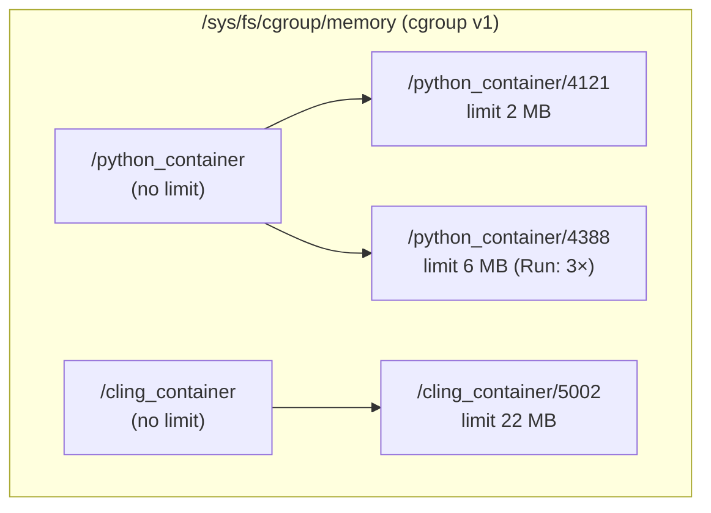
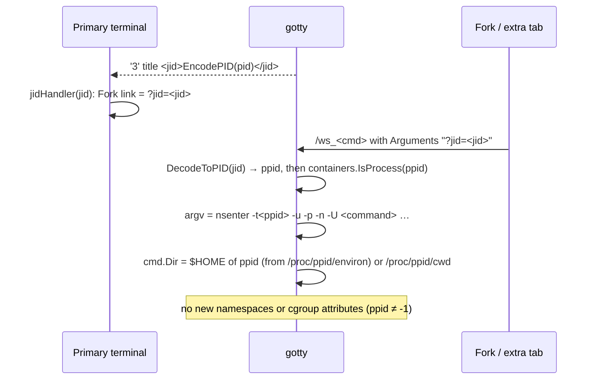
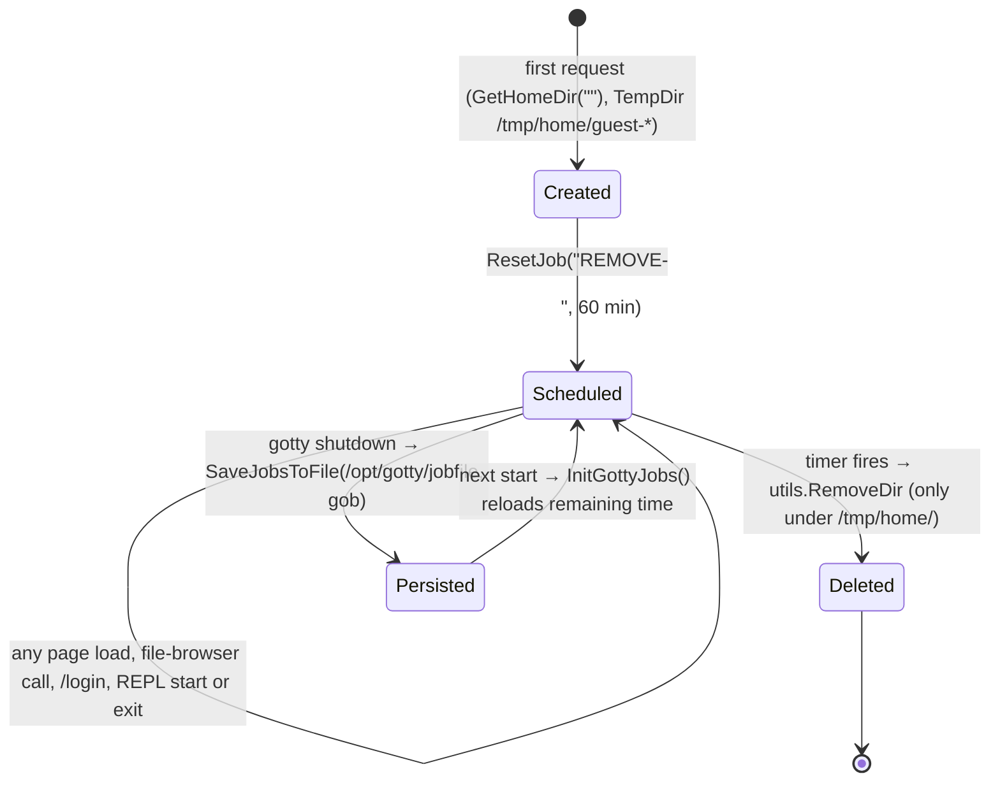

# LLD 03: Sandboxing and resource limits

Scope: `src/containers/{container.go,container_linux.go,container_notlinux.go}`, `src/encoder/encode.go` (jid), `src/utils/jobscheduler.go`, `src/filebrowser` (quota), `src/server/handler_atomic.go` (admission).

## 1. Container model

OpenREPL does not use a container runtime. Each REPL is a normal child process of `gotty` that is:

- **Cloned into new namespaces**, set by `SysProcAttr.Cloneflags` on `exec.Cmd`.
- **Placed in a cgroup v1 memory cgroup** of its own, through `github.com/containerd/cgroups` (`cgroups.V1`).



- `containers.InitContainers()` (at start-up) creates one parent cgroup `/<command>_container` for every key in `Commands2memLimitMap`. It first deletes any stale cgroup of that name. For each container it creates successfully, it also creates `/tmp/home/` and `/tmp/home/<command>/` with mode 0777.
- `container.AddProcesstoNewSubCgroup(pid, iscompiled)` creates the child cgroup `<pid>` with `memory.limit = Commands2memLimitMap[cmd] MB`, tripled for Run/compile. It then moves the PID in and records it in `SubCgroups[pid]`.
- `DeleteProcessFromSubCgroup(pid)` removes it when the process exits. `DeleteContainers()` removes the parents on shutdown.
- If `cgroups.New` fails (for example on a cgroup v2 host, or in Docker without `--privileged` and the `/sys/fs/cgroup` mount), the command gets **no** entry in `Containers`. Every later call becomes a no-op, so the REPL runs with no namespaces and no memory limit. The log line `Unable to create Container` is the signal.
- The CPU limit code is present but commented out, so only memory is limited.

### Namespaces

`NewContainer` sets up these attributes for each command:

| Field | Value |
|---|---|
| `Cloneflags` | `CLONE_NEWUTS \| CLONE_NEWPID \| CLONE_NEWNS \| CLONE_NEWNET \| CLONE_NEWUSER` |
| `Unshareflags` | `CLONE_NEWNS \| CLONE_NEWNET` |
| `UidMappings` / `GidMappings` | container 0 → host uid/gid of the gotty process, size 1 |

`AddContainerAttributes` copies `Cloneflags` and the ID maps (not `Unshareflags`) onto the command. When `params["usermode"] == "admin"`, it clears `CLONE_NEWNET` (`admin_privileges`), so admin REPLs share the host network. For everyone else, `EnableNetworking(pid)` runs `nsenter -n -t<pid> ifconfig lo up`, which gives the REPL a loopback-only network.

The REPL's environment is built in `localcommand.New`. It starts from gotty's own, minus the server's settings and anything whose name looks like a secret (`utils.ChildEnviron`: the `OPENREPL_` and `GOTTY_` prefixes, and the words `TOKEN`, `SECRET`, `PASSWORD`, `PASSWD`, `CREDENTIAL`, `API_KEY`, `APIKEY`, `ACCESS_KEY` and `PRIVATE_KEY` anywhere in a name). The `EnvFlags` the IDE sends (the environment-variables box) are expanded with `utils.ExpandIn` against that same list, never against gotty's own environment, so a `$NAME` in the box can only name a variable the REPL already has.

The mount namespace is new, but the root filesystem is not changed (no `pivot_root` or chroot). A REPL sees the same filesystem as the gotty process, with that process's permissions: root inside the Docker image, `gottyuser` under systemd. Separating workspaces relies on each REPL's cwd and `$HOME`, not on filesystem isolation (LLD 10).

On non-Linux builds (`container_notlinux.go`), all of these are stubs: there are no namespaces or cgroups, and `GetCommandArgs` still handles Run.

## 2. Fork and tabs: joining a running REPL (`jid`)



- **Encoding.** `EncodePID(pid) = base64url(pid × p)`, where `p` is a random 16-bit prime generated when the process starts (`encoder.smallsecret`). `DecodeToPID` reverses it, and returns -1 for an empty or invalid value. Links stop working after a server restart.
- **Validation.** `IsProcess(ppid)` checks every container's `SubCgroups`, so only live, OpenREPL-managed REPLs can be joined.
- **Home directory.** `cookie.GetOrUpdateHomeDir` gives `jid` top priority, so the file browser of the forked tab points at the parent's workspace.
- **Tabs.** The browser adds the primary tab's `jid` to every secondary tab (`WebTTY` constructor), so all tabs in a page share one namespace set. This is why a server started in one tab is reachable from another.
- **nsenter.** It is called with `-u -p -n -U` (UTS, PID, net, user). The mount namespace is not joined. `gotty.service` makes `/usr/bin/nsenter` setuid (`chmod 4755`).

## 3. Admission control (memory weights)

`Commands2memLimitMap` values (MB) are used in two ways: as the cgroup limit and as a **weight** for admission.

```text
on connect:  n  = counter.add(1)
             w  = counter.addWieght(memLimit[command])      // 0 if unknown
             if maxConn != 0 and (n > maxConn or w > maxConn): reject
on close:    counter.done(); counter.removeWieght(memLimit[command])
```

With `--max-connection 2564` (production), that is a budget of about 2.5 GB of REPL memory limits, which matches `MAX_MEMORY_LIMIT = 2564`. For example, it allows about 20 concurrent Java REPLs or about 1,280 Python REPLs.

## 4. Disk quota

`filebrowser.MAXDISKUSAGE_MB = 50` per workspace root:

- `filebrowser.New` walks the root and sums the file sizes. If the total is over 50 MB, the WebSocket session is refused with a message asking the user to delete files.
- Create and copy operations (`ProcessEventRequests`) and `/upload_file` return **507 Insufficient Storage** once over the quota.
- Writes made by the REPL itself are not limited at write time. They are only counted the next time a session opens.

## 5. Guest workspace lifecycle



- The key is `REMOVE-<absolute dir>`. `JobScheduler` keeps `name → {ExpirationTime, *time.Timer}` under a mutex.
- On reload, jobs whose time has passed fire immediately. The reload callback removes the directory named in the job.
- Signed-in users' directories (`/tmp/home/<id>`) are never scheduled for deletion. They still live under `/tmp`, so they survive only as long as that filesystem does (LLD 10).
