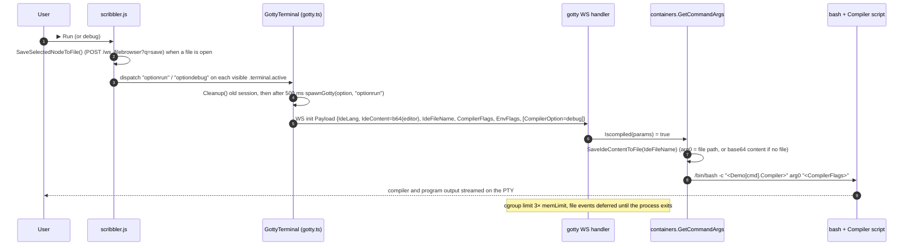

# LLD 04: IDE: Run/Debug, demos and files

Scope: `src/resources/meta/demos.xml`, `src/utils/{demo,utils}.go`, `src/server/utils.go` (`InitCommands2DemoMap`, `handleDemo`), `src/containers/container_linux.go` (`GetCommandArgs`), `src/filebrowser/filebrowser.go`, `src/server/handlers.go` (`handleFileBrowser`, `handleFileUpload`). Client: `src/resources/js/scribbler.js`, `src/js/src/gotty.ts`.

## 1. REPL catalog: `demos.xml`

`demos.xml` is embedded as `static/meta/demos.xml` and loaded lazily into `utils.Commands2DemoMap` (`map[command]Demo`). This happens on the first `/demo` call or when routes are set up.

```go
type Demo struct {
    Name     string   // backend command, also the WS route suffix: /ws_<Name>
    Prefix   string   // optional launcher placed before the command in REPL mode (no entry uses it today)
    Github   string   // link shown in the UI
    Codes    []Codes  // animated demo: []{Name, []Code{Prompt, Statement, Result}}
    Usage    []Usage  // meta-command table: []{Command, Description}
    Doc      string   // docs link, e.g. ./docs/gointerpreter.html
    Content  string   // starter code placed in the editor
    Compiler string   `json:"-"` // bash script used by Run; never sent to the browser
}
```

`GET /demo?q=<command>` returns `{"Status":"SUCCESS|FAILED","ErrorMsg":"","Demo":{…}}`. The page (`scribbler.js` → `actionOnchange`) uses the response to:

- type out the demo in the "Getting Started" panel (`PrintDemo`),
- fill the usage table (`PrintUsage`),
- set the GitHub and docs links,
- load `Content` into the editor, except on `/practice`.

Every REPL in the catalog has starter code in `Content`: a short program that prints something and shows the language's basics (a function, a loop or collection, string formatting). It must run as-is with **Run**. A shared code link (`?s=<id>`, LLD 06) replaces it once it has loaded.

## 2. Run and Debug pipeline



### Compiler script contract

A Run request executes `/bin/bash -c "$SCRIPT" "$ARG0" "$FLAGS"` (the `Prefix` is not used). The script can rely on:

| Input | Meaning |
|---|---|
| `$0` | Path of the saved editor file (`IdeFileName`), or the base64 editor content when no file is selected. Scripts decode it with `echo $0 \| base64 --decode`. |
| `$1` | The *Compiler/Repl Args* text box, passed as one string. |
| `$IdeLang` | The UI option value (`c`, `cpp`, `go`, `python`, …), so one backend (for example `cling`) can pick `gcc` or `g++`. |
| `$CompilerOption` | `debug` when **debug** was pressed. Scripts then add `-g` and launch `openrepl-gdb` (below) instead of a bare `gdb`. |
| `$IdeFileName`, `$HOME` | The same file path, and the workspace directory. |
| client `EnvFlags` | Extra variables from the *Env Vars/Paths* box. |

Scripts usually write `test.<ext>` into `$HOME` when there is no file, compile it, run it, and `printf "\n"` at the end.

### Debug on a host without ptrace (`openrepl-gdb`)

gdb traces the program with `ptrace`, and not every host has it: a Raspberry Pi worker runs the amd64 image under `qemu-user` (`ptrace` answers "Function not implemented"), and x86 code under Rosetta can start a traced child but not read its registers (`Couldn't get registers: Input/output error`). Scripts therefore start `openrepl-gdb [--gdb rust-gdb] PROGRAM [gdb arguments]` (`scripts/openrepl-gdb`, installed to `/usr/local/bin`), which asks `openrepl-ptrace-probe` (`scripts/ptrace-probe.c`, built once by the install script) and takes one route:

| Route | When | What it does |
|---|---|---|
| `ptrace` | The probe passes (it forks a child, traces it and reads its registers). | `exec gdb` as before. If only the address randomization cannot be switched off (the probe's exit 2), gdb gets `set disable-randomization off`, so it does not warn. |
| `emulator` | The probe fails and `QEMU_VERSION=1 /bin/true` prints a `qemu-` version: the container itself runs under qemu-user (the Pi workers). | Starts the program with `QEMU_GDB=<port>` in its environment, which makes the emulator that runs it wait for gdb on that port. No second emulator, no extra slowdown. |
| `qemu` | The probe fails, there is no emulator around, and the host is x86-64 (Rosetta, a sandbox). | Runs the program as `QEMU_GDB=<port> QEMU_LD_PREFIX=/ qemu-x86_64 PROGRAM` (`qemu-user` from apt). |
| none | Neither. | Prints "Debugging is not available on this server" and "Run still works", exit 1. |

On the last three routes gdb is started with `set sysroot /` and `target remote 127.0.0.1:<port>`, on a free port chosen per session. It only connects: the user sets breakpoints and continues. qemu describes its registers to gdb in XML, so these routes need a gdb built with XML support (`gdb --configuration` shows `--with-expat`). The helper takes the first `gdb` on the `PATH` that has it (for `rust-gdb`, it sets `RUST_GDB`). The gdb 8.1.1 the repo bundles as `bin/gdb` has none and, when it is first on the `PATH`, fails with `Remote 'g' packet reply is too long` and lets the program run away; Ubuntu's gdb (installed by the install script) is used instead, and if there is none the helper says so before it starts the program. The program starts paused at its first instruction, because a remote target cannot "run": `run` and `r` are redefined to `continue`, and the helper prints a two line banner saying so. The program keeps the terminal for its input, and Ctrl-C reaches gdb only (the shell ignores it for the background job), which interrupts the program. When gdb ends, or the terminal closes (a small watcher notices that `/dev/tty` is gone, because a gdb that waits for a running remote program ignores the hangup), the helper stops the program.

`OPENREPL_GDB_ROUTE=ptrace|emulator|qemu` forces a route; the install script's test uses `qemu`. Known limits of the QEMU routes: x86-64 only, slower than native, and a program that uses the 32-bit `int 0x80` system call gate does not work under qemu-user (the assembly sample uses `syscall`, which does). The assembly REPL (rappel) cannot work without `ptrace` at all: `/usr/local/bin/rappel` is a wrapper (`scripts/openrepl-rappel`) that runs the probe first and, if `ptrace` is missing, tells the user to use the editor's Run or Debug; otherwise it starts the real rappel (`OPENREPL_RAPPEL_BIN`, default `/opt/gotty/rappel/bin/rappel`).

### Language routing on the client

`handleTerminalOptions` (`gotty.ts`):

- **`java`:** the normal backend path (`/ws_java`) for both. The interactive terminal runs a tuned `jshell` (`utils.InteractiveCommand`, used by `containers.GetCommandArgs`; LLD 09 "Java"); Run compiles and runs the file with the compiler script of `demos.xml`. Share and Fork work as for any REPL. (It used to be an iframe to tryjshell.org because of the memory of a JVM.)
- **`javascript`:** always an iframe to `./jsconsole.html`, which evaluates in the browser. The share button is disabled.
- **Everything else:** a WebSocket to `/ws_<option>`. `c`, `cpp` and `go` map server-side to `cling`, `cling` and `gointerpreter`.

## 3. File browser

### Backend object

```go
type Filebrowser struct {
    Root             string            // homedir, or the IDE file's directory for Run
    watcher          *fsnotify.Watcher // nil for HTTP (stateless) use
    eventwriter      Eventwriter       // the session's *webtty.WebTTY (WriteEvent)
    watcherMap       map[string]bool
    deferwatch       bool              // queue events, flush on Close()
    pendingnotiflist []*Event
    size             float64           // MB, computed at construction
}
type TreeNode struct { Id, Text, Type string; Children []TreeNode } // Type: "default" (dir) | "file"
type Event    struct { Name string; Op fsnotify.Op; Type string; NewName string }
```

There are three ways to construct it:

| Caller | `watch` | `deferwatch` | Behaviour |
|---|---|---|---|
| REPL session (`processWSConn`) | true | false | Recursive watch of the homedir. Every create, remove or write is pushed at once as a `'6'` Event frame. |
| Run session (`processWSConn`, `Iscompiled`) | true | true | Watches only the root (the IDE file's parent). Events are queued and flushed by `Close()` when the program exits, so build output doesn't flood the browser. |
| HTTP APIs | false | true | Stateless helper for tree, load, save, zip, ops and quota. |

When a directory is created (for example by unzipping), the watcher walks the new tree and adds a watch on each subdirectory. It also emits synthetic create events for everything inside, so the jstree view stays in sync. `Chmod` events are ignored. `fsnotify.Op` is a bitmask: Create=1, Write=2, Remove=4, Rename=8, Chmod=16.

### HTTP API (`/ws_filebrowser`)

`filepath` must start with the caller's homedir (from `cookie.GetOrUpdateHomeDir`), and defaults to the homedir.

| Method and query | Body | Result |
|---|---|---|
| `GET` | n/a | `TreeNode` JSON of `filepath` (jstree `core.data`). |
| `GET ?q=load&filepath=F` | n/a | base64 of file F (`text/plain`). |
| `GET ?q=zip&filepath=D` | n/a | `application/zip` stream of D (`Writezip`). |
| `GET ?q=usage` | n/a | `{usedMB, limitMB, guest, deleteAfterMinutes}` for the workspace card in the Files panel. |
| `POST ?q=save&filepath=F` | base64 content | Writes F. |
| `POST` | JSON `Event` | Performs the operation: `Op&Create` makes a dir or file (with `NewName`, it copies `Name → NewName`); `Op&Remove` deletes; `Op&Rename` renames `Name → NewName`. Creates are refused with 507 when over quota. |

Slaves (shared viewers) and forked tabs reach the owner's workspace by adding `jid=` or `homedir=` to these URLs (`preprocessurl` in `scribbler.js`).

### Upload (`POST /upload_file`)

- The form has two fields: `file`, and `checksum` (SHA-256 hex computed in the browser).
- The server parses the multipart form with 5 MB in memory, rejects the upload with 507 when over quota, and strips a UTF-8 BOM. It writes `homedir/<filename>` with mode 0644.
- A checksum mismatch is only logged.
- The browser enforces `MAX_FILESIZE = 20 MB` and says so in its error notice.

### Client integration (`scribbler.js`)

- **Tree.** jstree is fed by `GET /ws_filebrowser`, with context-menu operations mapped to the `Event` POSTs. File icons come from `filename2IconClass`.
- **Context menu.** Built in the jstree `contextmenu` config in `page/07-file-browser.js`. Folder nodes get New (File, Folder), Rename, Cut, Copy, Paste, Save (disabled), Download and Delete; file nodes drop New and enable Save. Items are grouped by separators, Delete is last and carries the class `ctx-danger`, and every item has an icon class (`ctx-i-*`, drawn as a mask in `ui-refresh.css`). Cut, Copy, Paste and Save show their Cmd or Ctrl shortcut. jstree runs the item whose `shortcut` key code is pressed while the menu is open, so a string shortcut (`"off"`) is used on disabled items to show the label without binding the key. Protected nodes (`state.disabled`) have Rename, Cut, Copy and Paste disabled.
- **Selecting a file.** `LoadSelectedNodeFromFile` loads it (`q=load`) into Ace and sets `editor.env.filename`, which becomes `IdeFileName` on Run. The previously open file is saved first (`SaveSelectedNodeToFile`), and the language is switched by extension (`changelangbyselectednode`).
- **Live events.** `setEventHandler(eventhandler)` applies `'6'` events and Firebase `filebrowser-event`s to the tree: create_node, delete_node, refresh.
- **Empty workspace.** `updateFilesEmptyState` shows `#files-empty` ("No files yet. Upload a file, or right-click the folder above to create one.") while the root folder has no children. It runs after jstree's ready, refresh, load, create, delete, move and copy events.

## 4. Files with workspace sync

With `--workspace-sync` on a gateway ([LLD 12](12-workspace-sync.md)) the file browser and upload routes behave as follows:

- **Worker online.** Requests are forwarded to the worker unchanged, so a file is saved and run on the same disk. The worker first waits until the home is in step with the gateway's copy (503 "workspace is synchronizing" if that takes over 10 seconds).
- **Worker away.** The gateway serves `ws_filebrowser` (tree, load, zip, usage, save, create, delete, rename) and `upload_file` from its own copy of the home, using the same absolute paths. Changes reach the worker when it returns.
- **Changes made by programs** in a terminal (compilers, redirection, `rm`, `mv`) are seen by one file watcher per node and sent to the other side; they appear in the browser's tree through the existing per-terminal watcher as before.
- Files over 50 MB, sockets, FIFOs and device files are not synchronized, and names that start with `.wsync-` are reserved.
