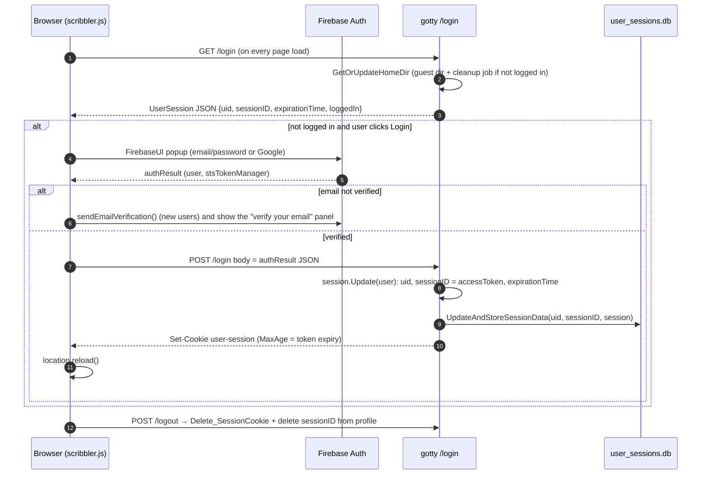
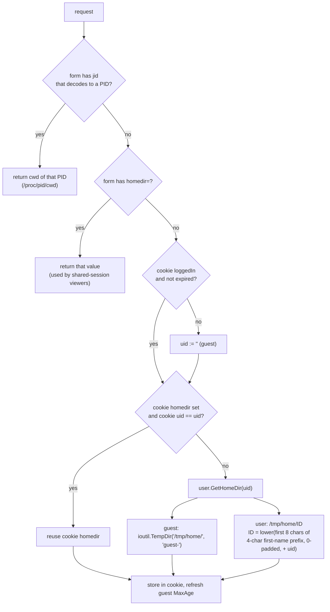

# LLD 05: Auth, sessions and storage

Scope: `src/user/{user,util}.go`, `src/cookie/cookie.go`, `src/cachedb/cachedb.go`, `src/server/{db,blog_db}.go`, sign-in code in `src/resources/js/scribbler.js`.

## 1. Sign-in flow

Identity comes from **Firebase Authentication**, which runs in the browser through FirebaseUI (email/password and Google). The Go server keeps its own session, keyed by the Firebase `uid`.



- A user can hold several sessions (browsers or devices), stored in `UserProfile.SessionMap[sessionID]`.
- `IsSessionExpired(uid, sessionID)` treats a missing or expired entry as logged out, and starts `PurgeExpiredSessionData` in the background.
- The session lifetime follows the Firebase ID token expiry (`stsTokenManager.expirationTime`), which is usually about 1 hour. There is no server-side refresh. The browser signs in again when the session ends.

## 2. The `user-session` cookie

This is a gorilla `sessions.CookieStore`. It is HMAC-signed with `SESSION_KEY`, a random 128-bit prime created once and stored in `user_sessions.db`. It is not encrypted, and its path is `/`.

| Key | Set by | Meaning |
|---|---|---|
| `uid`, `sessionID`, `loggedIn`, `expirationTime` | `Set_SessionCookie` (`/login`) | Session identity. |
| `homedir` | `Set_SessionCookie`, `GetOrUpdateHomeDir` | The workspace path for this browser. |
| `OPENAI_REQUEST_COUNT`, `OPENAI_REQUEST_LAST_ACCESS` | chat proxy | Token-bucket balance and time of last refill (LLD 07). |
| `ACCESS_TOKEN`, `ACCESS_SECRET` | `/config.js` | Per-session chat-proxy access token material (LLD 07). |

`MaxAge` is the remaining token lifetime for signed-in users. For guests it is refreshed to `DEADLINE_MINUTES × 60` (3600 s) on each homedir lookup (`UpdateGuestSessionCookieAge`).

## 3. Home directory resolution

`cookie.GetOrUpdateHomeDir(rw, req, uid)` is called by most handlers and by every WebSocket connect:



A signed-in user's directory name is derived from their profile name and `uid`, so it is the same on every device.

## 4. Persistent stores

All server-side stores are embedded **UnQLite** databases (`github.com/nobonobo/unqlitego`) under `utils.GOTTY_PATH = /opt/gotty`.

| File | Wrapper | Key → value | Used by |
|---|---|---|---|
| `user_sessions.db` | `cachedb.Database` (UnQLite + 15 MB `freecache`, write-through, read-through) | `SESSION_KEY` → cookie HMAC key; `<uid>` → `UserProfile` JSON | `user`, `cookie` |
| `feedback.db` | raw UnQLite | `<UnixNano timestamp>` → `{Name, Email, Message}` | `/feedback` |
| `blog.db` | raw UnQLite | `<blog name>` → `BlogPost` JSON | `/blog` |
| `jobfile` | `encoding/gob` | `map[name]*Job{Name, ExpirationTime}` | `utils.GottyJobs` (written on shutdown, read and deleted on start) |
| `.gitconfig` | text (read-only at runtime) | admin email, OpenAI key, allowed host | LLD 01, 07 |

Every write calls `Commit()` right away. Listing uses UnQLite cursors (`FetchFeedbackDataMap`, `FetchBlogDataMap`).

### Data models

```go
// user/user.go
type User        struct { Uid, Name(displayName), Email, PhotoURL string; StsTokenManager{AccessToken, RefreshToken string; ExpirationTime int64} }
type UserSession struct { Uid, SessionID string; ExpirationTime int64; LoggedIn bool; User *User /* only on the wire */ }
type UserProfile struct { Uid, Name, Email, PhotoURL string; SessionMap map[string]UserSession }

// server/db.go, server/blog_db.go
type feedback struct { Name, Email, Message string }
type BlogPost struct { Name, Title, Desc, Content string; Lastupdated time.Time }
```

`/profile?q=json` returns `UserProfile` with `SessionMap` set to nil.

## 5. Browser-side state

| Store | Key | Purpose |
|---|---|---|
| localStorage | `OpenREPL_Demo` | Set to `done` after the first-visit intro tour. |
| localStorage | `questions`, `bookmarkedRows`, `topic`, `difficultyLevel`, `temperature` | Practice mode: generated questions (latest 100) with per-language code, completed set, last filters, LLM temperature. |
| localStorage | theme key (`LS_THEME_KEY`) | Selected editor theme. |
| cookie | `Session` | Count of open terminal connections in this browser, capped at 3 (LLD 02). |
| Firebase RTDB | `openrepl/<dbpath>/<termId>/…` | Live-sharing event log (LLD 06). |
| Firebase RTDB | `chat-list/<dbpath>/…` | Genie chat history for the session (LLD 07). |

Practice progress and generated questions live only in the browser. They are not tied to the signed-in account.
