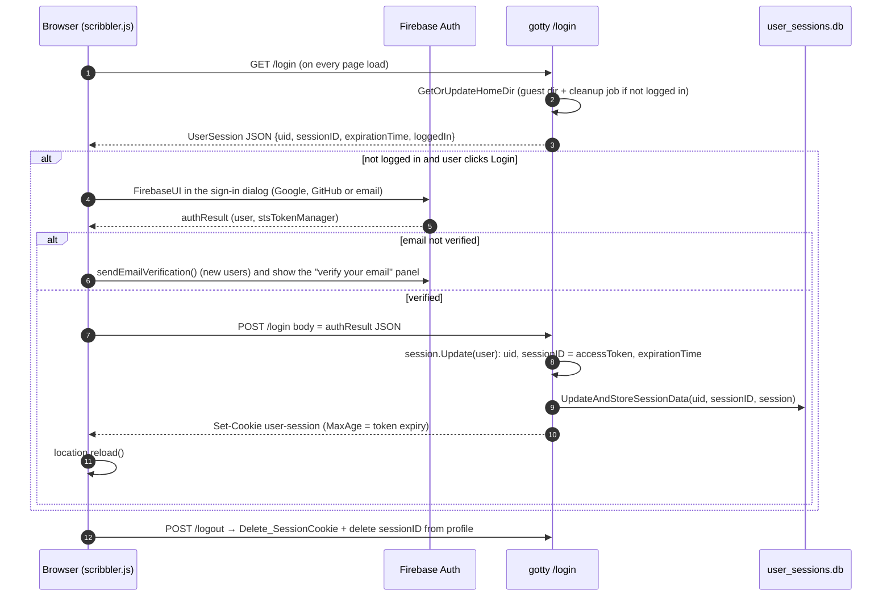
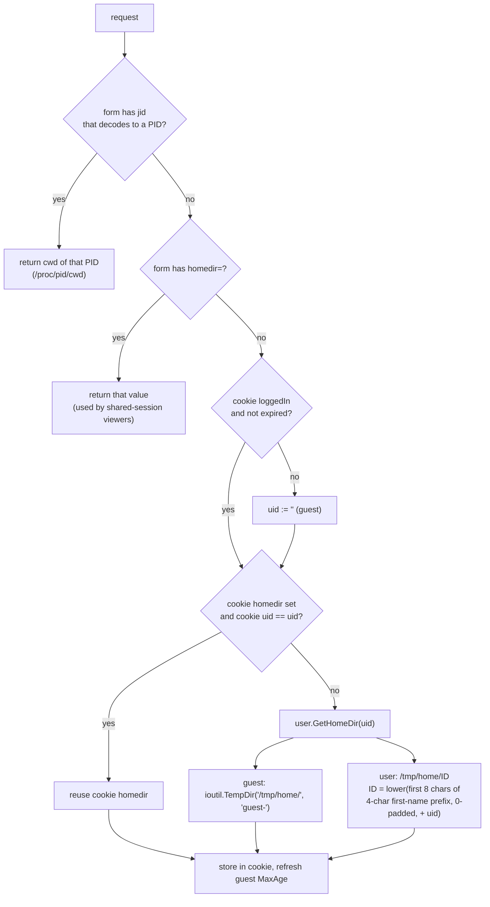

# LLD 05: Auth, sessions and storage

Scope: `src/user/{user,util}.go`, `src/cookie/cookie.go`, `src/cachedb/cachedb.go`, `src/server/{db,blog_db}.go`, sign-in code in `src/js/src/page/05-auth.js` (bundled into `scribbler.js`).

## 1. Sign-in flow

Identity comes from **Firebase Authentication**, which runs in the browser through FirebaseUI (Google, GitHub and email, shown in the sign-in dialog; LLD 06). The Go server keeps its own session, keyed by the Firebase `uid`.



- A user can hold several sessions (browsers or devices), stored in `UserProfile.SessionMap[sessionID]`.
- `IsSessionExpired(uid, sessionID)` treats a missing or expired entry as logged out, and starts `PurgeExpiredSessionData` in the background.
- The session lifetime follows the Firebase ID token expiry (`stsTokenManager.expirationTime`), which is usually about 1 hour. There is no server-side refresh. The browser signs in again when the session ends.
- `POST /login` does not verify the Firebase ID token: it trusts the `uid` in the body (launch blocker B2 in the UI tracker). Everything keyed by `uid` inherits that gap: the workspace, the admin check (LLD 01) and practice progress (section 4).

## 2. The `user-session` cookie

This is a gorilla `sessions.CookieStore`. It is HMAC-signed with `SESSION_KEY`, a random 128-bit prime created once and stored in `user_sessions.db`. It is not encrypted, and its path is `/`.

| Key | Set by | Meaning |
|---|---|---|
| `uid`, `sessionID`, `loggedIn`, `expirationTime` | `Set_SessionCookie` (`/login`) | Session identity. |
| `homedir` | `Set_SessionCookie`, `GetOrUpdateHomeDir` | The workspace path for this browser. |
| `OPENAI_REQUEST_COUNT`, `OPENAI_REQUEST_LAST_ACCESS` | chat proxy | Token-bucket balance and time of last refill (LLD 07). |
| `ACCESS_TOKEN`, `ACCESS_SECRET` | `/config.js` | Per-session chat-proxy access token material (LLD 07). |

`MaxAge` is the remaining token lifetime for signed-in users. For guests it is refreshed to `DEADLINE_MINUTES × 60` (3600 s) on each homedir lookup (`UpdateGuestSessionCookieAge`).

## 3. Home directory resolution

`cookie.GetOrUpdateHomeDir(rw, req, uid)` is called by most handlers and by every WebSocket connect:



A signed-in user's directory name is derived from their profile name and `uid`, so it is the same on every device.

## 4. Persistent stores

All server-side stores are embedded **UnQLite** databases (`github.com/nobonobo/unqlitego`) under `utils.GOTTY_PATH = /opt/gotty`.

| File | Wrapper | Key → value | Used by |
|---|---|---|---|
| `user_sessions.db` | `cachedb.Database` (UnQLite + 15 MB `freecache`, write-through, read-through) | `SESSION_KEY` → cookie HMAC key; `<uid>` → `UserProfile` JSON; `worker-pin:<uid>` → the execution node that holds the user's workspace (written by a gateway, `user/pin.go`, LLD 11); `blocked:<uid>` → `1` or `0`, set by an admin (`user/admin.go`, LLD 13) | `user`, `cookie` |
| `feedback.db` | raw UnQLite | `<UnixNano timestamp>` → `{Name, Email, Message, Read}` | `/feedback` |
| `blog.db` | raw UnQLite | `<blog name>` → `BlogPost` JSON | `/blog` |
| `snippets.db` | raw UnQLite, guarded by a mutex | `<8-character id>` → `snippet` JSON | `/snippet`, `/s/<id>` (LLD 01) |
| `practice.db` | raw UnQLite, guarded by a mutex | `u:<uid>` → `practiceDoc` JSON | `/practice/progress` |
| `jobfile` | `encoding/gob` | `map[name]*Job{Name, ExpirationTime}` | `utils.GottyJobs` (written on shutdown, read and deleted on start) |
| `.gitconfig` | text (read-only at runtime), the fallback for the `OPENREPL_*` environment variables | admin email, OpenAI key, allowed host | LLD 01, 07 |
| `settings.json` | JSON (`server/settings.go`), read once and cached, written atomically (tmp file + rename) | `SiteSettings`: colour of the day, announcement, maintenance, switched-off languages, Genie switch and rates (LLD 13); a missing file means every switch is off | `/settings.js`, `/admin` |
| `admin-audit.jsonl` | one JSON object per line, appended, mode 0600; the newest 500 are kept in memory | `{time, admin, action, detail, from}` for every change an admin made | `/admin/audit` (LLD 13) |
| `admin-stats.json` | JSON, rewritten at most every 30 seconds, mode 0600 | per day: visitors, terminals by language, and for today only the keyed hashes of the visitors seen; 60 days | `/admin/stats` (LLD 13) |

Every write calls `Commit()` right away. Listing uses UnQLite cursors (`FetchFeedbackDataMap`, `FetchBlogDataMap`).

### Data models

```go
// user/user.go
type User        struct { Uid, Name(displayName), Email, PhotoURL string; StsTokenManager{AccessToken, RefreshToken string; ExpirationTime int64} }
type UserSession struct { Uid, SessionID string; ExpirationTime int64; LoggedIn bool; User *User /* only on the wire */ }
type UserProfile struct { Uid, Name, Email, PhotoURL string; SessionMap map[string]UserSession }

// server/db.go, server/blog_db.go
type feedback struct { Name, Email, Message string }
type BlogPost struct { Name, Title, Desc, Content string; Lastupdated time.Time }

// server/snippets.go: ids use 57 unambiguous letters and digits (no 0/O, 1/l/I)
type snippet struct { Lang, Code string; Created int64 /* unix seconds */ }

// server/practice.go
type practiceState struct { Done, Del bool; T int64 /* ms of the change */ }
type practiceDoc   struct { Questions map[string]json.RawMessage; State map[string]practiceState; Updated int64 }
```

**Practice merge.** The browser sends its whole list; `mergePractice` combines it with the stored copy. For each id the newer mark wins (larger `T`; on a tie a deletion wins), and the newer copy of a question wins (larger of its `updated` and `added`). A question whose mark is `Del` is dropped, and the tombstone stays so another browser can't bring it back. Past 200 questions the oldest are dropped and marked deleted; past 1,000 marks the oldest tombstones and marks of missing questions go first. Question bodies are stored as the browser sent them (each under 64 KB).

`/profile?q=json` returns `UserProfile` with `SessionMap` set to nil.

## 5. Browser-side state

| Store | Key | Purpose |
|---|---|---|
| localStorage | `theme` | `light` or `dark` once someone uses the theme switch; absent means follow the system setting (`js/theme.js`). |
| localStorage | `files-panel` | `open` or `closed` for the Files panel in the workspace. |
| localStorage | `editor-theme` | The Ace theme picked in the status bar; absent means OpenREPL Dark (`ace/theme/openrepl_dark`). |
| localStorage | `questions`, `bookmarkedRows`, `topic`, `difficultyLevel`, `temperature` | Practice mode: generated questions (latest 100) with per-language code, the ids marked done (kept for older code), the last topic and level, LLM temperature. |
| localStorage | `practiceState` | `{id: {done, t}}` or `{id: {del: true, t}}`: done marks and deletions with the time of each change, for merging (`js/practice-store.js`). Created from `bookmarkedRows` on first use. |
| localStorage | `practiceFilters` | Status, topic, level and sort chosen on the practice list. |
| localStorage | theme key (`LS_THEME_KEY`) | Selected editor theme. |
| cookie | `Session` | Count of open terminal connections in this browser, capped at 3 (LLD 02). |
| Firebase RTDB | `openrepl/<dbpath>/<termId>/…` | Live-sharing event log (LLD 06). |
| Firebase RTDB | `chat-list/<dbpath>/…` | Genie chat history for the session (LLD 07). |

Practice questions and done marks live in the browser and, for a signed-in user, in `practice.db` too. `PracticeStore.init()` (practice list and practice editor) reads `/practice/progress`, merges it in, then sends the browser's copy to be merged on the server. Later changes are sent 1.5 s after they happen; a change left when the page closes is sent with `keepalive` when under 60 KB, otherwise on the next visit. Guests keep everything in the browser, as before.
