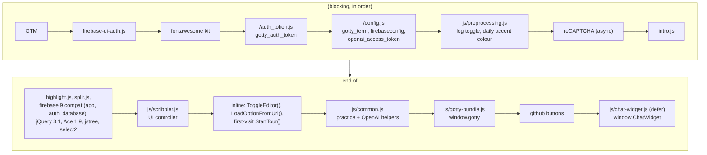
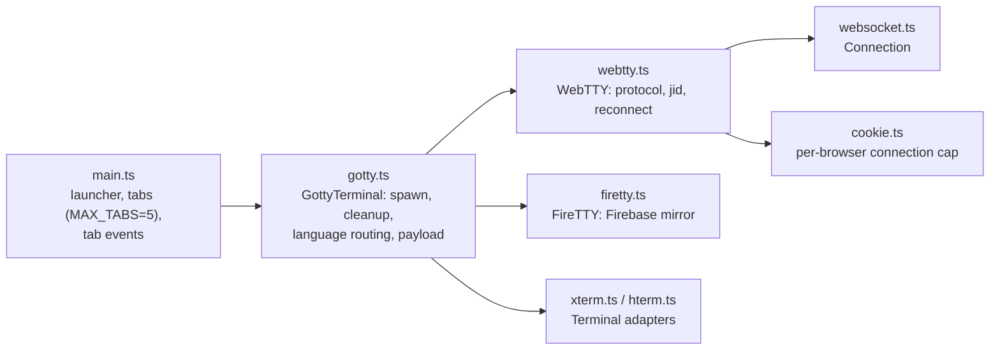
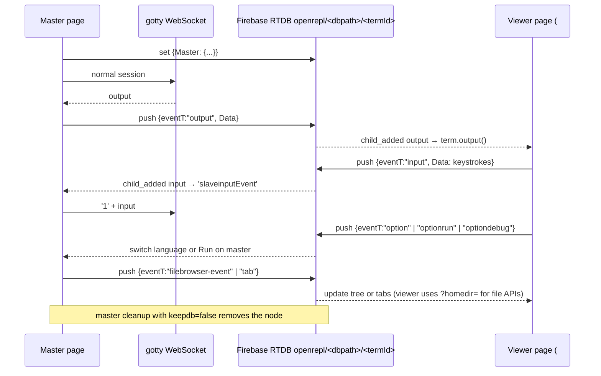

# LLD 06: Frontend

Scope: `src/resources/*.html`, `src/resources/js/*`, `src/resources/css/*`, `src/js/src/*.ts` (built into `gotty-bundle.js`), `src/resources/chat-widget/`, `src/jsconsole/`.

## 1. Pages

| URL | Source | Rendering | Notes |
|---|---|---|---|
| `/`, `/practice?<lang>&name=<q>` | `resources/index.html` | Go `html/template`, parsed once | Landing page and IDE. Practice mode is the same page with extra controls injected when `location.pathname` contains `practice`. |
| `/practice/dsa-questions` | `resources/practice.html` | template per request | Question list and generator (`scribbler-misc.js`, DataTables). |
| `/profile` | `resources/profile.html` | template with `UserProfile` | |
| `/doc.html`, `/docs/*.html` | `resources/doc.html`, `resources/docs/` | static | Per-REPL documentation (cling, gointerpreter, java, python). |
| `/about.html`, `/references.html` | static | static | |
| `/blog`, `/feedback`, error pages | `server/utils.go` templates | `CommonTemplate` | LLD 01. |
| `/editblog.html` | `resources/editblog.html` | static, admin only | |
| `/jsconsole.html` | built from `src/jsconsole` | static | JavaScript REPL iframe. |

`?<lang>` (for example `/?python`) or `?repl=<value>` preselects the language (`LoadOptionFromUrl`). `console.log` is silenced by default. A bare `?debug` (no value) keeps it on (`preprocessing.js`). `?debug=1` does **not**, because any non-empty value is treated like no flag.

## 2. Script loading and globals (`index.html`)

`scribbler.js` calls `gotty.launcher(firebaseconfig)` once the page is ready. That creates the primary terminal on `#terminal`.

### `scribbler.js` responsibilities

It is a roughly 2,100-line jQuery file with global functions:

- **Layout.** Split panes (split.js), fullscreen and rotate (`ToggleFunction`, `ToggleRotateEditor`), mobile warning.
- **Editor.** Ace setup, theme persistence, language mode from `data-editor`, `updateEditorContent`, download and upload.
- **Language switch.** `actionOnchange` fetches `/demo?q=` and renders the demo animation, usage table and links (LLD 04).
- **Run and debug.** `CompileandRun`, `RunandDebug` dispatch `optionrun` and `optiondebug`. `ToggleReconnect` reconnects.
- **File browser.** jstree, context menu, file load and save, live events (LLD 04).
- **Auth.** FirebaseUI config, `GET /login` status, account dropdown, `logout()`, profile rendering (LLD 05).
- **Intro tour.** `StartTour()` (intro.js).

## 3. Terminal engine (`src/js/src` → `gotty-bundle.js`)

webpack 2 + ts-loader (TypeScript 2.3) produces a UMD library named `gotty`, exposing `launcher`, `addTab`, `closeTab` and `setEventHandler`.

- **`GottyTerminal`** (one per tab) listens for three DOM events on its element: `optionchange` (restart with a new language), `optionrun`, and `optiondebug`. `Cleanup(keepdb, keepdbcallbacks)` closes the WebSocket and Firebase listeners before respawning.
- **`Terminal` interface** (`webtty.ts`) wraps xterm.js 2.7 (with the `fit` add-on) or hterm (libapps). Both provide the same output, input, resize, message and title calls.
- **Tabs.** The primary tab holds the real REPL. Each extra tab (`terminal-N`) opens its own WebSocket with the primary's `jid`, so it joins the same namespaces (LLD 03). Tab add, close, click and title changes are published to Firebase as `tab` events, so shared viewers follow along.

## 4. Live sharing (`FireTTY`)

A page is the **master** when the URL has no `#hash`. It is a **slave** (viewer) when it was opened as `…/#<dbpath>`. `dbpath` is the page's Firebase push key (`getExampleRef()`), and the *Share REPL* box shows `origin + path + search + "#" + dbpath`.

The event records are `{eventT, Data, uid, last?}`:

- `uid` is a random ID per page, used to ignore a page's own echoes.
- `last` is a timestamp that settles races when either side changes the language.

When a viewer opens a link whose `Master` node does not exist, it shows "Master Terminal is unavailable". Every output chunk is written to Firebase while the master is active. This is simple, but costs bandwidth (LLD 10).

## 5. Genie chat widget (`resources/chat-widget`)

The widget is TypeScript bundled with microbundle into `dist/index.umd.js` and shipped as `js/chat-widget.js`. `index.html` configures it through `window.ChatWidget.config`:

- `url = "/chat/completions"` and `api_key = openai_access_token` (LLD 07).
- `firebaseconfig`, and `dbpath = getExampleRef()`. Messages are stored under `chat-list/<dbpath>`, so a shared session also shares the chat.
- `openOnLoad` and `submitOnKeydown` on desktop.

The system message includes the current editor content, so the assistant can answer "debug my code". Code blocks in replies get **Insert** and **Replace** buttons that call `window.insertcodesnippet` and `window.replacecodesnippet`, which edit the Ace buffer. The widget's default model is `gpt-3.5-turbo`.

## 6. Practice mode

`/practice/dsa-questions` shows stored questions and a generator. `/practice?<Lang>&name=<slug>` opens a question in the IDE, where `index.html` adds the following:

- **Buttons:** Random, New Question and Mark as Completed. The Fork button is hidden.
- **Editor content:** a comment header (name, difficulty, description), a delimiter line, and the language template. Code below the delimiter is saved back into the question on Run, on language change and on unload (`SaveLastLanguageProgress`).
- **Generation:** questions and per-language templates are generated with `generateNewQuestion` and `getCodeTemplate` (`common.js`, LLD 07) and stored in `localStorage.questions` (latest 100).

## 7. JavaScript and Java REPLs

- **JavaScript:** `jsconsole.html` is a vendored build of `@remy/jsconsole`, a React app that evaluates code in the browser. No server process is involved. It is built with its own webpack config (LLD 08).
- **Java:** the interactive REPL is an iframe to `https://tryjshell.org`. Only **Run** uses the server (`/ws_java`).
