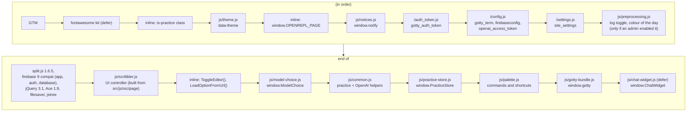
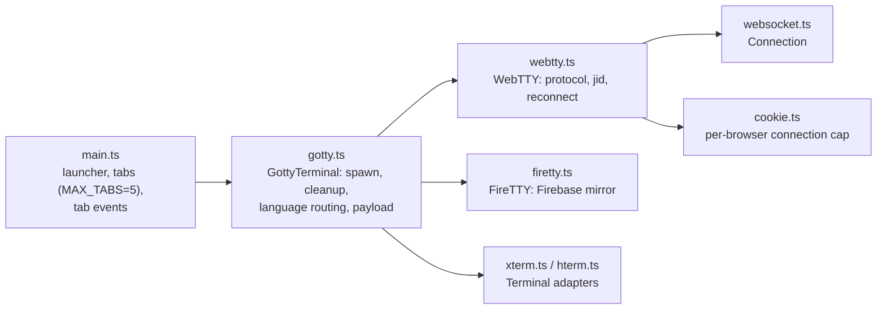
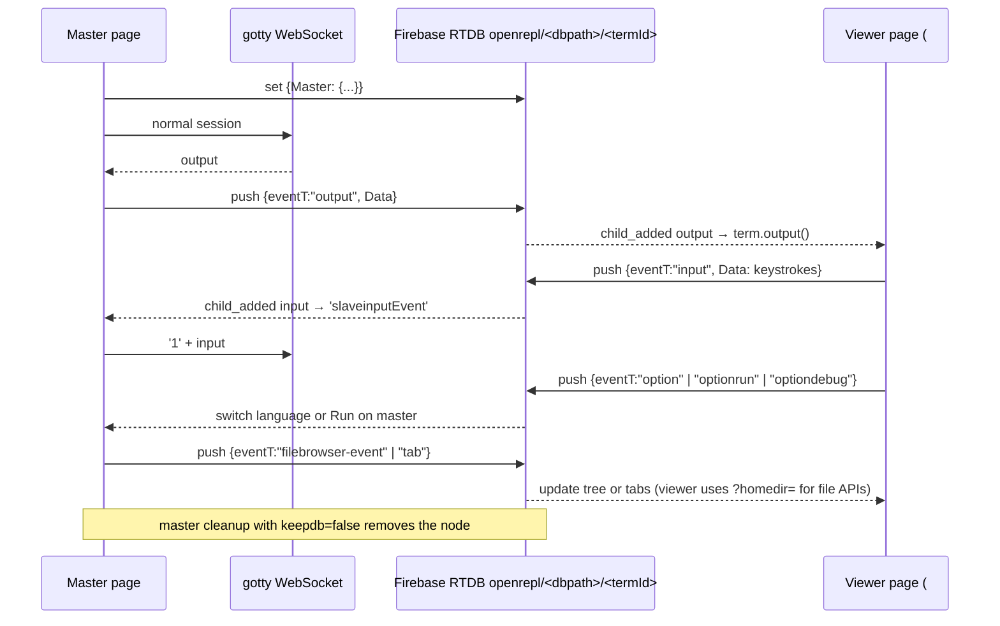

# LLD 06: Frontend

Scope: `src/resources/*.html`, `src/resources/js/*`, `src/resources/css/*`, `src/js/src/*.ts` (built into `gotty-bundle.js`), `src/resources/chat-widget/`, `src/jsconsole/`.

## 1. Pages

| URL | Source | Rendering | Notes |
|---|---|---|---|
| `/`, `/<language>`, `/practice?<lang>&name=<q>` | `resources/index.html` | Go `html/template`, parsed once, `.Page` per request | Landing page and IDE. The language pages (`/python` and so on, LLD 01) change the title, meta description, canonical link and hero heading. Practice mode is the same page with extra controls injected when `location.pathname` contains `practice`. |
| `/s/<id>` | redirect | server | A share-code link: opens the language's page with `?s=<id>` (section 9). |
| `/practice/dsa-questions` | `resources/practice.html` | template per request | Question list and generator (`practice-store.js` + `scribbler-misc.js`, section 6). |
| `/profile` | `resources/profile.html` | template with `profilePage` (`UserProfile` and `IsAdmin`) | The signed-in user's name, email and photo, an *Admin* badge and a link to the dashboard for admins, and *Log out*. It uses the same nav and footer as the legal pages and the `.profile-*` rules in `ui-refresh.css`, in both themes. The name, email and photo come from the sign-in account, so nothing on the page is editable. |
| `/doc.html`, `/docs/*.html` | `resources/doc.html`, `resources/docs/` | static | Per-REPL documentation (cling, gointerpreter, java, python). |
| `/about.html`, `/references.html` | static | static | The about page: what a REPL is, what OpenREPL is, what you can do, beta, terms and privacy. It is the target of most of the links in the site notes (`resources/knowledge`, LLD 07 section 3a), so keep it in step with them. |
| `/privacy.html`, `/terms.html` | `resources/privacy.html`, `resources/terms.html` | static | Privacy policy and terms of use, linked from every footer (including the older About, docs and References pages) and, through FirebaseUI's own line, from the sign-in dialog. The privacy policy has to list each kind of data the server keeps: workspaces, session and account data, practice progress, code links (`snippets.db`, no expiry), feedback, server logs (rotated, up to 30 days, `utils.InitLogging`), the daily usage totals (60 days, `admin_stats.go`), the cookies and third-party services. When a new store, log or cookie is added, update it and its "Last updated" date. |
| `/blog`, `/feedback`, error pages | `server/utils.go` templates | `CommonTemplate` | LLD 01. |
| `/editblog.html` | `resources/editblog.html`, `js/editblog.js`, `css/editblog.css`, `js/genie_plugin.js` | static, admin only | The blog editor (below). |
| `/jsconsole.html` | built from `src/jsconsole` | static | JavaScript REPL iframe. |

`?<lang>` (for example `/?python`), `?repl=<value>` or a language page (`window.OPENREPL_PAGE.repl`) preselects the language (`LoadOptionFromUrl`). `console.log` is silenced by default. A bare `?debug` (no value) keeps it on (`preprocessing.js`). `?debug=1` does **not**, because any non-empty value is treated like no flag.

The accent colour is the brand coral from the `:root` tokens in `css/scribbler-global.css`. `preprocessing.js` swaps in a "colour of the day" (`setupColorThemes`) only when `window.site_settings.colorOfTheDay` is true. An admin turns that on or off at `/admin`, and every page loads `/settings.js` just before `preprocessing.js`. If `/settings.js` fails to load, `site_settings` is undefined and the site stays coral. The same script shows what else an admin set (LLD 13): the announcement and maintenance banners at the top of `<body>`, switched-off languages greyed out in `#optionlist`, and the Genie buttons hidden when Genie is off. A terminal the site refuses on purpose is closed with `site notice: <text>`, which `webtty.ts` reports as the close kind `notice` and `11-terminal-state.js` shows in the terminal banner. The Genie widget (`resources/chat-widget/src/widget.css`) uses the same tokens, and falls back to coral when a page lacks them.

Every page loads `js/theme.js` first in `<head>`. It sets `<html data-theme="light|dark">` from the saved choice or, if there is none, the system setting, and wires every `[data-theme-toggle]` button (one per nav). Dark values are defined under `[data-theme="dark"]` in `scribbler-global.css` (shared tokens) and `ui-refresh.css` (home and legal pages). The home page's nav, hero, workspace and footer are dark in both themes. The nav (`#header-nav`), hero and workspace band use `--hero-bg` (#2A2930, a soft graphite approved on the redesign canvas); the IDE itself and the footer stay near-black (`--ink-950`). The hero's pill, chips, card and outline buttons use translucent white so they sit on that colour. In the dark theme the rest of the home page follows the same graphite family (`ui-refresh.css`, `[data-theme="dark"]` block): `--graphite-850` #25242A for page bands, `--graphite-750` #2F2E35 for the "white" bands and cards, `--graphite-code` #1B1A20 for code samples and the demo terminal, `--hero-bg` for the closing call to action, and `--graphite-900` #1F1E24 for the footer. Small grey text uses `--muted-2` there for contrast. The Genie panel is always dark (LLD 07).

## 2. Script loading and globals (`index.html`)

Loaded only when needed (`loadScriptOnce` / `loadStyleOnce` in `scribbler.js`): FirebaseUI when someone opens sign-in (`ensureAuthUI`), intro.js when the tour starts, and reCAPTCHA when the footer form gets focus. highlight.js and select2 are no longer used. The bundle uses the page's Firebase SDK (`declare var firebase` in `firetty.ts`), so only one Firebase copy loads.

`scribbler.js` calls `gotty.launcher(firebaseconfig)` once the page is ready. That creates the primary terminal on `#terminal`.

### `scribbler.js` responsibilities

Since T20 the page script is split into feature files under `src/js/src/page/`, which webpack (`src/js/webpack.config.js`, entry `scribbler`) bundles and minifies into `js/scribbler.js`; `src/resources/js/scribbler.js` no longer exists, so edit the files below. `index.js` imports them in the old section order, and each part is an ES module (strict mode) that makes its top-level names page globals: function declarations with `window.name = name` at the top of the file, and variables as `window.name = value`. Other parts, `index.html` (inline handlers such as `onclick="CompileandRun()"`), `palette.js`, the chat widget and `gotty-bundle.js` keep using them as globals, exactly as with the single file. When you add a top-level function that anything outside its file calls, expose it the same way.

| File | What it holds |
|---|---|
| `00-utils.js` | `get`, `getAll`, storage keys, the OpenREPL Dark Ace theme, `loadScriptOnce` / `loadStyleOnce`, CDN URLs, the web-font re-measure |
| `01-session.js` | `homedir`, `getExampleRef`, `ismob`, `isMaster`, language options, `getSelectValue`, jid helpers, `preprocessurl` |
| `02-layout.js` | `ToggleFunction`, `ToggleEditor`, `ToggleRotateEditor`, `syncEditorLayoutUI`, `updateEditorContent`, file saving, `ToggleReconnect` |
| `03-run-and-files.js` | `LoadOptionFromUrl`, `StartTour`, `CompileandRun`, `RunandDebug`, editor download and upload, `uploadFile` |
| `04-repl-demo.js` | The "Using the <language> REPL" demo, usage table and language switching (`actionOnchange`) |
| `05-auth.js` | Sign-in (FirebaseUI, `/login`), account menu, `logout` |
| `06-editor.js` | Ace set-up, themes, fonts, modes, Ctrl+S, editor sharing over Firebase |
| `07-file-browser.js` | The Files panel (jstree), context menu and live file events |
| `08-genie-nudge.js` to `17-share-code.js` | One file per Phase 1 and 2 feature: Genie nudge, hero chips, workspace controls, terminal state, landing, phone layout, accessibility, empty Files note, language pages, share-code links |
| `18-genie-review.js`, `lib-diff.mjs` | Review of what Genie wants to put in the editor (below). `lib-diff.mjs` is the pure diff code; node tests in `src/js/test` (`npm test`) |

What the parts do, together:

- **Layout.** Split panes (split.js), Maximize (`ToggleFunction`, Esc restores), Stacked or Side by side (`ToggleRotateEditor`), Hide/Show editor (`ToggleEditor` + `syncEditorLayoutUI`), and the phone layout (`applyMobileLayout`).
- **Editor.** Ace setup, theme persistence, language mode from `data-editor`, `updateEditorContent`, download and upload. `defineOpenreplAceTheme()` registers the default "OpenREPL Dark" Ace theme (`ace/theme/openrepl_dark`, the mockup's colours); every other Ace theme stays in `#select-theme`. The terminal uses the same 14px size as the editor (set in `js/src/xterm.ts`).
- **Language switch.** `actionOnchange` fetches `/demo?q=` and renders the demo animation, usage table and links (LLD 04).
- **Run and debug.** `CompileandRun`, `RunandDebug` dispatch `optionrun` and `optiondebug`. `ToggleReconnect` reconnects.
- **File browser.** jstree, context menu, file load and save, live events (LLD 04).
- **Auth.** FirebaseUI config, `GET /login` status, the sign-in dialog, account dropdown, `logout()`, profile rendering (LLD 05). The dialog is described below.
- **Sign-in dialog.** `<dialog id="signin-dialog">` in `index.html`, opened by *Sign in*, *Sign up free*, the guest card's "Sign up free to keep them" and `?signin=1` or `?signup=1` in the URL (for a visitor who is not signed in; the parameter is then removed). The home page stays visible behind it. FirebaseUI (loaded on first use, version pinned in `00-utils.js`) draws the methods into `#firebaseui-auth-container`: Google, GitHub, then email below an "or" (the order and the "Continue with ..." labels are in `signInOptions`). The dialog's own parts are a heading and a line about why to sign in, a link to switch between sign in and sign up (only the wording differs; FirebaseUI decides from the email), and "Continue as a guest". FirebaseUI adds its own "By continuing you accept our Terms of Service and Privacy Policy" line under the methods (`tosUrl` and `privacyPolicyUrl` in `05-auth.js`). Its state is three data attributes that `ui-refresh.css` reads: `data-mode` (`signin` or `signup`), `data-step` (`pick` for the method list, `flow` for FirebaseUI's email steps, which bring their own title, and `verify` for our "Check your inbox" panel; a `MutationObserver` on the container keeps it in step) and `data-state` (`ready`, `loading`, `error` with a Retry button). An address that is not verified gets the panel from `showVerifyPanel`: it sends the link to new accounts, offers "Send the link again" (30 second cool-down), "I've verified my email" (reloads the Firebase user, then continues) and "Use a different account". Closing the dialog resets FirebaseUI, so it always reopens on the method list. Google and GitHub open a popup; when the browser refuses it, FirebaseUI redirects the whole page to the provider instead, and the browser comes back to the home page with no dialog. While a provider's window is open the dialog shows "Signing in with GitHub. Finish in the window that opened." with a Cancel link (after 30 seconds it adds that a blank or closed window means cancel and try again). When the address of a GitHub or Google sign-in already belongs to an account made another way, FirebaseUI saves the new credential and shows "You already have an account" with a button for the existing method; after that sign-in it links the two. It restores the saved credential with `firebase.auth.AuthCredential.fromJSON`, which the v9 compat SDK does not have, so `ensureAuthUI` defines it from `OAuthProvider.credentialFromJSON`; without it FirebaseUI throws and draws nothing. The wait ends when FirebaseUI draws anything but its own spinner pages: the method list again, or a page that needs the visitor, such as "sign in with Google to link this GitHub account" when the address already belongs to an account made another way, or an error. It also ends when the visitor closes the window. A wrapper on `firebase.auth.Auth.signInWithPopup` (FirebaseUI signs in through an app copy of its own, so it sits on the class; the original is kept as `__plainSignInWithPopup`) notes how the window ended, and shows the codes that point at a setup problem under the methods. The dialog also keeps a short trail of the steps since the provider was chosen (the window's result, the FirebaseUI pages shown, the account handed over, the answer of `POST /login`) in the console; when FirebaseUI leaves its container empty after a provider, so that only the logo would show, the dialog prints that trail under the methods and starts FirebaseUI again. FirebaseUI hides the reason when a request to Firebase fails, so the dialog watches `fetch` for failed calls to `identitytoolkit.googleapis.com` and `securetoken.googleapis.com` and shows Firebase's own message under the methods ("Firebase said: INVALID_IDP_RESPONSE (signInWithIdp, 400)") and in the console; when the wait passes 30 seconds it also checks that `apis.google.com` and the project's `authDomain` can be reached from the browser. Choosing a provider therefore sets `openrepl-signin-pending` in `sessionStorage` (capture phase, before FirebaseUI's own handler), and a page load that finds it, for a visitor who is not signed in, opens the dialog again so that FirebaseUI can finish the redirect; success, closing the dialog and the page load clear it. FirebaseUI's stylesheet loads after ours, so the skin ("Sign-in dialog" in `ui-refresh.css`) starts every rule with `.signin` and overrides the colours FirebaseUI sets inline with `!important`; the dialog follows the light and dark themes and is a bottom sheet up to 600px. `window.openSignIn(mode)` is the entry for other scripts. `TestSignInDialogMarkupMatchesThePageScript` fails when the ids in the script and the markup stop matching.
- **Intro tour.** `StartTour()` (intro.js). It runs only from "Take the 1-minute tour" in the hero.
- **Workspace controls.** Run split button and menu, Ctrl or Cmd + Enter to run and Shift for debug, Files panel toggle, workspace usage card (`refreshWorkspaceUsage`), editor file name and cursor position.
- **Right-click menus.** Both share one look in `ui-refresh.css` ("Right-click menus" block): dark panel, 34px rows (44px up to 800px), mask icons tinted by `--ctx-icon`, danger rows in red. The file menu is jstree's `ul.vakata-context` (LLD 04); the terminal tab menu is `#tabContextMenu` (`.ctx-menu`, `position: fixed`). `main.ts` fills it from `#optionlist` (Reconnect, then one `menuitemradio` per language with its extension from `LANG_EXT`), ticks the language the picker shows each time it opens, places it with `showTabContextMenu` (clamped inside the window, flipped above the pointer when there is no room below, so page scroll does not matter), and handles Arrow keys, Home, End, Esc (focus returns to the tab) and Tab. It closes on an outside click, resize, window blur and page scroll, but not on terminal or list scrolling. Choosing the language already selected only closes the menu.
- **Terminal state.** Listens for `ttystate` (LLD 02) and updates the tab dots, the footer with the session time left, and the banner with its one action.
- **Hero and landing.** Language chips and cards (`pickLanguage`), the usage heading, the docker command copy and the request form.
- **Genie nudge.** `setupGenieErrorNudge` watches terminal output for the first error.
- **Language pages.** `langPageForRepl` and a `#optionlist` change handler move the address to the language's page with `history.replaceState` and update the title, hero and canonical link (variants without a page keep the address).
- **Share-code links.** "Create code link" in the Share popover POSTs the editor content to `/snippet` and shows the link. On a page opened with `?s=<id>`, `applySharedSnippet` puts the saved code in the editor once the language's starter code has loaded, and says so in a notice.
- **Accessibility helpers.** `syncTerminalTabsA11y` and arrow-key handling for the terminal tabs, the Esc-then-Tab way out of the editor and terminal (`moveFocusOutOf`), `describeCodeInputs`, and the Share popover's keyboard support.
- **Empty Files panel.** `updateFilesEmptyState` (LLD 04).

## 3. Terminal engine (`src/js/src` → `gotty-bundle.js`)

webpack 5 + ts-loader (TypeScript 4.9, which still runs on the build image's Node 12) produces a UMD library named `gotty`, exposing `launcher`, `addTab`, `closeTab` and `setEventHandler`. hterm and its libapps dependency are split into `hterm.js`, which the bundle loads only when the server runs with `--term hterm` (`publicPath: "auto"` finds it next to `gotty-bundle.js`).

- **`GottyTerminal`** (one per tab) listens for three DOM events on its element: `optionchange` (restart with a new language), `optionrun`, and `optiondebug`. `Cleanup(keepdb, keepdbcallbacks)` closes the WebSocket and Firebase listeners before respawning.
- **`Terminal` interface** (`webtty.ts`) wraps xterm.js 6 (`@xterm/xterm`, with `@xterm/addon-fit` and `@xterm/addon-web-links`) or hterm (libapps). Both provide the same output, input, resize, message and title calls.
- **`Xterm` adapter** (`xterm.ts`). Font (JetBrains Mono 14px), line height and colours are terminal options (`THEME`), because xterm.js 6 measures the font itself; it measures again once the web font has loaded. A `ResizeObserver` on the terminal element refits the grid when the window, the editor split, the Files panel or tab visibility changes, and the "cols x rows" overlay shows only when the size really changed. Plain URLs in the output are clickable and open in a new tab without an opener. Output bytes are decoded with the browser's `TextDecoder` in streaming mode (no libapps). Two helpers serve the page: `typeInput(data)` sends keys as if typed (the phone extra-keys row) and `recentText(lines)` returns the text up to the cursor (the Genie error nudge).
- **CSS.** xterm.js also puts the class `terminal` on its own root, so `xterm_customize.css` resets the container rules there, and the 8px/12px padding sits on the xterm root (not the container) so the fit add-on counts it. `css/xterm.css` is copied from `js/node_modules/@xterm/xterm/css/xterm.css`.
- **Tabs.** The primary tab holds the real REPL. Each extra tab (`terminal-N`) opens its own WebSocket with the primary's `jid`, so it joins the same namespaces (LLD 03). Tab add, close, click and title changes are published to Firebase as `tab` events, so shared viewers follow along.

## 4. Live sharing (`FireTTY`)

A page is the **master** when the URL has no `#hash`. It is a **slave** (viewer) when it was opened as `…/#<dbpath>`. `dbpath` is the page's Firebase push key (`getExampleRef()`), and the *Share REPL* box shows `origin + path + search + "#" + dbpath`.

The event records are `{eventT, Data, uid, last?}`:

- `uid` is a random ID per page, used to ignore a page's own echoes.
- `last` is a timestamp that settles races when either side changes the language.

When a viewer opens a link whose `Master` node does not exist, it shows "Master Terminal is unavailable". Every output chunk is written to Firebase while the master is active. This is simple, but costs bandwidth (LLD 10).

### Reviewing Genie's changes to the editor (`18-genie-review.js`)

What Genie writes into the editor is shown as a diff over the editor first, and applied only when accepted. Genie's Insert and Replace file buttons (`window.insertcodesnippet`, `window.replacecodesnippet`, defined in this file; the chat widget keeps a placeholder only for a page that has none) and, later, the agent mode (`docs/agent-mode-design.md`) all go through `window.GenieReview.propose(newText, {title})`.

- **Diff.** `makeHunks` (`lib-diff.mjs`) splits the change into hunks: a line diff of the editor's text and the new text, with the common start and end cut off and a longest-common-subsequence table for the middle (at most 4 million cells; a bigger change is one hunk). Each hunk has the old lines it removes (`del`), the lines it adds (`add`), and the old lines before and after it.
- **The panel** (`.genie-review`, over `.editor-body`; styles in `ui-refresh.css`): a title ("Genie wants to insert 2 changes (1 left)"), Accept all, Reject all, a close button and one card per change with its lines (removed in red, added in green, two lines of context, long hunks cut with "… more lines …") and Accept and Reject. All text is set as text, never as HTML. Enter accepts all and Esc rejects all (the key is not passed on to the page).
- **Applying.** An accepted hunk goes through Ace's document API (`removeFullLines`, `insertFullLines`), so it is an ordinary edit: Ctrl+Z works, and Accept all is one step for it. Rows of later hunks are moved by the accepted ones before them. Before each accept the hunk is looked for in the editor (`locate`: the expected row, or the nearest row within 200 where the lines it removes and the lines around it are still as they were), so typing above it does not matter; if it cannot be found it is stale ("The code changed meanwhile") and can only be rejected.
- **Undo.** After the first accepted change the text before it is kept. "Undo what Genie did" restores it in one step, if the editor still holds exactly what the last accepted change left. If the user typed between two accepted changes the button is replaced by "undo with Ctrl+Z", so that their typing is never thrown away.
- **Insert** puts the code where the cursor or selection is; at the start of a line that has text it goes in front of the line (a newline is added), not into its first words. **Replace file** proposes the whole text and stays blocked in practice mode. A suggestion equal to the editor says so and shows no panel.

## 5. Genie chat widget (`resources/chat-widget`)

The widget is TypeScript bundled with microbundle into `dist/index.umd.js` and shipped as `js/chat-widget.js`. `index.html` configures it through `window.ChatWidget.config`:

- `url = "/chat/completions"` and `api_key = openai_access_token` (LLD 07).
- `firebaseconfig`, and `dbpath = getExampleRef()`. Messages are stored under `chat-list/<dbpath>`, so a shared session also shares the chat.
- `submitOnKeydown` on desktop, and `openOnLoad` only on `/practice`. Elsewhere Genie opens from the app bar, the floating button or the error note (LLD 07).
- `closeOnOutsideClick = false`: the Genie panel is docked and non-modal (LLD 07).

The system message includes the current editor content, so the assistant can answer "debug my code". `NUM_MANDATORY_ENTRIES`, the number of messages at the start of the history that are never trimmed (the last is the editor snapshot that each user message refreshes), is set in `init()` from what was added, not fixed: it was 4 while two of them were the page text and the documentation list, and has to follow the list. A reply that used the site's notes shows a "Used OpenREPL notes" line with a note card, and one that did not says so (LLD 07 section 3a; `parseContextHeader`, `appendContextLine`, styles `.chat-widget__notes` in `widget.css`). Code blocks in replies get **Insert** and **Replace** buttons that call `window.insertcodesnippet` and `window.replacecodesnippet`, which edit the Ace buffer. The model and effort are chosen with a chip in the composer and come from `js/model-choice.js` (default Luna, Low; Gemma 4 31B through OpenRouter when the server has a key, and an unavailable card with Try again and Switch to GPT-6 Luna when it cannot answer); the context sent is the editor code and the terminal's recent output (LLD 07).

## 6. Practice mode

**Question list** (`/practice/dsa-questions`, `practice.html` + `scribbler-misc.js`). The same nav, graphite hero and footer as the rest of the site. The hero has New question, Random question (a question still to do, in a new tab) and a progress card: done out of total, a bar, counts per level, and where progress is saved ("Saved in this browser" or "Saved to your account"). Below it:

- a search box (name, topic, level) and filters for status, topic and level, plus a sort: to do first (default), newest, oldest, name, easiest. The filters and sort are remembered in `localStorage.practiceFilters`;
- a table with a Done checkbox, the question (opens `/practice?name=<slug>` in a new tab), topic, level badge, relative date added, and Delete, which asks for a second press before it deletes;
- empty states for no questions yet and for filters with no match (Clear filters).

It uses no jQuery, DataTables, select2 or Font Awesome.

**Store** (`js/practice-store.js`, `window.PracticeStore`), used by the list and the editor: `all()`, `find(id or slug)`, `isDone`, `setDone`, `add` (what `saveNewQuestions` now calls), `update` (sets `updated`), `remove` (leaves a tombstone), `init()` (starts account sync), `status()`, `onChange(fn)`. Storage keys and sync: LLD 05. Another tab's changes arrive through the `storage` event.

**New question dialog** (`#modal`, same markup on both pages). A topic text field with suggestions from `topics` (a `<datalist>`, so any topic can be typed), level, creativity (the LLM temperature) and extra instructions. `practice-store.js` moves focus into it, keeps Tab inside, closes it on Esc and returns focus, and shows "Generating…" on the button while `common.js` works.

**In the editor** (`/practice?<Lang>&name=<slug>`), `index.html` adds:

- **Buttons:** Random question, New question and Mark as completed (`aria-pressed`), added to the app bar after the language picker. The Fork button and the hero are hidden.
- **Editor content:** a comment header (name, difficulty, description), a delimiter line, and the language template. Code below the delimiter is saved back into the question on Run, on language change and on unload (`SaveLastLanguageProgress`), only when it changed.
- **Generation:** questions and per-language templates are generated with `generateNewQuestion` and `getCodeTemplate` (`common.js`, LLD 07) and saved through `PracticeStore`.

## 7. JavaScript and Java REPLs

- **JavaScript:** `jsconsole.html` is a vendored build of `@remy/jsconsole`, a React app that evaluates code in the browser. No server process is involved. It is built with its own webpack config (LLD 08).
- **Java:** a normal backend terminal (`/ws_java`) running a tuned `jshell`, about 150 MB at most per session (LLD 09 "Java"); **Run** uses the same route with the compile script. Only `javascript` is left in `unhandledLanguages` (`gotty.ts`).

## 8. Home page structure (UI refresh, Phase 1)

`index.html` top to bottom:

| Part | Element | Notes |
|---|---|---|
| Nav | `nav#header-nav.site-nav` | Wordmark, Languages, Practice, Docs, Blog, Contact, theme switch, Star on GitHub, account menu, Sign in, Sign up free. `ul.menu` must keep exactly that class for the mobile toggle in `common.js`. The account menu (`#user-account`, shown by `05-auth.js` once signed in) is the avatar button with a panel: name and email (filled from `/profile?q=json`), Profile, Admin (admins only) and Log out. It opens on hover, and on click or Enter for touch and keyboards; Escape, a click elsewhere or moving focus away closes it. In the opened phone menu its entries are listed in place. Styles: "Account menu" in `ui-refresh.css`. |
| Hero | `header.hero` | Pitch, Start coding, What is a REPL?, `#lang-chips`, the tour link. Hidden in practice mode (`.is-practice`). |
| Workspace | `section#workspace > .ide-shell` | App bar `#optionMenu` (language `#optionlist`, Genie, `#fork-widget`, Share `#share-btn-1` + `#myDropdown`, Run `#play-button` + `#run-menu` with `#compiler_flags`, `#env_flags`, `#debug-play-button`), then `#terminal__row`: `#files-panel` (jstree `#file-browser`, `#workspace-card`) and `#ide-split` with `#ide` (editor header, `#editor`, status bar `#controls-buttons` with `#select-lang`, `#select-theme`, `#efontSize`) and `#terminal-div` (`#terminal-tabs`, terminals, `#term-banner`, `#extra-keys`, `#term-footer`). |
| Landing | `main#landing` | `#repl`, `#getting-started` (the per-language demo, `#repl_usage`, `#callout_doc`), `#features`, `#languages`, `#faq`, final call to action. |
| Footer | `footer#footer.site-footer` | The "Contact us" block (`h2#request`, then the language request and feedback form `#feedback-form`: `#feedback-name`, `#email`, `#message` textarea, reCAPTCHA, then Send), link columns, share links. *Contact* in the nav and under Project in the footer (`data-contact`) calls `focusContactForm()` in `12-landing.js`: it closes the phone menu, scrolls the form to the middle of the screen, puts the cursor in the name field and shows the reCAPTCHA (a programmatic focus does not always fire the focus event that normally shows it). The practice page's *Contact* links to `/#request`; on arrival the home page does the same, and once more after 3 seconds because the terminal takes the focus when it connects. The command palette's "Send feedback" uses the same function. `TestContactLinksReachTheFeedbackForm` fails when the markup and the script stop agreeing. |

Keep these ids: `scribbler.js`, `gotty-bundle.js` and practice mode look them up. In particular, `#terminal-tabs` must stay a direct child of `#terminal-div`, with `#add-tab` as its last button, because `main.ts` inserts tabs before it and appends terminals to its parent.

Styles for all of the above are in `css/ui-refresh.css`, loaded last so it overrides the older landing rules. Pop-up `alert()` calls are replaced by `notify()` from `js/notices.js`, which also turns any remaining `alert()` into a notice.

Up to 800 px wide (`applyMobileLayout`), the split is removed and one pane shows at a time (`#ide-split[data-mobile-view]`), Files becomes a drawer, and `#extra-keys` sends Tab, Esc, Ctrl C and arrow keys to the active terminal through xterm's `handler()`. Terminals do not take focus on load on phones.

## 9. Phase 2 additions

| Feature | Where | Notes |
|---|---|---|
| Language pages | `server/langpages.go`, `index.html` template, `scribbler.js` | 16 pages; `sitemap.xml`; canonical links (LLD 01). |
| Share-code links | `server/snippets.go`, Share popover (`#create-code-link`, `#code-link-row`) | A snapshot, separate from live-session sharing. The link keeps the original code if the editor changes. |
| Command palette and shortcuts | `js/palette.js`, `#palette-button` in the app bar | Ctrl/Cmd+Shift+P anywhere, Ctrl/Cmd+K outside the editor and terminal, Ctrl+` between editor and terminal, ? for the shortcuts list. Commands are rebuilt on each open, so labels follow the state (Hide or Show files). The listener sits on `window` in the capture phase, so it runs before Ace, xterm and the page's own handlers; Esc in the palette doesn't also restore a maximized workspace. |
| Accessibility | `index.html`, `ui-refresh.css` (T15 block), `scribbler.js` | Skip link, focus ring on every focusable element, labels on icon buttons, `lang="en"` on every page, reduced motion, the terminal tabs as a button group, Esc-then-Tab out of the editor and terminal (`#kbd-escape-hint`). axe reports no violations on the home page, language pages, practice pages, docs and legal pages. |
| Page load | `index.html`, `scribbler.js` | Section 2. About 580 KB less JavaScript on first view than before Phase 2. |
| Starter snippets | `meta/demos.xml` | LLD 04. |
| Practice page | `practice.html`, `scribbler-misc.js`, `practice-store.js`, `server/practice.go` | Section 6, LLD 05. |

## 10. The blog and its editor

**The public pages** (`/blog`, `/blog?name=`) are rendered by `handleBlog` with `BlogList_Template` and `Blog_Template` inside `CommonTemplate`. The list shows the newest post first as cards (title, date, reading time at 200 words a minute, description, "Read more"); a post is a single readable column with a "All posts" link, code blocks in the code font, and images and tables that fit the screen (`css/scribbler-doc.css`, classes `blog-*`). The page shell's menu button is a real button, and on a phone the theme button stays in the bar next to it (`css/scribbler-global.css`, `.menu__item--theme`).

**The editor** (`/editblog.html`, admin only) has a list of the posts on the left (search, "New post", newest first) and the post on the right: title, address (made from the title for a new post, and editable; a new address saves a new post), a short description with a counter, and the editor. Its parts:

- *TinyMCE* is the free GPL build from jsDelivr (`tinymce@7`, `license_key: 'gpl'`): no account or API key and none of the paid plugins, which used to put a "premium plugin is not enabled" notice on the page for each. The plugins are `anchor autolink charmap code codesample emoticons fullscreen image link lists media searchreplace table visualblocks wordcount`; the toolbar is undo, blocks, bold, italic, underline, strikethrough, link, image, media, table, code sample, lists, quote, clear formatting, source code, Ask Genie and fullscreen. Its skin follows the site theme and the editor starts again, with the content kept, when the theme button is pressed.
- *Ask Genie* (`js/genie_plugin.js`) sends the selected text, or what is typed, with a task (proofread, shorter, clearer, summarize, continue, write about this) to the site's `/chat/completions` with the page's access token, which is never shown, and offers the answer to insert or to replace the selection. The dialog has a Model list and, for a model that thinks (Luna), an Effort list, filled from `js/model-choice.js` like the chat widget's, so a model an admin switched off is not offered. The editor keeps its own choice, under the storage key `genie-blog-model` (`editblog.html` sets `window.MODEL_CHOICE_KEY` before loading the picker), so it does not change the model of the chat widget or of New question. Luna's answer budget is the effort's plus 1,200 tokens, so thinking does not eat the text. If the picker is missing the request asks for GPT-4o mini, as before (LLD 07). For the tasks that write new text (Continue writing, Write about this) the request also carries `context: "blog"` and the post title and text as `context_hint`, so the server can add the site's own notes and posts (LLD 07 section 3a); no line about it is shown in the editor.
- *Saving* is `POST /blog` with `fetch` and the `X-Requested-With: openrepl-admin` header (the form is no longer sent through a hidden frame); the answer is JSON and is shown as a message of the site (`notify`), not `alert()`. Ctrl or Cmd with S saves. A new address that already exists asks before replacing.
- *Drafts*: while there are unsaved changes a draft is kept in `localStorage` (`blog-draft:<address or new>`, every 1.5 s after a change); opening the post again offers to restore or discard it, and a successful save removes it. Leaving the page, or opening another post, with unsaved changes asks first.
- *Delete* asks in a dialog and says what happens; it is disabled for a post that is not saved.
- *Preview* shows the post in a dialog with the site's blog styles and the current theme.
- `?name=<address>` opens that post.

