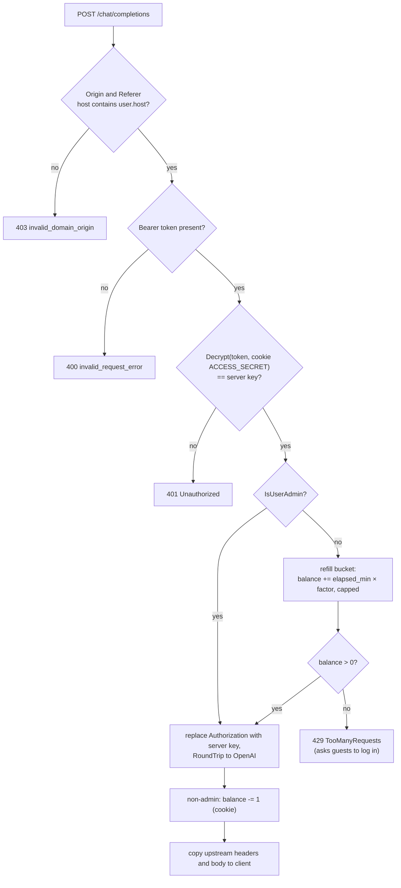

# LLD 07: AI features

Scope: `src/server/chatproxy.go`, `src/server/handlers.go` (`handleConfig`), `src/cookie/cookie.go` (request-count helpers), `src/utils/utils.go` (factors), `src/resources/js/common.js`, `src/resources/chat-widget/src/index.ts`.

The browser never talks to OpenAI directly. Every LLM call goes to `POST /chat/completions` on the gotty server, which checks the caller and forwards the body to `https://api.openai.com/v1/chat/completions` with the server's key.

## 1. Configuration

| Setting | Source | Default |
|---|---|---|
| OpenAI API key | `OPENREPL_OPENAI_API_KEY` as it is, or the file's `user.OpenaiAPIKey`, base64-encoded (`utils.OpenAIKey`) | empty (proxy calls fail upstream) |
| Allowed host | `OPENREPL_HOST`, or the file's `user.host` (`utils.Host`) | `localhost` |
| Guest refill rate | `utils.GUEST_FACTOR = 0.33` requests/min, or the admin's setting (`utils.GuestFactor()`, LLD 13) | about 20 requests per hour |
| Signed-in refill rate | `utils.USER_FACTOR = 1` request/min, or the admin's setting (`utils.UserFactor()`) | 60 requests per hour |
| Switch | `SiteSettings.Genie.Disabled`: the proxy answers 503 `GenieDisabled` to everybody but admins | on |
| Bucket cap | `factor × DEADLINE_MINUTES (60)` | about 20 for guests, 60 for users |

## 2. Per-session access token

`GET /config.js` (`handleConfig`) creates an opaque token for the page:

1. It reuses the `ACCESS_SECRET` in the session cookie, or generates a new random 128-bit value.
2. It computes `openai_access_token = AES-GCM-Encrypt(defaultToken, secret)` (`encoder.Encrypt`, URL-safe base64).
3. It stores `ACCESS_TOKEN` and `ACCESS_SECRET` in the `user-session` cookie, and writes `var openai_access_token = '…'` into the script.

The chat widget and `common.js` send the token as `Authorization: Bearer <token>`.

## 3. Proxy pipeline (`handleChatProxy`)

- The request body is passed through unchanged, so the client chooses `model`, `messages`, `temperature` and `max_tokens`.
- OpenAI errors are returned with their original status and body. Proxy errors use OpenAI's error shape: `{"error":{"message","type","param","code"}}`.
- The rate limit is stored in the signed session cookie, per browser session.

## 4. Genie assistant (chat widget)

- **Opening:** on the home page Genie no longer opens on load. It opens from the app bar's Ask Genie button, the floating button, or the note that appears after the first error in a terminal, which fills in that error (`setupGenieErrorNudge` in `scribbler.js`). On `/practice` it still opens on load, because it plays the interviewer.
- **Panel:** a dark panel docked to the bottom-right corner (a sheet across the bottom on phones), styled after the mockup's "Genie panel" (`chat-widget/src/widget.html` and `widget.css`). The header shows the title, "Reads <file>" from `#editor-filename`, the Peer chat switch and a close button. It is not modal: the page sets `closeOnOutsideClick = false`, so there is no backdrop or focus trap, and you can keep typing in the editor while it is open. It closes with the × button, Esc, or the app bar button (`ChatWidget.toggle`). While it is open, `body.genie-open` hides the floating "Ask Genie" button (`.genie-fab`) and marks the app bar button as pressed. Drag the top-left corner to resize it. Setting `closeOnOutsideClick = true` brings back the old modal behaviour.
- **Model:** `gpt-3.5-turbo` (the widget default; `index.html` does not override it).
- **Context:** a system message with the live editor content, followed by the conversation history.
- **History sync:** every message is pushed to Firebase `chat-list/<dbpath>`. Shared viewers see the same conversation, and the master's `cleanup()` deletes it.
- **Output handling:** fenced code blocks get Insert and Replace file buttons, which call `window.insertcodesnippet` and `window.replacecodesnippet`. The payload is UTF-8 base64 (`btoa(unescape(encodeURIComponent(code)))`), decoded by `decodeGenieCode` in `index.html`, so non-ASCII code no longer breaks the reply. Replace is blocked in practice mode.

## 5. Practice question generation (`common.js`)

| Function | Prompt → output |
|---|---|
| `generateNewQuestion(topic, difficulty, customPrompt, languages)` | Asks for a DSA problem that is not in the stored titles, as JSON `{title, description, code_templates{lang:{template, multiline_comment_start, multiline_comment_end}}}`. `sanitizeJSONString` extracts the JSON. The function then adds `id`, `nameHyphenated`, `topic`, `difficulty`, `added` and `delimeter`. |
| `getCodeTemplate(nameHyphenated, language)` | Fetches or generates the template for a language not yet in `code_templates`, and caches it in the stored question. |

- Both call `getResponseFromOpenAI(openai_access_token, prompt, {baseUri: "/chat/completions"})`: model `gpt-4o-mini`, `max_tokens` 800, and `temperature` from `localStorage.temperature` (default 0.3).
- Topics come from the `topics` array in `common.js` (for example Two Pointers, DP, Graphs and System Design).
- Results are saved through `PracticeStore` in `localStorage.questions`, which keeps the latest 100, and for signed-in users in their account (LLD 05, 06).
