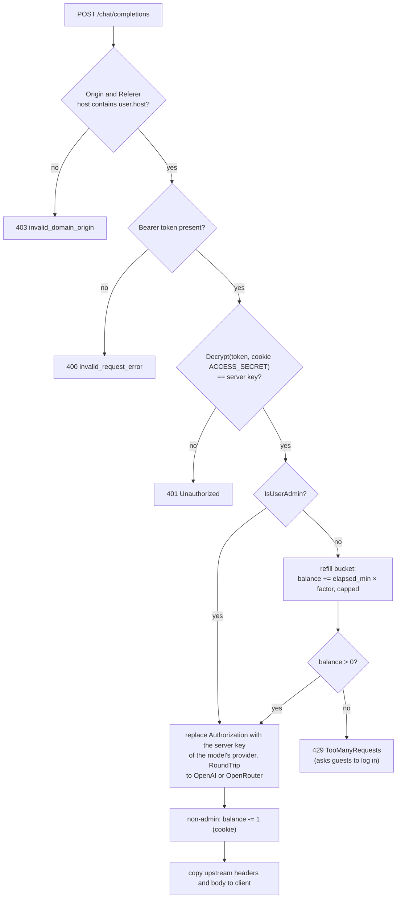

# LLD 07: AI features

Scope: `src/server/chatproxy.go`, `src/server/handlers.go` (`handleConfig`), `src/cookie/cookie.go` (request-count helpers), `src/utils/utils.go` (factors), `src/resources/js/common.js`, `src/resources/chat-widget/src/index.ts`.

The browser never talks to OpenAI directly. Every LLM call goes to `POST /chat/completions` on the gotty server, which checks the caller and forwards the body to `https://api.openai.com/v1/chat/completions` with the server's key. The one open model, Gemma 4 31B, goes instead to OpenRouter's `https://openrouter.ai/api/v1/chat/completions` with its own key (section 3).

## 1. Configuration

| Setting | Source | Default |
|---|---|---|
| OpenAI API key | `OPENREPL_OPENAI_API_KEY` as it is, or the file's `user.OpenaiAPIKey`, base64-encoded (`utils.OpenAIKey`) | empty (proxy calls fail upstream) |
| OpenRouter API key | `OPENREPL_OPENROUTER_API_KEY` as it is (env only, `utils.OpenRouterKey`) | empty (Gemma is not offered; the proxy answers it with `model_unavailable`) |
| Allowed host | `OPENREPL_HOST`, or the file's `user.host` (`utils.Host`) | `localhost` |
| Guest refill rate | `utils.GUEST_FACTOR = 0.33` requests/min, or the admin's setting (`utils.GuestFactor()`, LLD 13) | about 20 requests per hour |
| Signed-in refill rate | `utils.USER_FACTOR = 1` request/min, or the admin's setting (`utils.UserFactor()`) | 60 requests per hour |
| Switch | `SiteSettings.Genie.Disabled`: the proxy answers 503 `GenieDisabled` to everybody but admins | on |
| Bucket cap | `factor × DEADLINE_MINUTES (60)` | about 20 for guests, 60 for users |

## 2. Per-session access token

`GET /config.js` (`handleConfig`) creates an opaque token for the page:

1. It reuses the `ACCESS_SECRET` in the session cookie, or generates a new random 128-bit value.
2. It computes `openai_access_token = AES-GCM-Encrypt(defaultToken, secret)` (`encoder.Encrypt`, URL-safe base64).
3. It stores `ACCESS_TOKEN` and `ACCESS_SECRET` in the `user-session` cookie, and writes `var openai_access_token = '…'` into the script.

The chat widget and `common.js` send the token as `Authorization: Bearer <token>`.

## 3. Proxy pipeline (`handleChatProxy`)

- The body is cleaned before it is forwarded (`sanitizeChatBody` in `server/chatmodels.go`; the body is read with a 1 MB limit). Only `model`, `messages`, `stream`, `temperature`, `max_tokens`, `max_completion_tokens`, `reasoning_effort` and `response_format` get through, and `response_format` only as `{"type":"json_object"}`.
- An admin can change the numbers of Genie (LLD 13 section 3, "Genie limits"): what it is told about the page (the page reads them from `settings.js`, `genieContext`), how long its conversation is, the answer size of each model (`answerCap` replaces the built-in cap in `sanitizeChatBody`), and OpenRouter's time limit and hosts (`openRouterRouting`).
- An admin can switch models off and choose the default (LLD 13 section 3, `genie.disabledModels` and `genie.defaultModel`). A request for a model that is off is answered `503 model_unavailable`, code `model_disabled`, before the balance is touched; the pages read the same lists from `settings.js` and do not offer the model (`js/model-choice.js`), starting visitors on the default. A visitor whose page is still open sees a card with no "Try again" and a button for another model.
- Only three models are accepted: `gpt-6-luna`, `gpt-4o-mini` and `google/gemma-4-31b-it`. Any other name (or none) is answered by `gpt-4o-mini`, so older callers such as the blog editor keep working.
- Each model keeps only its own settings. Luna: `reasoning_effort` (`none`, `low`, `medium` or `high`, else `low`) and `max_completion_tokens` (default by effort 1000 / 2000 / 3000 / 4000, at most 7000); no `temperature` or `max_tokens`. 4o mini: `temperature` (0 to 2) and `max_tokens` (default 800, at most 3000); no effort. Gemma: the same as 4o mini, with `max_tokens` at most 4000. A request that is not a chat request (no `messages` list) gets a 400 with no balance charged.
- The model, effort and token lists exist in three places that have to match: `server/chatmodels.go`, `js/model-choice.js` and, for the allowed efforts, the tests in `server/chatmodels_test.go`. A model change is checked first with a `curl` of the exact request body against `/v1/chat/completions`, because models differ in which parameters they accept (Luna refuses `max_tokens`).
- OpenAI errors are returned with their original status and body (the proxy used to answer 200 for them; the status is now passed on, which is what lets the question generator's retry on 400 work). Proxy errors use OpenAI's error shape: `{"error":{"message","type","param","code"}}`.
- **OpenRouter (Gemma 4 31B only).** `sanitizeChatBody` returns the model with the body; for `google/gemma-4-31b-it` the proxy uses `openrouterEndpoint` and `utils.OpenRouterKey()`, sends `X-Title: OpenREPL`, and adds the host rule itself: `provider: {order: ["modelrun/fp4","coreweave/fp4"], only: [same], allow_fallbacks: false}`. ModelRun answers first and CoreWeave only when ModelRun cannot; no other host is allowed, so a request fails rather than go to one (OpenRouter then answers 404 "No allowed providers are available"). A `provider` field sent by the browser is dropped. Both can be changed in `openRouterHosts` (`server/chatmodels.go`).
- **When OpenRouter cannot answer** (no key set, a timeout, or any status of 400 or more: 402 no credit, 404 no host, 429, 5xx) the visitor gets `503 {"error":{"message":"Gemma 4 31B isn't available right now","type":"model_unavailable","code":"model_unavailable"}}`, nobody is charged a request, and the reason is only logged. Time limits (`openAITimeout` 90 s, `openRouterTimeout` 60 s) stay under Cloudflare's roughly 100 s. The Genie panel turns that error into a card with "Try again" and "Switch to GPT-6 Luna"; the New question dialog shows it as a message. Tests: `server/chatproxy_test.go`, with fake upstreams.
- The rate limit is stored in the signed session cookie, per browser session.

## 4. Genie assistant (chat widget)

- **Opening:** on the home page Genie no longer opens on load. It opens from the app bar's Ask Genie button, the floating button, or the note that appears after the first error in a terminal, which fills in that error (`setupGenieErrorNudge` in `scribbler.js`). On `/practice` it still opens on load, because it plays the interviewer.
- **Panel:** a dark panel docked to the bottom-right corner (a sheet across the bottom on phones), styled after the mockup's "Genie panel" (`chat-widget/src/widget.html` and `widget.css`). The header shows the title, "Reads <file>" from `#editor-filename`, the Peer chat switch and a close button. It is not modal: the page sets `closeOnOutsideClick = false`, so there is no backdrop or focus trap, and you can keep typing in the editor while it is open. It closes with the × button, Esc, or the app bar button (`ChatWidget.toggle`). While it is open, `body.genie-open` hides the floating "Ask Genie" button (`.genie-fab`) and marks the app bar button as pressed. Drag the top-left corner to resize it. Setting `closeOnOutsideClick = true` brings back the old modal behaviour.
- **Model and effort:** a chip in the composer ("Luna · Low") opens a small panel with a card for each model in two sections, OpenAI (GPT-6 Luna, GPT-4o mini) and OpenRouter (Gemma 4 31B, listed only when the server has an OpenRouter key: `config.js` sets `openrouter_enabled`), and four effort levels (Off, Low, Medium, High). The default is Luna with Low. The effort control is dimmed for 4o mini and Gemma, which do not think first, and the chip is hidden while Peer chat is on (those messages go to people, not a model). Under each reply a caption names the model and effort (or, for Gemma, "Gemma 4 31B · OpenRouter") that answered, and while Luna thinks the waiting bubble says "Luna is thinking…". Keyboard: Enter opens the chip, arrow keys move through the cards and levels, Esc closes the panel first and Genie second. The two lists, the saved choice (`localStorage` key `genie-model`) and the request fields come from `js/model-choice.js` (`window.ModelChoice`), loaded before `chat-widget.js`; the widget only draws them. Luna's request carries `reasoning_effort` and `max_completion_tokens`, 4o mini's `temperature` and `max_tokens`. The gpt-3.5-turbo that was once the widget's default is not available to every OpenAI project (a key can work for `gpt-4o-mini` and be refused for it with "Missing scopes: model.request").
- **Context:** a system message on every request with the language, the file name, the live editor code (cut at 12,000 characters) and the most recent 20 lines of the active terminal (cut at 4,000 characters, read through `recentText` of the xterm adapter, else from the DOM rows), followed by the conversation history. The header says "Reads <file> + terminal". Everything in it is sent to OpenAI, which the privacy policy says.
- **History sync:** every message is pushed to Firebase `chat-list/<dbpath>`. Shared viewers see the same conversation, and the master's `cleanup()` deletes it.
- **Output handling:** fenced code blocks get Insert and Replace file buttons, which call `window.insertcodesnippet` and `window.replacecodesnippet`. The payload is UTF-8 base64 (`btoa(unescape(encodeURIComponent(code)))`), decoded by `decodeGenieCode` in `index.html`, so non-ASCII code no longer breaks the reply. Replace is blocked in practice mode.

## 5. Practice question generation (`common.js`)

| Function | Prompt → output |
|---|---|
| `generateNewQuestion(topic, difficulty, customPrompt, languages)` | Asks for a DSA problem that is not in the stored titles, as JSON `{title, description, code_templates{lang:{template, multiline_comment_start, multiline_comment_end}}}`. `sanitizeJSONString` extracts the JSON. The function then adds `id`, `nameHyphenated`, `topic`, `difficulty`, `added` and `delimeter`. |
| `getCodeTemplate(nameHyphenated, language)` | Fetches or generates the template for a language not yet in `code_templates`, and caches it in the stored question. |

- Both go through `requestJSONFromOpenAI`, which sends the chosen model's fields (`questionRequestFields()`: the same choice as Genie's, with 3,000 more tokens of room for a long answer, and `temperature` from `localStorage.temperature` for 4o mini) and asks for JSON mode (`response_format: {"type":"json_object"}`), so a quote or a newline inside the text cannot make the reply unparseable. If the API answers 400, the request is sent once more without JSON mode and `sanitizeJSONString` tidies the reply. The prompts hold no `//` comments in their example JSON.
- The New question dialog has Model and Effort selects (`#qmodel`, `#qeffort`, filled by `initQuestionModelFields` in `common.js`) on the home page and on the practice page. They read and write the same saved choice as Genie. With Luna the Creativity field is disabled (Luna takes no temperature); with 4o mini and Gemma the Effort select is. The Model select groups its options by provider, like the panel.
- Topics come from the `topics` array in `common.js` (for example Two Pointers, DP, Graphs and System Design).
- Results are saved through `PracticeStore` in `localStorage.questions`, which keeps the latest 100, and for signed-in users in their account (LLD 05, 06).
