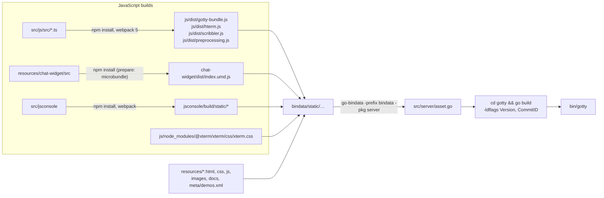
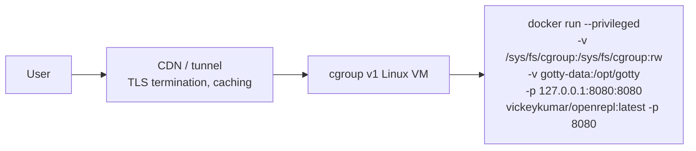

# LLD 08: Build, packaging and deployment

Scope: `src/Makefile`, `src/Makefile.include`, `src/gotty/Makefile`, `src/js/{package.json,webpack.config.js}`, `src/resources/chat-widget/package.json`, `src/jsconsole/`, `Dockerfile`, `install_prerequisite.sh`, `scripts/run_app.sh`, `src/services/gotty.service`, `.github/workflows/*`.

## 1. Toolchain and layout

- **GOPATH.** `Makefile.include` sets `ROOT = GOPATH = <git top>`, and `GO111MODULE=off`. When `git rev-parse` fails (git refuses a repo owned by another user, as in the dev container with the repo mounted), it falls back to the folder above `Makefile.include`. Packages are imported by directory name under `src/`.
- **Go version.** On Linux, `GOROOT` is the checked-in `go_1.19/go`. Elsewhere it is derived from `/usr/local/bin/go`.
- **Dependencies.** Third-party Go packages are vendored as plain directories: `src/github.com/…`, `src/golang.org/x/…`, `src/pkg/…`. Some of them are **patched**, for example `github.com/kr/pty/run.go` (LLD 02). `Godeps/Godeps.json` records the original versions.
- **Helper binaries.** `bin/` holds `go-bindata`, `godep`, `gox`, `ghr` and a `gdb` build copied into the Docker image.

## 2. Build pipeline (`make all`)

The terminal client (`src/js`) builds with webpack 5, ts-loader 9 and TypeScript 4.9, pinned in `package-lock.json` (lockfile v2). All of them run on Node 12 with npm 8.5.1, the versions in the build image. `js/node_modules/webpack` depends on `js/package.json`, so `make` runs `npm install` again whenever the dependencies change, and it calls `./node_modules/.bin/webpack` directly instead of `npm bin`.



- **Everything the browser loads is compiled into the binary.** Editing a file in `resources/` has no effect until you run `make asset` (or `make all`) and rebuild. The only runtime override is `--index` for `index.html`.
- **Useful targets:**

  | Target | What it does |
  |---|---|
  | `make all` | `clean` + `asset` + `gotty` |
  | `make asset` | Rebuilds only the bindata |
  | `make gotty` | Compiles only |
  | `make deb` | Builds `deb/gotty.deb`, which installs `/usr/local/bin/gotty` and the systemd unit |
  | `make cleanjs` | Wipes `node_modules` and the JS dist folders |
  | `make buildgo` | Bootstraps the bundled Go (non-x86_64) |
  | `make test` | Only checks `go fmt` |

- **Version string.** `main.Version` + `main.CommitID` are set by `-ldflags`. `gotty/Makefile` uses `VERSION=2.0.0-alpha.3`.

For a local build and test loop on macOS (Colima with Rosetta, plus a dev container that mounts the repo), see [Run locally on macOS (Colima)](../../README.md#run-locally-on-macos-colima).

## 3. Container image (`Dockerfile`)

It has three stages, all based on `ubuntu:22.04`:

1. **`builder`:** copies `install_prerequisite.sh` and `bin/gdb`, then runs `./install_prerequisite.sh --cleanup-tools --run-tests`. This installs every REPL runtime:
   - from apt: gcc/g++, default-jdk, python2.7/3, ipython/ipython3, golang, yaegi, npm/nvm/node, ruby, perl, tcl, sqlite3, jq, rustc/cargo, rust-gdb, nasm, rlwrap, net-tools, libcap2-bin;
   - prebuilt: cling (`repls/cling-Ubuntu-22.04-x86_64-*.tar.bz2`) and evcxr;
   - from source: gointerpreter, jq-repl, perli, rappel;
   - from npm: `typescript@4.9.5` and `ts-node`.
2. **`build-image`:** adds make, git and npm (pinned to 8.5.1), copies the repo, and runs `make all`.
3. **Final:** `builder` plus `/usr/local/bin/gotty` and `/opt/scripts/run_app.sh`. It creates `/gottyTraces` and `/opt/gotty`, sets `ENV TERM=xterm GODEBUG=cgocheck=1 GOPATH=/opt/gotty/`, `EXPOSE 80`, `ENTRYPOINT run_app.sh`, `CMD ["-p","80"]`.

`scripts/run_app.sh` mounts a `name=systemd` cgroup v1 hierarchy (best-effort) so nested cgroups work, then runs:

```sh
/usr/local/bin/gotty -w --title-format "<fmt><title>{{ .command }}</title><jid>{{ encodePID .pid }}</jid></fmt>" "$@"
```

Run it with `-v /sys/fs/cgroup:/sys/fs/cgroup:rw --privileged` on a **cgroup v1** host to get per-REPL namespaces and memory limits (LLD 03). The image is amd64 only, because the cling tarball is x86_64.

## 4. CI (`.github/workflows`)

| Workflow | Trigger | Steps |
|---|---|---|
| `docker-image.yml` | push and PR to `master` | `docker build` on ubuntu-22.04, then a size and layer report (limit 3 GB and 15 layers, non-blocking). |
| `docker-push.yml` | push to `master` | Log in to `${{ vars.DOCKER_REGISTRY }}`, then build and push `openrepl:<short-sha>` and retag and push `:latest`. |

There are no Go unit-test or lint steps beyond what the Docker build runs (`install_prerequisite.sh --run-tests`).

## 5. systemd deployment (`gotty.service`, `.deb`)

- **User.** Runs as `gottyuser`, and needs `cgroupusers` group ownership of `/sys/fs/cgroup`.
- **`ExecStartPre` steps (as root):**
  - mount the `name=systemd` cgroup;
  - `chgrp` and `chmod` the cgroup tree;
  - `chmod 4755 /usr/bin/nsenter`;
  - open up `/opt/gotty/.gitconfig` to 644 (it is set back to 400 after start).
- **Command.** `gotty -w --max-connection 2564 --port 80 --title-format "<fmt>…encodePID…</fmt>"`.
- **Hardening and limits:**
  - capabilities `CAP_NET_BIND_SERVICE CAP_SYS_PTRACE CAP_SYS_ADMIN CAP_SETUID CAP_SETGID` (bounding and ambient);
  - `NoNewPrivileges=true`, `LimitNOFILE=4096`;
  - `MemoryLimit=${TOTAL_MEMORY}K` and `CPUQuota=${CPU_QUOTA}%` from the environment;
  - `Restart=always`, `RestartSec=1`.

## 6. Runtime file layout

| Path | Contents | Persistence advice |
|---|---|---|
| `/usr/local/bin/gotty` | The binary with all web assets | Image |
| `/opt/gotty/` | `user_sessions.db`, `feedback.db`, `blog.db`, `jobfile`, `.gitconfig` (secrets), `bin/` on `PATH` for REPLs, and `GOPATH` for Go REPLs | **Mount a volume.** Losing it logs everyone out and drops feedback and blogs. |
| `/tmp/home/` | `guest-*` and user workspaces, plus `/<command>/` dirs | Mount a volume if signed-in users' files should survive restarts. |
| `/tmp/go_cache/` | Go build cache for Go REPLs | Disposable |
| `/gottyTraces/gotty.log*` | Rotated logs | Optional volume |
| `/sys/fs/cgroup/memory/<cmd>_container/<pid>` | Per-REPL cgroups (LLD 03) | Host kernel |

## 7. Typical production topology



TLS is normally terminated at the edge. gotty's own `--tls` flags are available if you expose it directly. WebSockets must be allowed through the edge. `user.host` in the gitconfig must match the public hostname, or the chat proxy returns 403.
