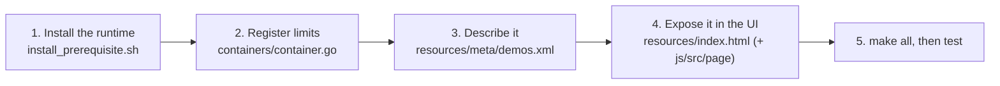

# LLD 09: Adding a new REPL

Adding a language touches four layers. The example below adds **Lua**, using the `lua5.4` interpreter.



## 1. Install the runtime

Add the package to `install_prerequisite.sh`, for example `apt-get install -y --no-install-recommends lua5.4`. The executable must be findable with `exec.LookPath` inside the container, or placed in `/opt/gotty/bin`, which is appended to REPL `PATH`s.

## 2. Register memory limit and weight (required)

In `src/containers/container.go`, add the command name to `Commands2memLimitMap`:

```go
"lua5.4": 4, // MB; measure idle RSS of the REPL and add headroom
```

This map also decides which commands get a container. `InitContainers()` only creates parent cgroups for its keys. A command missing from the map would run **without namespaces or a memory limit**, and would count as weight 0 for admission control.

## 3. Add a `<Demo>` to `src/resources/meta/demos.xml`

`<Name>` must equal the command name. It becomes the WebSocket route `/ws_lua5.4` and the key used by `/demo?q=`.

```xml
<Demo>
    <Name>lua5.4</Name>
    <Github>https://github.com/lua/lua</Github>
    <Doc>./doc.html</Doc>
    <Codes>
        <Code><Prompt>&gt;</Prompt><Statement> print(1+2)</Statement><Result>3</Result></Code>
    </Codes>
    <Usage><Command>os.exit()</Command><Description>Exit the REPL.</Description></Usage>
    <Content>-- Welcome to OpenREPL!
print("hello")
</Content>
    <Compiler>
FILE=test.lua
if [ "$IdeFileName" != "" ]; then FILE="$IdeFileName"; else echo $0 | base64 --decode > $HOME/$FILE; FILE=$HOME/$FILE; fi
lua5.4 "$FILE" $1
printf "\n";
    </Compiler>
</Demo>
```

See LLD 04 §2 for the Compiler script contract (`$0`, `$1`, `$IdeLang`, `$CompilerOption`). Escape `<`, `>` and `&` in XML. `<Prefix>` can wrap the REPL (for example with `rlwrap`) in interactive mode only.

## 4. Expose it in the UI (`src/resources/index.html`)

- Add an option to `#optionlist`. Its `value` must be the command name, and `data-editor` is the Ace mode:

  ```html
  <option value="lua5.4" data-editor="lua">Lua</option>
  ```

- In the editor's `#select-lang` list, make sure the Ace mode is not `disabled`. `lua` is disabled today.
- Optional: map a file extension to the mode in `codeext2menuoption` (`src/js/src/page/07-file-browser.js`), so opening `*.lua` in the file browser switches the editor mode.
- Optional: if the REPL needs fixed extra arguments when selected, add them to `option2args` in `src/js/src/gotty.ts`. For example, C uses `arg=-xc&arg=-noruntime`.
- Optional: add a docs page under `src/resources/docs/` and point `<Doc>` at it.

## 5. Build and verify

```sh
cd src && make all && ../bin/gotty -w -p 8080
```

Checklist:

- [ ] `/demo?q=lua5.4` returns `"Status":"SUCCESS"`.
- [ ] Selecting **Lua** opens a working prompt, and the log shows `New client … connections` with the new weight.
- [ ] **Run** executes the editor content, and a file selected in the tree is saved and run.
- [ ] On a cgroup v1 host, `/sys/fs/cgroup/memory/lua5.4_container/<pid>/memory.limit_in_bytes` exists for a live session.
- [ ] **Fork REPL** and an extra terminal tab both work (nsenter into the same namespaces).
- [ ] The Docker image builds (`docker build .`), and CI passes.

## 6. When the REPL is another program than the language: Java

A language can have a Run button (the compiler script of its `<Demo>`) and a REPL that is a different program. `java` is the example. Its route, memory limit, weight and demo are `java`'s (`/ws_java`, `Commands2memLimitMap["java"]`); `utils.InteractiveCommand("java")` says that the interactive terminal runs `jshell` with fixed arguments, and `containers.GetCommandArgs` uses it for every terminal that is not a Run request (a Run request is `bash -c <script>` as before). If the program is not installed, the language's own command runs, as before, and the log says so.

The jshell flags (`utils/interactive.go`) are chosen for memory: `--execution local` runs the snippets in the tool's own JVM instead of a second one; `-J-Xmx48m -J-Xms8m` bound the heap; `-J-XX:TieredStopAtLevel=1`, `-J-XX:+UseSerialGC`, `-J-XX:CICompilerCount=1`, `-J-XX:ReservedCodeCacheSize=16m`, `-J-XX:MaxMetaspaceSize=64m` and `-J-Xss512k` keep the JVM's own areas small, and `-J-Djava.util.logging.config.file=/dev/null` keeps the JDK's INFO lines (the preferences folder being created) out of the terminal. Setting only `-R` flags barely helps: they size the second JVM, and the tool's JVM (the compiler and line editor) is the larger one. Measured with OpenJDK 11 on a simple session:

| jshell | peak memory | start-up | four at once |
|---|---|---|---|
| default | 375 MB | 4.8 s | about 240 MB each |
| two JVMs, tuned | 221 MB | 3.3 s | not measured |
| one JVM, tuned (used) | about 150 MB | 1.9 s | about 115 MB each |

The weight of `java` is 192 MB: the REPL peaks near 150, and the same weight covers Run (`javac` and `java`). The price of one JVM is that the snippets share the 48 MB heap with the compiler: a large allocation ends in an `OutOfMemoryError` message, and `System.exit` or a loop that never ends affects that session only. Lower the heap or the weight only after watching a real server; the numbers above are from one JDK and a simple session.

The JDK comes from `default-jdk` in `install_prerequisite.sh`, which includes `jshell`; the script's test list runs `jshell --version`.
