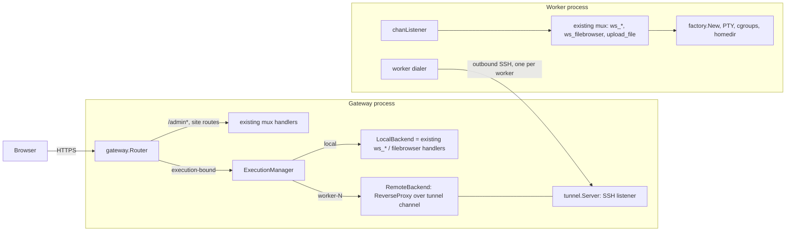
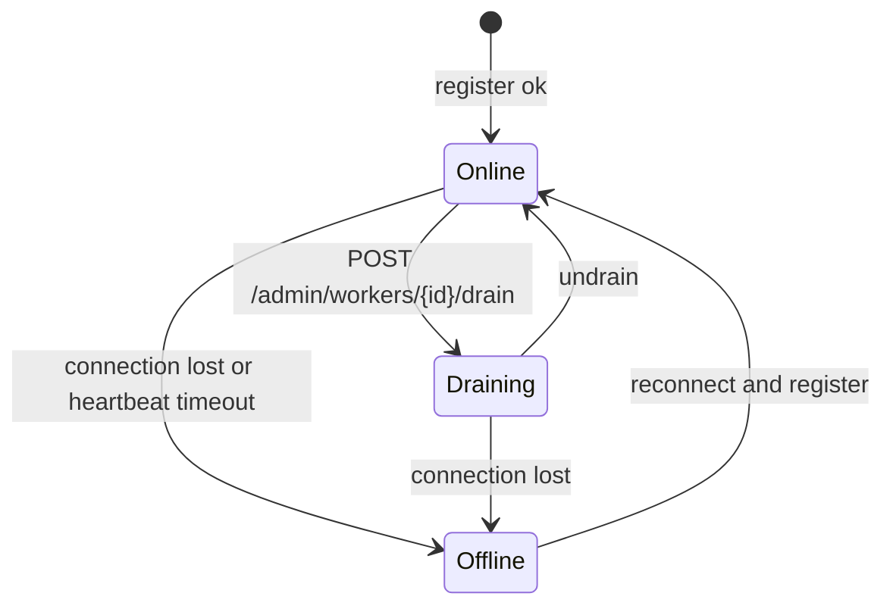

# LLD 11: Distributed execution (gateway and workers)

Status: proposed. Implements [hld/distributed-execution.md](../hld/distributed-execution.md) against the current code. Nothing here exists yet; file names are the planned ones.

Scope today: `src/server/{server,handlers,options}.go`, `src/cookie/cookie.go`, `src/user/util.go`, `src/containers/container_linux.go`, `src/gotty/main.go`. New: `src/gateway/`, `src/worker/`, `src/tunnel/`.

## 1. Principles

1. **Standalone is the default and must not change.** With `--mode=standalone` (default) none of the new code is on the request path.
2. **Only execution-bound routes use affinity.** Account and website routes always run on the gateway. See section 3.
3. **The worker runs the existing server.** The same `setupHandlers` mux, `processWSConn`, `factory.New`, cgroups and `filebrowser` run on the worker. We add a trusted identity input and a tunnel listener; we do not fork the handlers.
4. **The gateway owns identity.** The session-cookie secret never leaves the gateway. Workers get identity from trusted headers that only arrive over the authenticated tunnel.
5. **No migration.** If a worker dies its sessions fail; they are never re-placed.

## 2. Modes and process layout

| Mode | Flag | What runs |
|---|---|---|
| standalone | `--mode=standalone` (default) | Today's server. No tunnel, no registry. |
| gateway | `--mode=gateway` | Public server plus `gateway` router, tunnel server, registry, pool. May also run sessions itself (`LocalBackend`). |
| worker | `--mode=worker` | The server mux on a tunnel-only listener, plus a dialer to the gateway. No public port. |



## 3. Route ownership

Derived from `setupHandlers` (`src/server/server.go`).

| Class | Routes | Runs on |
|---|---|---|
| Gateway only | `/api/tunnel` (worker tunnel, section 9), `/admin`, `/admin/*`, `editblog.html`, `login`, `logout`, `profile`, `auth_token.js`, `config.js`, `settings.js`, `chat/completions`, `feedback`, `blog`, `snippet`, `s/`, `demo`, `practice/*`, `sitemap.xml`, static assets, `/` and language pages | Gateway handlers, always |
| Execution-bound | `ws`, `ws_c`, `ws_cpp`, `ws_go`, every `ws_<command>`, `ws_filebrowser`, `upload_file` | Backend chosen by affinity: `LocalBackend` or a worker |

`gateway.Router.ServeHTTP`:

```text
path == tunnelPath                              -> tunnel.Server.ServeWS (local; worker connections only)
path == "/admin" || HasPrefix(path, "/admin/")  -> site mux (local, never proxied)
isExecutionBound(path)                          -> ExecutionManager.Resolve(r) -> backend
otherwise                                       -> site mux
```

`isExecutionBound` is a fixed prefix check (`ws`, `ws_*`, `upload_file`) built from the same `Commands2DemoMap` loop that registers the `ws_*` routes, so a new REPL is picked up without touching the router. The admin check must be a prefix; today `/admin` and `/admin/settings` are exact routes.

## 4. Execution context and affinity

```go
// package gateway
type ExecutionContext struct {
    Key       string    // "u:<uid>" for signed-in users, "g:<guestID>" for guests
    UID       string    // empty for guests
    GuestID   string    // random id stored in the affinity cookie
    BackendID string    // "local" or a worker id
    CreatedAt time.Time
    ExpiresAt time.Time // guests: sliding, utils.DEADLINE_MINUTES; users: none
}
```

`SessionRegistry` (in-process, mutex-guarded map keyed by `Key`):

| Method | Behaviour |
|---|---|
| `Resolve(r)` | Key from the request: `cookie.Get_Uid(r)` if signed in, else the guest id from the affinity cookie. Returns the existing context or `nil`. |
| `Create(key, backend)` | Stores a new context. Called only after the pool picks a backend. |
| `Touch(key)` | Slides a guest's expiry on each execution-bound request. |
| `Release(key)` | Removes it (guest expiry, explicit logout). |

- **Signed-in users are pinned.** `uid -> worker` is persisted (a record in the existing UnQLite user store, written through the `user` package) so it survives a gateway restart. New sessions for that user go to the same worker. If it is `DRAINING` or `OFFLINE` the request fails with 503 "workspace node unavailable"; the pool is not consulted.
- **Guests are placed freely.** Their context lives in memory only. The guest id is carried in an `or-aff` cookie, signed with the existing `cookie.SECRET_KEY` (gateway side only) via `securecookie`.
- **First assignment is lazy.** Created on the first execution-bound request (`ws*`, `upload_file`), not on the index page, so a visitor who only reads pages never occupies a slot.
- **Affinity is never recomputed.** An existing context is used as is, including for WebSockets.

## 5. Backends

```go
type Backend interface {
    ID() string
    State() State                  // Online, Draining, Offline
    Capacity() (used, max int64)   // memory-weight units, section 8
    HasLanguage(cmd string) bool
    Serve(w http.ResponseWriter, r *http.Request) error
}
```

- **`LocalBackend`** (`gateway/local.go`). `Serve` calls the existing site/ws mux handler directly. No proxy hop. Capacity is `--max-connection` / total weight as today. `--local-weight=0` makes the gateway routing-only (never selected by the pool).
- **`RemoteBackend`** (`gateway/remote.go`). Wraps a `*tunnel.Conn`. `Serve` runs a `httputil.ReverseProxy` whose `Transport.DialContext` opens a new SSH channel `openrepl-http` to the worker. Go 1.19's `ReverseProxy` already handles `Upgrade`, so WebSockets are bridged without `koding/websocketproxy`. `Host`, method, path, query, cookies and body are preserved.

Gateway-added headers on the proxied request (any `X-OpenREPL-*` header supplied by the client is deleted first):

| Header | Value |
|---|---|
| `X-OpenREPL-Uid` | uid, empty for guests |
| `X-OpenREPL-Guest` | guest id (guests only) |
| `X-OpenREPL-Home-ID` | `generateHomeDirectoryID(name, uid)` for signed-in users, computed on the gateway because the worker has no user-profile DB |
| `X-OpenREPL-Priv` | `utils.ADMIN` or `utils.GUEST` |
| `X-OpenREPL-Session` | context key (for logs) |

## 6. Worker side

### 6.1 Trusted identity

`fetchRequestedPayload` (`src/server/handlers.go:40`) today reads the cookie. It gains one branch:

```text
if trustedFromTunnel(r)  -> uid, homedir, privilege from X-OpenREPL-* headers
else                     -> existing cookie logic (standalone, local backend)
```

`trustedFromTunnel` is true only when the request arrived on the `chanListener` (a per-listener `ConnContext` sets a context value). The worker has no other public listener, so the headers cannot come from a browser. The same branch is used by `ws_filebrowser` and `upload_file`, which call `GetOrUpdateHomeDir` today.

### 6.2 Homedir on the worker

- **Signed-in user:** `utils.HOME_DIR + X-OpenREPL-Home-ID`.
- **Guest:** `utils.HOME_DIR + "guest-" + X-OpenREPL-Guest`, created lazily with `MkdirAll`.
- **Cleanup:** the guest removal job (`utils.REMOVE_JOB_KEY + homedir`, `GottyJobs.ResetJob`) is scheduled on the worker that owns the directory.
- **Gateway change:** in `handleIndex`, when `--mode=gateway`, skip `GetOrUpdateHomeDir` and the cleanup `defer`, because the directory may belong to a worker. The ws/upload paths still call it, so `LocalBackend` sessions create their directory lazily.
- **Query overrides are ignored for remote sessions.** `GetOrUpdateHomeDir` currently honours `homedir` and `jid` from the query. The gateway removes `homedir` from the query on remote requests and validates `jid` (section 7).

### 6.3 Execution

Unchanged. `processWSConn` → `server.factory.New(params)` → `containers.GetCommandArgs` → PTY in namespaces + cgroup. Run/Debug carries the editor content in the WebSocket init payload; `SaveIdeContentToFile` writes it into the worker's own homedir, so no file sync is needed. `ws_filebrowser` and `upload_file` hit the same directory.

One required fix first: `generateHandleWS` calls `server.SetNewCommand(command)` on shared state per request. Make the command per-connection before relying on concurrency.

## 7. Fork (`jid`) routing

`jid` is `encodePID(pid)` and `containers.GetWorkingDir` / `nsenter -t<pid>` only work on the machine that owns the process.

- **Record.** When a worker creates a slave it sends an SSH global request `jid-open {jid, uid}` to the gateway *before* it writes the title message to the browser. The gateway stores `jid -> (workerID, uid)` in `JIDMap`. On slave close the worker sends `jid-close {jid}`.
- **Route.** A request with a `jid` query parameter or init payload field is resolved through `JIDMap` first and overrides normal affinity.
- **Validate.** The recorded `uid` must equal the caller's; otherwise 403. A client-supplied `jid` that is unknown yields an error, never a re-balance.
- **Failure.** Worker `OFFLINE` drops all its `JIDMap` entries; forks fail.

This replaces the earlier "sniff the title frame" idea: the worker already knows the pid, so reporting it over the control channel avoids parsing WebSocket frames in the gateway.

## 8. Capacity and load balancing

- **Unit:** the existing memory weights, `containers.GetCommandWieght(command)` (the units behind `--max-connection`).
- **Worker capacity** is advertised at registration (`--worker-capacity`, default derived from `/proc/meminfo`). `used` is the sum of weights of active sessions, reported in each heartbeat and also maintained locally by the gateway (increment when a session opens, decrement when its stream closes) so selection does not wait for a heartbeat.
- **Selection** (`gateway/pool.go`, adapted from `sish-lb/lb.go`): filter to `Online` workers that `HasLanguage(cmd)` and have `max-used >= weight(cmd)`, then pick by weighted random using each worker's configured weight. Changes from sish-lb: no global flags, no `rand.Seed` on the global RNG (one `*rand.Rand` per pool under the mutex), no hostname keys, `Delete` by worker id, `Add` keeps the cumulative-total array.
- `LocalBackend` participates as one more candidate when `--local-weight > 0`.

## 9. Tunnel (`src/tunnel`)

Transport is SSH (`golang.org/x/crypto/ssh`), one connection per worker, dialed outbound from the worker. The SSH session can ride on either of two byte streams; both feed the same `ssh.NewServerConn` on the gateway, so everything above the stream (registration, heartbeat, channels) is identical.

| `--worker-server` value | Stream | Use |
|---|---|---|
| `wss://gateway.example.com/api/tunnel` (recommended), `ws://` for local tests | A WebSocket on the gateway's normal HTTP(S) port | One public port, works through HTTP-only fronts (nginx, Cloudflare, load balancers), TLS comes from the existing HTTPS termination |
| `ssh://gateway.example.com:2222` | Raw TCP to a dedicated SSH listener (`--tunnel-addr`) | Networks where WebSocket is not allowed but the port is open |

### WebSocket carrier (`src/tunnel/wsconn.go`)

- `wsConn` wraps a `*websocket.Conn` (gorilla, already vendored) as a `net.Conn`: binary frames, `Read` drains the current frame then fetches the next, `Write` sends one binary frame, a mutex serialises writers.
- Gateway: `tunnel.Server.ServeWS` is registered on the outer mux at `--tunnel-path` (default `/api/tunnel`, relative to the random-URL prefix if one is set). It sits outside `gziphandler`, `wrapHeaders` and the basic-auth wrapper, because workers cannot answer a basic-auth challenge and gzip must not touch an upgraded connection.
- The upgrade is rejected unless the request has `Authorization: Bearer <worker-token>` (constant-time compare). Browsers cannot send this header and workers send no `Origin`, so any request carrying an `Origin` is also rejected. After the upgrade the SSH handshake authenticates again with the same token.
- Keepalive: WebSocket ping every 20 s (below the idle timeout of common proxies) in addition to the SSH keepalive. A missed pong closes the carrier and the worker goes `OFFLINE`.
- Failed upgrades are rate-limited per client IP.

```mermaid
sequenceDiagram
    participant W as Worker
    participant G as Gateway tunnel.Server
    W->>G: connect (wss upgrade with Bearer token, or raw TCP), then SSH handshake (user=worker-id, password=--worker-token)
    G-->>W: auth ok
    W->>G: global request "register" {id, version, os, arch, languages[], capacity, weight}
    G-->>W: reply {connection_id, heartbeat_interval}
    loop every heartbeat_interval
        W->>G: global request "heartbeat" {used, cpu, mem}
    end
    Note over G: browser request for worker-N
    G->>W: open channel "openrepl-http"
    W->>W: chanListener.Accept returns the channel as net.Conn; http.Server serves it
```

| Item | Detail |
|---|---|
| Auth | Token as SSH password for v1 (compared in constant time); over `wss://` the TLS certificate authenticates the gateway; over `ssh://` the worker must pin the gateway host key via `--worker-hostkey`. Key-based worker auth can replace the token later. |
| Control messages | Global requests: `register`, `heartbeat`, `jid-open`, `jid-close`, `unregister`. Gateway→worker: `drain` (sets worker to stop reporting available capacity; the gateway-side flag is what blocks assignment). |
| Data | One SSH channel per proxied HTTP request or WebSocket. A channel is a `net.Conn` wrapper, closed when either side closes. `copyBoth` / `IdleTimeoutConn` from sish-lb are reused for idle handling. |
| Liveness | `keepalive@openssh.com` at `heartbeat_interval`; no heartbeat for `timeout` (30 s) or a closed connection ⇒ `OFFLINE`. |
| Reconnect | Worker retries with capped exponential backoff and re-registers; it comes back `ONLINE` with `used=0` (sessions on the old connection are gone). |
| Vendoring | `x/crypto/ssh` and its dependencies are not in `src/golang.org/x` today (only `sys`, `tools`); they must be vendored. The build is `GO111MODULE=off`. |

### Worker states



## 10. Request flows

### New guest, first terminal

```mermaid
sequenceDiagram
    participant B as Browser
    participant R as Router
    participant S as SessionRegistry
    participant P as Pool
    participant W as Worker
    B->>R: GET /ws_go (no or-aff cookie)
    R->>S: Resolve(r) -> nil
    R->>P: Select(cmd=go, weight)
    P-->>R: worker-2
    R->>S: Create(g:<id>, worker-2); Set-Cookie or-aff
    R->>W: proxy WS upgrade + X-OpenREPL-* headers
    W->>W: fetchRequestedPayload(headers) -> processWSConn -> factory.New
    W->>R: jid-open {jid, uid} (control)
    W-->>B: title frame with <jid> (through proxy)
```

### Existing session, file save

`ws_filebrowser`/`upload_file` → `Resolve` finds `worker-2` → proxied to the same worker's mux → writes the same homedir the terminal uses. The pool is not consulted.

### Admin

`/admin/workers` is handled by the gateway's local mux. It never opens a channel.

## 11. Admin API (gateway-local)

Registered under the existing `wrapAdmin`:

| Route | Purpose |
|---|---|
| `GET /admin/workers` | JSON: id, state, last heartbeat, used/max capacity, languages, weight, active sessions |
| `POST /admin/workers/{id}/drain` | `ONLINE` → `DRAINING` |
| `POST /admin/workers/{id}/undrain` | `DRAINING` → `ONLINE` |
| `GET /admin/sessions` | execution contexts (key, backend, expiry) |

## 12. Configuration

New fields on `server.Options` (same tag convention: `hcl`, `flagName`, `default`), so each is settable in `~/.gotty`, env or CLI.

| Flag / HCL key | Default | Mode |
|---|---|---|
| `--mode` / `mode` | `standalone` | all |
| `--tunnel-path` / `tunnel_path` | `/api/tunnel` (WebSocket tunnel endpoint on the public port) | gateway |
| `--tunnel-addr` / `tunnel_addr` | empty = raw SSH listener disabled; e.g. `0.0.0.0:2222` to enable | gateway |
| `--tunnel-hostkey` / `tunnel_hostkey` | `~/.gotty.tunnel_key` (private key; generated if absent, its SHA256 fingerprint is logged at startup) | gateway (used by both carriers) |
| `--worker-hostkey` / `worker_hostkey` | none; required for `ssh://`, optional for `wss://` | worker: the gateway's SHA256 fingerprint to pin |
| `--worker-token` / `worker_token` | empty (required) | gateway, worker |
| `--local-weight` / `local_weight` | `10` (0 = routing-only gateway) | gateway |
| `--worker-id` / `worker_id` | hostname | worker |
| `--worker-server` / `worker_server` | none (required). URL: `wss://host/api/tunnel` or `ssh://host:2222` | worker |
| `--worker-weight` / `worker_weight` | `10` | worker |
| `--worker-capacity` / `worker_capacity` | derived from RAM | worker |
| `--worker-languages` / `worker_languages` | auto-detected from installed REPLs | worker |

Validation (`Options.Validate`): gateway requires a token; worker requires a `worker-server` URL with a `wss`, `ws` or `ssh` scheme, a token, and a `worker-hostkey` when the scheme is `ssh`; `standalone` ignores the rest.

## 13. Usage

The binary is the same `gotty` for every mode; `--mode` selects the role. Every flag below can also be set as an HCL key in `~/.gotty` (or the file named by `--config` / `$GOTTY_CONFIG`) or as an environment variable (`$GOTTY_<FLAG_NAME>`), with the existing precedence: defaults, then config file, then CLI. Prefer the environment variable or the config file for the token so it stays out of `ps` output.

### Standalone (default, unchanged)

```bash
../bin/gotty -w -p 8080
```

### Gateway

```bash
export GOTTY_WORKER_TOKEN='<shared secret>'
gotty -w --mode=gateway --port 80 --max-connection 2564 --local-weight 10
```

- Workers connect to `/api/tunnel` on the same public port, so no extra port or firewall rule is needed.
- `--local-weight 0` makes the gateway routing-only (it runs no sessions itself).
- Optional raw SSH listener for networks that block WebSockets: add `--tunnel-addr 0.0.0.0:2222` and open that TCP port to workers only. On first start the gateway generates `~/.gotty.tunnel_key` and logs its fingerprint (`SHA256:...`); workers using `ssh://` pin it with `--worker-hostkey`.
- If a reverse proxy sits in front, it must allow WebSocket upgrades on `/api/tunnel` and an idle timeout above 60 s (pings keep the link active).

Equivalent `~/.gotty`:

```hcl
mode         = "gateway"
port         = "80"
max_connection = 2564
# tunnel_addr = "0.0.0.0:2222"   # optional raw SSH listener
local_weight = 10
# worker_token comes from $GOTTY_WORKER_TOKEN
```

### Worker

```bash
export GOTTY_WORKER_TOKEN='<same shared secret>'
gotty -w --mode=worker \
      --worker-server wss://gateway.example.com/api/tunnel \
      --worker-id worker-01 --worker-weight 10
```

Raw SSH instead (needs the gateway's `--tunnel-addr` and a pinned host key):

```bash
gotty -w --mode=worker \
      --worker-server ssh://gateway.example.com:2222 \
      --worker-hostkey 'SHA256:<fingerprint from the gateway log>' \
      --worker-id worker-01
```

- Outbound only: no inbound port or public address is needed, so it works behind NAT or a firewall.
- It must have the same runtime as a normal server (the Dockerfile image, REPL toolchains, `nsenter`, cgroup v1 access). It advertises only the languages it finds installed unless `--worker-languages` is set.
- `--worker-capacity` (memory-weight units) defaults to a value derived from RAM. It replaces `--max-connection` for admission on the worker side.
- It reconnects automatically with backoff if the gateway restarts or the link drops.

Equivalent `~/.gotty`:

```hcl
mode            = "worker"
worker_server   = "wss://gateway.example.com/api/tunnel"
# worker_hostkey = "SHA256:<fingerprint>"   # only needed for ssh://
worker_id       = "worker-01"
worker_weight   = 10
```

### Deployment notes

- **systemd:** copy `src/services/gotty.service` and change `ExecStart` to the gateway or worker command above (the title format flag is no longer needed). Use `EnvironmentFile=` for `GOTTY_WORKER_TOKEN`.
- **Docker:** run the existing image with the same arguments; for a worker no `-p` port mapping is required.
- **TLS:** terminate HTTPS on the gateway (`--tls`) or in front of it and use `wss://`; the certificate then authenticates the gateway. The SSH layer inside the tunnel encrypts independently.
- **Basic auth:** if `--credential` basic auth is enabled it does not apply to `/api/tunnel` (workers authenticate with the token instead).
- **Rolling out:** start the gateway, then workers. Drain a worker before maintenance (below), wait for its active count to reach 0, then stop it.

### Operating the fleet

As a signed-in admin (the same session that opens `/admin`):

```bash
curl -b "$ADMIN_COOKIE" https://openrepl.example.com/admin/workers
curl -b "$ADMIN_COOKIE" -X POST https://openrepl.example.com/admin/workers/worker-01/drain
curl -b "$ADMIN_COOKIE" -X POST https://openrepl.example.com/admin/workers/worker-01/undrain
```

Validation at startup fails fast: a gateway or worker without a token, or a worker without `--worker-server` (or without `--worker-hostkey` when using `ssh://`), exits with an error instead of running half-configured.

## 14. Failure handling

| Event | Behaviour |
|---|---|
| Worker connection drops | Mark `OFFLINE`, close its channels (browsers see WS close "execution node unavailable"), drop its `JIDMap` entries, remove from pool. Contexts that point to it are kept so a pinned user gets 503 rather than a different worker. |
| Browser closes | Proxy closes the channel; worker's `processWSConn` sees `ErrMasterClosed` and runs normal PTY/cgroup cleanup. |
| Pinned user's worker down | 503 with a clear message; never reassigned in v1. |
| Guest's worker down | Context removed on next request; a new session may land elsewhere (their old files are gone). |
| Gateway restart | Workers reconnect and re-register. Pinned `uid -> worker` survives (persisted); guest contexts are lost, so a guest may be reassigned (their old workspace is orphaned and cleaned by the worker's cleanup job). |
| Unknown or expired session | Treated as new (guest) or pinned lookup (user). |
| Worker draining | No new assignments; existing sessions run; `/admin/workers` shows active count. |

## 15. Security notes

- Strip all inbound `X-OpenREPL-*` headers on the gateway. Workers accept them only on the tunnel listener.
- Workers have no public listener in worker mode; the tunnel is outbound only.
- `/api/tunnel` is on the public port: Bearer-token check before upgrade, reject any request with an `Origin`, per-IP rate limit on failures, then SSH auth again inside.
- Constant-time token comparison; host key pinning for `ssh://`; rate-limit failed registrations.
- Remove client-supplied `homedir` for remote sessions; validate `jid` ownership by uid.
- `ws_filebrowser` already requires paths under the homedir (`strings.HasPrefix(path, homedir)`); that check now uses the worker-resolved homedir.
- The affinity cookie carries only a random guest id, signed on the gateway.

## 16. sish-lb reuse map

| sish-lb | Here |
|---|---|
| `lb.go` `ServerPool` weighted selection | `gateway/pool.go`, adapted (no globals, capacity and language filters) |
| `http.go` `ReverseProxy` over a custom dialer | `gateway/remote.go`; dialer opens an SSH channel instead of a unix socket; WebSockets via `Upgrade` support |
| `requests.go` `copyBoth`, `IdleTimeoutConn` | `tunnel/conn.go`, reused |
| `handle.go` keepalive handling | `tunnel/server.go`, heartbeat/keepalive |
| `HTTPListenerMap` keyed by hostname | Replaced by `SessionRegistry` keyed by session |
| gin, console, GeoIP, subdomain logic | Not used |

Because sish-lb is `package main` with global flags, code is copied into `src/` with the origin noted in file headers rather than imported.

## 17. Implementation order and tests

1. **Router and LocalBackend, behaviour unchanged.** `gateway` package, `isExecutionBound`, `SessionRegistry`, `/admin` prefix match, per-connection command fix. Tests: route classification table, admin always local, standalone mode bypasses the router entirely, affinity cookie issue/validate, registry create/resolve/expire.
2. **Tunnel and RemoteBackend with one worker.** `tunnel`, `worker`, trusted-header branch in `fetchRequestedPayload`, worker homedir, `handleIndex` homedir skip. Tests: register/heartbeat/timeout/reconnect against an in-process SSH server; proxied request preserves method, path, query, cookie, body; WebSocket echo through the bridge; closing the browser closes the worker stream; header stripping (spoofed `X-OpenREPL-Uid` is ignored); `homedir`/`jid` override rejected.
3. **Pool, pinning, jid routing, drain, admin.** Tests: weighted selection with capacity, language filtering, draining/offline exclusion, pinned user gets 503 when their worker is down, `jid` routes to owner and rejects other uids, drain flow, admin JSON.
4. **Integration:** gateway plus two worker processes: distribute sessions, verify affinity of terminal and file APIs to one worker, kill a worker (new sessions avoid it, existing fail), reconnect.

Run `go test -race ./...` for the new packages. Today only `webtty` has tests, so these are the first tests for server-side routing.

## 18. Open items

- Where exactly `uid -> worker` is persisted (a new UnQLite collection in `src/user` is the plan).
- Whether logged-in users need a way to be re-pinned by an admin (e.g. when a worker is decommissioned). Not in v1.
- Per-worker versioning: the gateway should refuse workers whose protocol version it does not support.
