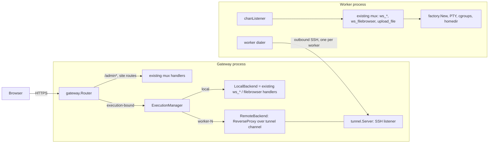
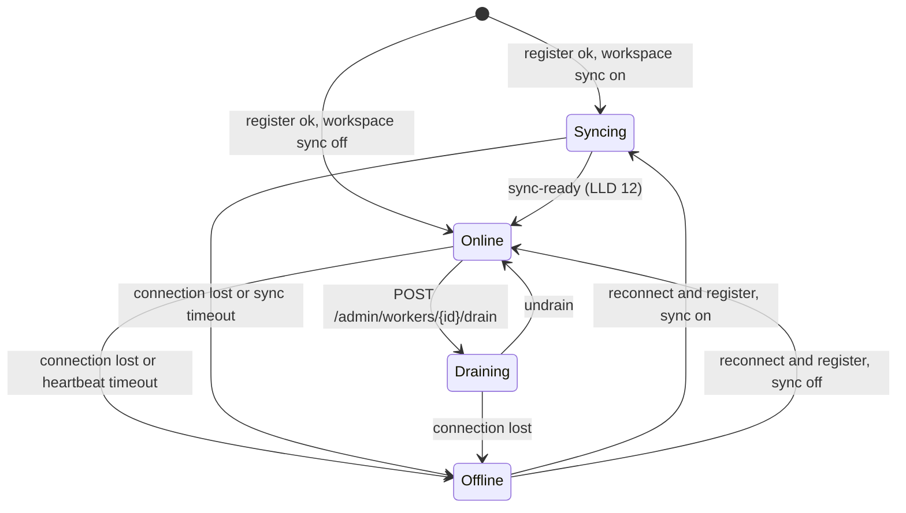

# LLD 11: Distributed execution (gateway and workers)

Status: steps 1 to 3 are implemented on the `distributed-execution` branch. See the next section for exactly what exists and what is left. Implements [hld/distributed-execution.md](../hld/distributed-execution.md) against the current code.

## Implementation status

| Piece | State |
|---|---|
| `--mode` (`standalone`, `gateway`, `worker`), option validation | Implemented |
| `gateway` package: router, session registry, guest affinity cookie, `LocalBackend`, `RemoteBackend`, route map | Implemented, unit and in-process cluster tests |
| `tunnel` package: WebSocket carrier at `/api/tunnel`, optional raw `ssh://` listener, registration, heartbeat, reconnect, streams | Implemented and tested |
| `trusted` package: identity headers and worker workspace naming | Implemented and tested |
| Worker mode: serves only tunnel streams, trusted identity, cookie-secret and auth-token sync, guest cleanup | Implemented, checked end to end with a gateway and a worker container |
| Cross-session routing of `jid` and `homedir`, client puts `jid` on the WebSocket URL | Implemented |
| Signed-in users with a workspace on the gateway stay on `local` | Implemented |
| Placement | `gateway.Pool`: randomized weighted selection over the online backends that have a weight and free capacity (section 8) |
| Durable `uid -> worker` pin in the user database | Implemented (`user/pin.go`), unit-tested through the router; not exercised with a real sign-in |
| Drain, `/admin/workers`, `/admin/sessions`, `--local-weight`, `--worker-languages` | Implemented and tested (the admin API in-process; over HTTP only the 401 for a caller who is not an admin) |

Known limits: a drain set through the admin API is kept in memory, so a gateway restart clears it; a client that never loads a page gets no affinity (section 20); a signed-in user cannot be moved to another worker (section 18).

Scope today: `src/server/{server,handlers,options}.go`, `src/cookie/cookie.go`, `src/user/util.go`, `src/containers/container_linux.go`, `src/gotty/main.go`. New: `src/gateway/`, `src/worker/`, `src/tunnel/`.

## 1. Principles

1. **Standalone is the default and must not change.** With `--mode=standalone` (default) none of the new code is on the request path.
2. **Only execution-bound routes use affinity.** Account and website routes always run on the gateway. See section 3.
3. **The worker runs the existing server.** The same `setupHandlers` mux, `processWSConn`, `factory.New`, cgroups and `filebrowser` run on the worker. We add a trusted identity input and a tunnel listener; we do not fork the handlers.
4. **The gateway owns identity.** Session records (session ids, profiles, the user DB) stay on the gateway. Workers get identity from trusted headers that only arrive over the authenticated tunnel, and they can also read the signed session cookie because the gateway hands them the cookie secret at registration (6.1a).
5. **No migration.** If a worker dies its sessions fail; they are never re-placed.

## 2. Modes and process layout

| Mode | Flag | What runs |
|---|---|---|
| standalone | `--mode=standalone` (default) | Today's server. No tunnel, no registry. |
| gateway | `--mode=gateway` | Public server plus `gateway` router, tunnel server, registry, pool. May also run sessions itself (`LocalBackend`). |
| worker | `--mode=worker` | The server mux on a tunnel listener, plus a dialer to the gateway. No port of its own unless `--port` or `--address` is given (6.2a). |



## 3. Route ownership

Derived from `setupHandlers` (`src/server/server.go`).

| Class | Routes | Runs on |
|---|---|---|
| Gateway only | `/api/tunnel` (worker tunnel, section 9), `/admin`, `/admin/*`, `editblog.html`, `login`, `logout`, `profile`, `auth_token.js`, `config.js`, `settings.js`, `chat/completions`, `feedback`, `blog`, `snippet`, `s/`, `demo`, `practice/*`, `sitemap.xml`, static assets, `/` and language pages | Gateway handlers, always |
| Execution-bound | `ws`, `ws_c`, `ws_cpp`, `ws_go`, every `ws_<command>`, `ws_filebrowser`, `upload_file` | Backend chosen by affinity: `LocalBackend` or a worker |

`gateway.Router.ServeHTTP`:

```text
path == tunnelPath                              -> tunnel.Server.ServeWS (local; worker connections only)
path == "/admin" || HasPrefix(path, "/admin/")  -> site mux (local, never proxied)
isExecutionBound(path)                          -> ExecutionManager.Resolve(r) -> backend
otherwise                                       -> site mux
```

`isExecutionBound` is a fixed prefix check (`ws`, `ws_*`, `upload_file`) built from the same `Commands2DemoMap` loop that registers the `ws_*` routes, so a new REPL is picked up without touching the router. The admin check must be a prefix; today `/admin` and `/admin/settings` are exact routes.

## 4. Execution context and affinity

```go
// package gateway
type ExecutionContext struct {
    Key       string    // "u:<uid>" for signed-in users, "g:<guestID>" for guests
    UID       string    // empty for guests
    GuestID   string    // random id stored in the affinity cookie
    BackendID string    // "local" or a worker id
    CreatedAt time.Time
    ExpiresAt time.Time // guests: sliding, utils.DEADLINE_MINUTES; users: none
}
```

`SessionRegistry` (in-process, mutex-guarded map keyed by `Key`):

| Method | Behaviour |
|---|---|
| `Resolve(r)` | Key from the request: `cookie.Get_Uid(r)` if signed in, else the guest id from the affinity cookie. Returns the existing context or `nil`. |
| `Create(key, backend)` | Stores a new context. Called only after the pool picks a backend. |
| `Touch(key)` | Slides a guest's expiry on each execution-bound request. |
| `Release(key)` | Removes it (guest expiry, explicit logout). |

- **Signed-in users are pinned.** A user counts as signed in only while the session cookie says so and has not expired, the same rule `cookie.GetOrUpdateHomeDir` uses; otherwise the request is a guest's. `uid -> worker` is persisted (key `worker-pin:<uid>` in `user_sessions.db`, `user/pin.go`) the first time the pool places the user, so it survives a gateway restart. With no live context the router reads the pin and goes straight to that backend. If it is not connected or not `ONLINE`, the request fails with 503 "workspace node unavailable"; the pool is not consulted and the pin is not changed. A user who already has a session keeps it while the worker drains.
- **Guests are placed freely.** Their context lives in memory only. The guest id is carried in an `or-aff` cookie, signed with the existing `cookie.SECRET_KEY` (gateway side only) via `securecookie`.
- **First assignment happens on the first page load**, not on the first `ws*` call. The IDE page fires several requests at once (terminal WebSocket, file tree, usage), and today the index page is what creates the cookie and homedir so those requests share one directory (`handleIndex` comment, `handlers.go:307`). The gateway therefore issues the guest id and picks the backend when it serves `/` or a language page, and any later execution-bound request without a context (API clients) is assigned on the spot. This costs nothing: capacity is consumed only while a WebSocket is open (section 8), a registry entry is not a slot.
- **Existing signed-in users stay where their files are.** Today every user's homedir is on the one server's disk. For a signed-in user with no stored pin, the gateway checks whether their homedir already exists locally (`HOME_DIR + generateHomeDirectoryID(...)`) and, if so, pins them to `local`. Only users with no existing local workspace go through the pool. Without this rule the first login after enabling gateway mode could land an existing user on an empty worker.
- **v1 assumes homogeneous workers** (same image as the gateway), so assignment at page load does not need to know the language. `--worker-languages` is still advertised and checked at `ws_<command>` time; a missing language returns a clear error instead of silently running elsewhere.
- **Affinity is never recomputed.** An existing context is used as is, including for WebSockets.

## 5. Backends

```go
type Backend interface {
    ID() string
    State() State                  // Online, Draining, Offline
    Serve(w http.ResponseWriter, r *http.Request) error
    Weight() int                   // share of new sessions, 0 = never chosen
    Capacity() (used, max int64)   // memory-weight MB, max 0 = no limit
    HasLanguage(command string) bool
}
```

- **`LocalBackend`** (`gateway/backend.go`). `Serve` calls the existing site/ws mux handler directly. No proxy hop. Capacity is `--max-connection` / total weight as today. `--local-weight=0` makes the gateway routing-only (never selected by the pool).
- **`RemoteBackend`** (`gateway/remote.go`). Wraps a `*tunnel.Conn`. `Serve` runs a `httputil.ReverseProxy` whose `Transport.DialContext` opens a new SSH channel `openrepl-http` to the worker. Go 1.19's `ReverseProxy` already handles `Upgrade`, so WebSockets are bridged without `koding/websocketproxy`. `Host`, method, path, query, cookies and body are preserved.

Gateway-added headers on the proxied request (any `X-OpenREPL-*` header supplied by the client is deleted first):

| Header | Value |
|---|---|
| `X-OpenREPL-Uid` | uid, empty for guests |
| `X-OpenREPL-Guest` | guest id (guests only) |
| `X-OpenREPL-Home-ID` | `generateHomeDirectoryID(name, uid)` for signed-in users, computed on the gateway because the worker has no user-profile DB |
| `X-OpenREPL-Priv` | `utils.ADMIN` or `utils.GUEST` |
| `X-OpenREPL-Session` | context key (for logs) |

## 6. Worker side

### 6.1 Trusted identity

`fetchRequestedPayload` (`src/server/handlers.go:40`) today reads the cookie. It gains one branch:

```text
if trustedFromTunnel(r)  -> uid, homedir, privilege from X-OpenREPL-* headers
else                     -> existing cookie logic (standalone, local backend)
```

`trustedFromTunnel` is true only when the request arrived on the `chanListener` (a per-listener `ConnContext` sets a context value). The worker has no other public listener, so the headers cannot come from a browser. The same branch is used by `ws_filebrowser` and `upload_file`, which call `GetOrUpdateHomeDir` today.

### 6.1a Cookies on the worker leg

Decision: workers may read the session cookie (for example to take the homedir from it later), while session ids and the user DB stay on the gateway.

- **Secret sync.** The gateway's `OPENREPL_SECRET` (`RegisterReply.Secret`, only when it has one) is also sent in the `register` reply; the worker keeps it in memory (`utils.SetSecretFromGateway`) and `utils.Secret()` returns it in preference to the worker's own for as long as the connection lasts. The cookie secret (`cookie.SECRET_KEY`) is sent to the worker in the `register` reply, on every connect and reconnect, over the authenticated tunnel. The worker calls `cookie.Init_SessionStore(secret)` with it, replacing the temporary secret its own `init()` generated. It is held in memory only: never written to disk, never logged, and not part of any admin output. A gateway restart or secret change reaches workers on their next reconnect; a worker never keeps a secret from a previous connection.
- **Cookie forwarded.** The gateway forwards the `Cookie` header unchanged. The worker can therefore decode `user-session` and read `uid`, `loggedIn`, `expirationTime` and the stored `homedir` with the existing `cookie.Get_*` functions.
- **Trusted headers stay authoritative for identity and privilege.** `X-OpenREPL-Uid`, `X-OpenREPL-Priv` and `X-OpenREPL-Home-ID` are set by the gateway after it has validated the session against the DB. A signature-valid cookie does not prove the session is still live (logout and expiry live in the gateway DB), so the worker must not use the cookie to decide who the user is or whether they are an admin. `IsUserAdmin` is never called on a worker; it reads the user profile and session records, which only the gateway has.
- **Cookie reads are for data the cookie carries** (for example `homedir`), used only as a hint where headers are absent, never to override a header.
- **Writes stay with the gateway.** The gateway deletes any `Set-Cookie` on worker responses, so the worker never sets or refreshes a browser cookie. If a later change wants workers to update the cookie (for instance its `homedir`), extend this to an allow-list for the `user-session` cookie rather than removing the filter.
- **No DB sync.** The user DB (sessions, profiles, blog, snippets, practice) is not copied to workers in v1 (see section 19).

Residual risk, accepted: a worker that holds the secret can mint a validly signed cookie for any `uid`. The impact is limited because the gateway re-validates the session id against its DB before it grants identity or admin rights, and a worker has no session ids except the ones in cookies it receives, so an admin who is routed to a worker exposes their own session cookie to it. Mitigations: keep the secret memory-only, rotate it on reconnect, and prefer to keep admin accounts' sessions on `local`. A fully trusted-fleet deployment is assumed.

### 6.2 Homedir on the worker

- **Signed-in user:** `utils.HOME_DIR + X-OpenREPL-Home-ID`.
- **Guest:** `utils.HOME_DIR + "guest-" + X-OpenREPL-Guest`, created lazily with `MkdirAll`.
- **Cleanup:** the guest removal job (`utils.REMOVE_JOB_KEY + homedir`, `GottyJobs.ResetJob`) is scheduled on the worker that owns the directory.
- **Gateway change:** in `handleIndex`, when `--mode=gateway`, skip `GetOrUpdateHomeDir` and the cleanup `defer`, because the directory may belong to a worker. The ws/upload paths still call it, so `LocalBackend` sessions create their directory lazily.
- **Query overrides are routed, not stripped.** `GetOrUpdateHomeDir` honours `homedir` and `jid` from the query, and the page uses both on purpose: `preprocessurl` (`js/src/page/01-session.js`) appends `homedir=<master's path>` to every file-browser, upload and download request of a shared-session viewer, and `jid` to requests made from a fork link. They can come from a different browser session than the owner, so they must reach the node that owns the directory or process. The worker keeps honouring them exactly as today; the gateway routes on them (section 7). Their trust model is unchanged: the path or jid acts as a capability. Tightening that (for example a signed share token) is a separate, later change.
- **Worker `Run` binds no port by default.** `Server.Run` listens on `options.Address:options.Port` in the other modes. In worker mode it serves the same mux on the tunnel `chanListener`, whose connections `trustTunnel` marks as trusted. If the operator gave `--port` or `--address`, it also serves that address (6.2a). Requests that arrive over the tunnel skip basic auth.
- **`AuthToken`.** `processWSConn` rejects a WebSocket whose init `AuthToken` differs from `options.Credential` (the WebSocket routes are registered outside the basic-auth wrapper, so this check is their only gate). The worker receives the gateway's credential (`auth_token`) in the `register` reply, together with the cookie secret, and compares against that, so a worker needs no `--credential` flag.

### 6.2a The worker's own port

`main` sets `Options.LocalListen` when `--port` or `--address` was given on the command line, in the environment, or in the config file (`utils.ConfigKeys` reads the file's keys, so a value equal to the default still counts). `Run` then calls `serveLocal`, the same code the standalone server uses, with a second `http.Server` that has no `ConnContext`. The tunnel server and this one share one handler, and the only difference between their requests is `isTrusted(r)`.

| Concern | On the tunnel (trusted) | On the worker's own port |
|---|---|---|
| Identity and home | `X-OpenREPL-*` headers, `trusted.HomeDir` | Session cookie and `GetOrUpdateHomeDir`, as in standalone. The headers are ignored. |
| Basic auth (`wrapSiteAuth`) | Skipped; the gateway did it | Applied when the worker has `--credential` |
| WebSocket `AuthToken` (`credentialFor`) | The gateway's token from the register reply | The worker's own `Credential`, which `/auth_token.js` serves there |
| Routes (`announce`) | `jid` and `homedir` keys are announced to the gateway | Nothing is announced; the session is not reachable through the gateway |
| Workspace sync (`waitWorkspace`) | Waits until the home is in step | Does not wait and starts no sync; the home is not synchronized (LLD 12) |
| Capacity | Counted | Counted, by the same `counter` |

### 6.2b The config a worker follows

The gateway applies the site rules (maintenance mode, languages that are switched off) to everybody it forwards (`wrapControls`, LLD 13). A worker that also serves its own port has to apply them to the people who open that port, and show them the same announcement, so the gateway hands its rules to every worker:

- `tunnel.WorkerConfig` (`protocol.go`): `Revision`, the colour of the day, the announcement (text, level), maintenance (on, message) and the list of languages that are off. Nothing secret, and nothing about Genie, keys or admins. `Revision` is a hash of the content (never 0), so the same rules have the same revision on every gateway and after a restart.
- *Delivery:* in the `register` reply (`RegisterReply.Config`) on every connect and reconnect, and afterwards in the reply to a heartbeat. A worker reports the revision it follows in each heartbeat (`Heartbeat.ConfigRev`); when the gateway's differs, the reply carries the new config (`HeartbeatReply`). So a change reaches workers within one heartbeat interval (10 s), and a worker that is current gets nothing extra. `ServerConfig.Config` is the gateway's provider and `ClientConfig.OnConfig` the worker's callback, called once per revision.
- *Use:* `applyWorkerConfig` (`server/worker_config.go`) makes the config the worker's `SiteSettings`, in memory only; the worker reads no `settings.json` or database for them. `/settings.js` of the worker then shows the gateway's banner, and `wrapWorkerControls` closes a terminal of a visitor of the worker's own port with `site notice: ...` for maintenance and for a switched-off language. A request the gateway forwarded (trusted) is not checked again: the gateway knows who is an admin and the worker does not. On the worker's own port nobody is exempt, admins included; an admin who needs a terminal during maintenance uses the gateway.
- *Before the first config* (or if the gateway never sends one, an older gateway) the worker has the default settings: no rules.
- *Dashboard:* the worker's drawer shows "Site rules: up to date" or the revision it follows (`WorkerInfo.ConfigRev`, `ConfigCurrent`).
- *Not sent on purpose:* the MongoDB or Firestore settings (a worker keeps files, LLD 05), keys, the admin list, and limits such as capacity, which are the worker's own flags. Together with the secret (section 6.1a), this is everything a worker takes from the gateway.

A failure to listen ends `Run` before the worker connects to the gateway. A listener that stops later cancels the worker's context, like a standalone server. On shutdown `runWorker` closes both servers, then waits for the live WebSockets.

### 6.3 Execution

Unchanged. `processWSConn` → `server.factory.New(params)` → `containers.GetCommandArgs` → PTY in namespaces + cgroup. Run/Debug carries the editor content in the WebSocket init payload; `SaveIdeContentToFile` writes it into the worker's own homedir, so no file sync is needed. `ws_filebrowser` and `upload_file` hit the same directory.

The shared-state race in `generateHandleWS` (`server.SetNewCommand` on the single factory) is fixed in step 1: the command is passed per connection through `factory.NewWithCommand`.

## 7. Fork (`jid`) routing

`jid` is `encodePID(pid)` and `containers.GetWorkingDir` / `nsenter -t<pid>` only work on the machine that owns the process.

A fork link (`?jid=...`, the Fork button in `webtty.ts` `jidHandler`) can be opened by someone other than the owner, so `jid` routing must not depend on the caller's uid.

- **Record.** When a node creates a slave it announces `{kind:"jid", key}` *before* the title message is written to the browser, and withdraws it when the slave closes (`routeTracker` in `server/identity.go`). It announces `{kind:"home", key}` for a workspace it resolved for its own session (not one named by a `homedir` or `jid` override), and withdraws it after two hours without use. A worker sends these as `route-open@openrepl` / `route-close@openrepl` and waits up to 2 s for the gateway's reply; the gateway's own backend writes them straight into the map, so keys owned by `local` are routable too. The gateway keeps one `RouteMap` of `(kind, key) -> backend id`. After a reconnect the worker announces its open keys again.
- **Route, HTTP.** `ws_filebrowser`, `upload_file` and downloads carry `jid` and `homedir` in the query (`preprocessurl`). The gateway looks them up in `RouteMap` first; a hit overrides normal affinity.
- **Route, WebSocket.** The terminal sends `jid` only inside the init message (`webtty.ts`: `this.args += "jid=..."`), which arrives after the upgrade, when the gateway has already chosen a backend. Fix: the client also puts `jid` on the WebSocket URL (a one-line change where the connection URL is built in `gotty.ts`/`websocket.ts`). The init message is unchanged, so the worker still reads `jid` from `params`.
- **Unknown key.** An unknown `jid` or `homedir` falls back to the caller's normal affinity; the worker then finds no such process or directory and fails as it does today. It is never re-balanced to a new worker.
- **Same browser needs no lookup.** A new tab in the same browser has the same cookies, so affinity already sends it to the same worker; `RouteMap` matters for cross-session links.
- **Failure.** Worker `OFFLINE` drops its `RouteMap` entries; forks and viewer requests for it fail.

This replaces the earlier "sniff the title frame" idea: the worker already knows the pid, so reporting it over the control channel avoids parsing WebSocket frames in the gateway.

## 8. Capacity and load balancing

- **Unit:** the existing memory weights in MB, `containers.GetCommandWieght(command)`, the units behind `--max-connection`.
- **Worker capacity** is advertised at registration (`--worker-capacity`, default the machine's RAM from `/proc/meminfo`). The worker also enforces it: unless `--max-connection` is set, it uses the capacity as its own admission limit, so a terminal that does not fit is refused with the usual "exceeding max number of connections" message.
- **Used capacity** as the gateway sees it is the larger of two numbers: what the worker last reported in a heartbeat, and the weight of the terminals currently open through this gateway (`RemoteBackend.tracked`, raised for the life of each terminal WebSocket). The second is immediate, so a burst of arrivals does not all see the same stale figure.
- **The gateway's own backend** has weight `--local-weight` (default 10, 0 = routing-only) and capacity `--max-connection` (0 = no limit).

### Selection (`gateway/pool.go`)

Randomized weighted selection, the method of `ServerPool.Select` in `sish-lb/lb.go`:

1. Candidates are the backends that are `ONLINE`, have a weight above 0 and have free capacity (`max == 0` or `used < max`).
2. If none has free capacity, the candidates are all `ONLINE` backends with a weight. The session is still placed, and the node refuses the terminal itself, as a full single server does.
3. If there is still none, placement fails with "no execution node available" (the page still loads; the terminal gets 503).
4. The candidates are ordered by weight and their weights summed into a running total. A uniform random integer in `1..total` selects the first candidate whose running total reaches it (`sort.SearchInts`). A backend with weight 30 is chosen three times as often as one with weight 10.

Differences from sish-lb: the candidate list is rebuilt on every pick because eligibility changes with state and load; there are no global flags; the pool has its own `*rand.Rand` under a mutex instead of calling `rand.Seed` on the shared generator; the key is the session, not a hostname.

Placement happens once per session, on the first page load, before the language is known. So the language is not part of selection: a worker that lacks the requested REPL (`--worker-languages`) answers that terminal with 503 "this language is not available on your execution node". With no `--worker-languages` a worker is taken to have every REPL.

## 9. Tunnel (`src/tunnel`)

Transport is SSH (`golang.org/x/crypto/ssh`), one connection per worker, dialed outbound from the worker. The SSH session can ride on either of two byte streams; both feed the same `ssh.NewServerConn` on the gateway, so everything above the stream (registration, heartbeat, channels) is identical.

| `--worker-server` value | Stream | Use |
|---|---|---|
| `wss://gateway.example.com/api/tunnel` (recommended), `ws://` for local tests | A WebSocket on the gateway's normal HTTP(S) port | One public port, works through HTTP-only fronts (nginx, Cloudflare, load balancers), TLS comes from the existing HTTPS termination |
| `ssh://gateway.example.com:2222` | Raw TCP to a dedicated SSH listener (`--tunnel-addr`) | Networks where WebSocket is not allowed but the port is open |

### WebSocket carrier (`src/tunnel/wsconn.go`)

- `wsConn` wraps a `*websocket.Conn` (gorilla, already vendored) as a `net.Conn`: binary frames, `Read` drains the current frame then fetches the next, `Write` sends one binary frame, a mutex serialises writers.
- Gateway: `tunnel.Server.ServeWS` is registered on the outer mux at `--tunnel-path` (default `/api/tunnel`, relative to the random-URL prefix if one is set). It sits outside `gziphandler`, `wrapHeaders` and the basic-auth wrapper, because workers cannot answer a basic-auth challenge and gzip must not touch an upgraded connection.
- The upgrade is rejected unless the request has `Authorization: Bearer <worker-token>` (constant-time compare). Browsers cannot send this header and workers send no `Origin`, so any request carrying an `Origin` is also rejected. After the upgrade the SSH handshake authenticates again with the same token.
- Keepalive: WebSocket ping every 20 s (below the idle timeout of common proxies) in addition to the SSH keepalive. A missed pong closes the carrier and the worker goes `OFFLINE`.
- Failed upgrades are rate-limited per client IP.

```mermaid
sequenceDiagram
    participant W as Worker
    participant G as Gateway tunnel.Server
    W->>G: connect (wss upgrade with Bearer token, or raw TCP), then SSH handshake (user=worker-id, password=--worker-token)
    G-->>W: auth ok
    W->>G: global request "register" {id, version, os, arch, languages[], capacity, weight}
    G-->>W: reply {connection_id, heartbeat_ms, cookie_secret, auth_token}
    loop every heartbeat_ms
        W->>G: global request "heartbeat" {used, cpu, mem}
    end
    Note over G: browser request for worker-N
    G->>W: open channel "openrepl-http"
    W->>W: chanListener.Accept returns the channel as net.Conn; http.Server serves it
```

| Item | Detail |
|---|---|
| Auth | Token as SSH password for v1 (compared in constant time); over `wss://` the TLS certificate authenticates the gateway; over `ssh://` the worker must pin the gateway host key via `--worker-hostkey`. Key-based worker auth can replace the token later. |
| Control messages | SSH global requests from the worker, all answered: `register@openrepl`, `heartbeat@openrepl`, `route-open@openrepl`, `route-close@openrepl` (`tunnel/protocol.go`). The SSH user must equal the registered worker id. Drain is a gateway-side flag on the worker id, set through the admin API (section 11). |
| Data | One SSH channel (`openrepl-http`) per proxied HTTP connection or WebSocket. `tunnel/conn.go` wraps it as a `net.Conn` with working read and write deadlines, which the terminal's session time limit relies on. `httputil.ReverseProxy` does the copying, so sish-lb's `copyBoth` was not needed. |
| Liveness | The worker sends `heartbeat@openrepl` every interval the gateway names in its reply (`heartbeat_ms`, default 10 s). A worker silent for 30 s, or a closed connection, is `OFFLINE`. The worker likewise drops a gateway that does not answer within three intervals. The WebSocket carrier adds a ping every 20 s. |
| Reconnect | Worker retries with capped exponential backoff and re-registers; it comes back `ONLINE` with `used=0` (sessions on the old connection are gone). |
| Vendoring | `x/crypto/ssh` and its dependencies are not in `src/golang.org/x` today (only `sys`, `tools`); they must be vendored. The build is `GO111MODULE=off`. |

### Worker states



`SYNCING` exists only with `--workspace-sync` ([LLD 12](12-workspace-sync.md)): a worker that has just registered takes no new sessions until its homes are in step with the gateway.

## 10. Request flows

### New guest, first terminal

```mermaid
sequenceDiagram
    participant B as Browser
    participant R as Router
    participant S as SessionRegistry
    participant P as Pool
    participant W as Worker
    B->>R: GET /ws_go (no or-aff cookie)
    R->>S: Resolve(r) -> nil
    R->>P: Select(cmd=go, weight)
    P-->>R: worker-2
    R->>S: Create(g:<id>, worker-2); Set-Cookie or-aff
    R->>W: proxy WS upgrade + X-OpenREPL-* headers
    W->>W: fetchRequestedPayload(headers) -> processWSConn -> factory.New
    W->>R: route-open {jid} (control)
    W-->>B: title frame with <jid> (through proxy)
```

### Existing session, file save

`ws_filebrowser`/`upload_file` → `Resolve` finds `worker-2` → proxied to the same worker's mux → writes the same homedir the terminal uses. The pool is not consulted.

### Admin

`/admin/workers` is handled by the gateway's local mux. It never opens a channel.

## 11. Admin API (gateway-local)

`gateway/admin.go`, mounted by the server in gateway mode behind `adminAPI` (the admin check, the `X-Requested-With: openrepl-admin` header on every change, and `Cache-Control: no-store`; see LLD 13). The admin dashboard shows and drives these routes. In standalone and worker mode they do not exist.

| Route | Purpose |
|---|---|
| `GET /admin/workers` | `{"workers":[...]}`: one row per backend, including `local`. Fields: `id`, `state`, `weight`, `usedMB`, `maxMB` (0 = no limit), `sessions` (execution contexts assigned), `picked` (sessions the picker has given the node since the gateway started, `Router.countPick` in `place`), `pickedPercent` (its share of all picks, one decimal) and `weightPercent` (the share its weight gives it among the backends that take new sessions now: `ONLINE` with weight above 0, else 0), and for workers `terminals`, `languages`, `remoteAddr`, `lastSeen`, `connectionId`, `os`, `arch`, `version`, `connected` (since when this connection has been up) and, with workspace sync and a running conversation, `sync` {`homes`, `clockOffsetMs`}. The reply also carries `pickedTotal` and `pickedSince`. Only the picker's choices are counted, not a signed-in user going back to their pinned worker; the counts are in memory and start again when the gateway restarts; a backend that has left keeps its picks in the total but has no row |
| `POST /admin/workers/{id}/drain` | The worker stops receiving new sessions; existing ones carry on. Replies `{"id","state"}` |
| `POST /admin/workers/{id}/undrain` | Resumes placement |
| `POST /admin/workers/{id}/reconnect` | Closes the worker's connection (`Worker.Disconnect`); the worker connects again by itself, which starts everything that depends on the connection afresh. 400 for `local` |
| `GET /admin/sessions` | `{"sessions":[...]}`: `key`, `uid`, `user` (`Config.UserLabel`, the email), `backend`, `created`, `expires`, `home`, `terminals` (open now) and `lastActive` (the last two with the tracking in `gateway/terminals.go`) |
| `POST /admin/sessions/{key}/end` | Closes the session's terminals and releases its execution context. Replies `{"key","terminalsClosed"}`. 404 for an unknown session |
| `POST /admin/sessions/{key}/move` | Body `{"to":"<node>"}`. Moves the session as LLD 13 section 4 describes; 409 with the reason when it cannot (no workspace sync, the node is unknown or not `ONLINE`, or it is the current one) |

Errors: 405 for the wrong method, 404 for an unknown worker or path, 400 for draining `local` (use `--local-weight 0`). The drain flag belongs to the worker id on the gateway (`tunnel.Server.SetDraining`), so it survives the worker reconnecting. It is kept in memory and is cleared by a gateway restart.

## 12. Configuration

New fields on `server.Options` (same tag convention: `hcl`, `flagName`, `default`), so each is settable in `~/.gotty`, env or CLI.

| Flag / HCL key | Default | Mode |
|---|---|---|
| `--mode` / `mode` | `standalone` | all |
| `--local-weight` / `local_weight` | `10`; 0 = routing-only gateway | gateway |
| `--tunnel-path` / `tunnel_path` | `/api/tunnel` (WebSocket tunnel endpoint on the public port) | gateway |
| `--tunnel-addr` / `tunnel_addr` | empty = raw SSH listener disabled; e.g. `0.0.0.0:2222` to enable | gateway |
| `--tunnel-hostkey` / `tunnel_hostkey` | `~/.gotty.tunnel_key` (private key; generated if absent, its SHA256 fingerprint is logged at startup) | gateway (used by both carriers) |
| `--worker-hostkey` / `worker_hostkey` | none; required for `ssh://`, optional for `wss://` | worker: the gateway's SHA256 fingerprint to pin |
| `--worker-token` / `worker_token` (`$GOTTY_WORKER_TOKEN`) | empty. Required on a worker; a gateway without it accepts no workers | gateway, worker |
| `--worker-id` / `worker_id` | hostname | worker |
| `--worker-server` / `worker_server` | none (required). URL: `wss://host/api/tunnel` or `ssh://host:2222` | worker |
| `--worker-weight` / `worker_weight` | `10` | worker |
| `--worker-capacity` / `worker_capacity` | `0` = RAM in MB from `/proc/meminfo` | worker |
| `--worker-languages` / `worker_languages` | empty = every REPL; otherwise a comma-separated list of REPL command names such as `python,bash,cling` | worker |


Validation (`Options.Validate`): a gateway without a token starts with workers disabled (every session runs locally, as in step 1); worker requires a `worker-server` URL with a `wss`, `ws` or `ssh` scheme, a token, and a `worker-hostkey` when the scheme is `ssh`; `standalone` ignores the rest.

## 13. Usage

The binary is the same `gotty` for every mode; `--mode` selects the role. Every flag below can also be set as an HCL key in `~/.gotty` (or the file named by `--config` / `$GOTTY_CONFIG`) or as an environment variable (`$GOTTY_<FLAG_NAME>`), with the existing precedence: defaults, then config file, then CLI. Prefer the environment variable or the config file for the token so it stays out of `ps` output.

### Standalone (default, unchanged)

```bash
../bin/gotty -w -p 8080
```

### Gateway

```bash
export GOTTY_WORKER_TOKEN='<shared secret>'
gotty -w --mode=gateway --port 80 --max-connection 2564
```

- Workers connect to `/api/tunnel` on the same public port, so no extra port or firewall rule is needed.
- Without `GOTTY_WORKER_TOKEN` (or `--worker-token`) the gateway accepts no workers and runs every session itself.
- New sessions are spread over the gateway and the online workers by weight. `--local-weight 0` makes the gateway routing-only (it runs no sessions itself, except for signed-in users whose files are already on its disk).
- Optional raw SSH listener for networks that block WebSockets: add `--tunnel-addr 0.0.0.0:2222` and open that TCP port to workers only. On first start the gateway generates `~/.gotty.tunnel_key` and logs its fingerprint (`SHA256:...`); workers using `ssh://` pin it with `--worker-hostkey`.
- If a reverse proxy sits in front, it must allow WebSocket upgrades on `/api/tunnel` and an idle timeout above 60 s (pings keep the link active).

Equivalent `~/.gotty`:

```hcl
mode         = "gateway"
port         = "80"
max_connection = 2564
# tunnel_addr = "0.0.0.0:2222"   # optional raw SSH listener
# worker_token comes from $GOTTY_WORKER_TOKEN
```

### Worker

```bash
export GOTTY_WORKER_TOKEN='<same shared secret>'
gotty -w --mode=worker \
      --worker-server wss://gateway.example.com/api/tunnel \
      --worker-id worker-01 --worker-weight 10
```

Raw SSH instead (needs the gateway's `--tunnel-addr` and a pinned host key):

```bash
gotty -w --mode=worker \
      --worker-server ssh://gateway.example.com:2222 \
      --worker-hostkey 'SHA256:<fingerprint from the gateway log>' \
      --worker-id worker-01
```

- Outbound only: no inbound port or public address is needed, so it works behind NAT or a firewall. It opens a port of its own only when asked (6.2a).
- It must have the same runtime as a normal server (the Dockerfile image, REPL toolchains, `nsenter`, cgroup v1 access). If it has only some REPLs, list them with `--worker-languages` (the command names behind the `ws_<name>` routes, for example `python,bash,cling,gointerpreter`).
- `--worker-capacity` (memory-weight units) defaults to a value derived from RAM. It replaces `--max-connection` for admission on the worker side.
- It reconnects automatically with backoff if the gateway restarts or the link drops.

Equivalent `~/.gotty`:

```hcl
mode            = "worker"
worker_server   = "wss://gateway.example.com/api/tunnel"
# worker_hostkey = "SHA256:<fingerprint>"   # only needed for ssh://
worker_id       = "worker-01"
worker_weight   = 10
```

### Deployment notes

- **systemd:** copy `src/services/gotty.service` and change `ExecStart` to the gateway or worker command above (the title format flag is no longer needed). Use `EnvironmentFile=` for `GOTTY_WORKER_TOKEN`.
- **Docker:** run the existing image with the same arguments; for a worker no `-p` port mapping is required.
- **TLS:** terminate HTTPS on the gateway (`--tls`) or in front of it and use `wss://`; the certificate then authenticates the gateway. The SSH layer inside the tunnel encrypts independently.
- **Basic auth:** if `--credential` basic auth is enabled it does not apply to `/api/tunnel` (workers authenticate with the token instead).
- **Rolling out:** start the gateway, then workers. Drain a worker before maintenance (below), wait for its active count to reach 0, then stop it.

### Operating the fleet

As a signed-in admin (the same session that opens `/admin`):

```bash
curl -b "$ADMIN_COOKIE" https://openrepl.example.com/admin/workers
curl -b "$ADMIN_COOKIE" -H 'X-Requested-With: openrepl-admin' -X POST https://openrepl.example.com/admin/workers/worker-01/drain
curl -b "$ADMIN_COOKIE" -H 'X-Requested-With: openrepl-admin' -X POST https://openrepl.example.com/admin/workers/worker-01/undrain
```

Validation at startup fails fast: a gateway or worker without a token, or a worker without `--worker-server` (or without `--worker-hostkey` when using `ssh://`), exits with an error instead of running half-configured.

## 14. Failure handling

| Event | Behaviour |
|---|---|
| Worker connection drops | Mark `OFFLINE`, close its channels (browsers see WS close "execution node unavailable"), drop its `JIDMap` entries, remove from pool. Contexts that point to it are kept so a pinned user gets 503 rather than a different worker. |
| Browser closes | Proxy closes the channel; worker's `processWSConn` sees `ErrMasterClosed` and runs normal PTY/cgroup cleanup. |
| Pinned user's worker down | 503 with a clear message; never reassigned in v1. |
| Guest's worker down | Context removed on next request; a new session may land elsewhere (their old files are gone). |
| Gateway restart | Workers reconnect and re-register. Pinned `uid -> worker` survives (persisted); guest contexts are lost, so a guest may be reassigned (their old workspace is orphaned and cleaned by the worker's cleanup job). |
| Unknown or expired session | Treated as new (guest) or pinned lookup (user). |
| Worker draining | No new assignments; existing sessions run; `/admin/workers` shows active count. |

## 15. Security notes

- Strip all inbound `X-OpenREPL-*` headers on the gateway. Workers accept them only on the tunnel listener.
- A worker has no listener unless `--port` or `--address` is given; the tunnel is outbound only. On that port the trusted headers are never believed (only tunnel connections carry the trust mark), basic auth uses the worker's own `--credential`, and its sessions are not announced to the gateway.
- `/api/tunnel` is on the public port: Bearer-token check before upgrade, reject any request with an `Origin`, per-IP rate limit on failures, then SSH auth again inside.
- Constant-time token comparison; host key pinning for `ssh://`; rate-limit failed registrations.
- `homedir` and `jid` from the client are routed through `RouteMap` and then honoured by the worker as today (same capability-style trust as the single-node server). Hardening that is out of scope for v1.
- `ws_filebrowser` already requires paths under the homedir (`strings.HasPrefix(path, homedir)`); that check now uses the worker-resolved homedir.
- The cookie secret is delivered over the authenticated tunnel at register/reconnect, held in memory on workers only, and never logged. A compromised worker can forge cookies but not session ids (see 6.1a).
- The affinity cookie carries only a random guest id, signed with the cookie secret.

## 16. sish-lb reuse map

| sish-lb | Here |
|---|---|
| `lb.go` `ServerPool` weighted selection | `gateway/pool.go`, adapted (no globals, capacity and language filters) |
| `http.go` `ReverseProxy` over a custom dialer | `gateway/remote.go`; dialer opens an SSH channel instead of a unix socket; WebSockets via `Upgrade` support |
| `requests.go` `copyBoth`, `IdleTimeoutConn` | `tunnel/conn.go`, reused |
| `handle.go` keepalive handling | `tunnel/server.go`, heartbeat/keepalive |
| `HTTPListenerMap` keyed by hostname | Replaced by `SessionRegistry` keyed by session |
| gin, console, GeoIP, subdomain logic | Not used |

Because sish-lb is `package main` with global flags, code is copied into `src/` with the origin noted in file headers rather than imported.

## 17. Implementation order and tests

1. **Done.** **Router and LocalBackend, behaviour unchanged.** `gateway` package, `isExecutionBound`, `SessionRegistry`, `/admin` prefix match, per-connection command fix. Tests: route classification table, admin always local, standalone mode bypasses the router entirely, affinity cookie issue/validate, registry create/resolve/expire.
2. **Done.** **Tunnel and RemoteBackend with one worker.** `tunnel`, `worker`, trusted-header branch in `fetchRequestedPayload`, worker homedir, `handleIndex` homedir skip. Tests: register/heartbeat/timeout/reconnect against an in-process SSH server; proxied request preserves method, path, query, cookie, body; WebSocket echo through the bridge; closing the browser closes the worker stream; header stripping (spoofed `X-OpenREPL-Uid` is ignored); `homedir`/`jid` override rejected.
3. **Done.** **Pool, pinning, jid routing, drain, admin.** Tests: weighted selection with capacity, language filtering, draining/offline exclusion, pinned user gets 503 when their worker is down, `jid` routes to owner and rejects other uids, drain flow, admin JSON.
4. **Done** (in-process cluster tests in `gateway/integration_test.go`, and a manual run with one gateway and two worker containers). **Integration:** gateway plus two worker processes: distribute sessions, verify affinity of terminal and file APIs to one worker, kill a worker (new sessions avoid it, existing fail), reconnect.
5. **Done.** **The worker's own port** (6.2a). Tests in `server/local_test.go`: the expected WebSocket token differs between a forwarded request and a visitor of the worker's port; basic auth asks direct visitors only; a direct session is not announced; no sync wait for a direct request; the removal guard keeps only homes with a record. `utils/flags_test.go`: which keys a config file sets. Manual run with a gateway and two worker containers: the port serves and the other worker opens none, a terminal there keeps its files on the worker, `--credential` asks for a password there and not through the gateway, a port already in use stops the worker before it connects, and the port can come from the flag, `GOTTY_PORT` or the config file.

Run `go test -race ./...` for the new packages. Today only `webtty` has tests, so these are the first tests for server-side routing.

## 18. Open items

- Persisting the drain flag across gateway restarts.
- Whether logged-in users need a way to be re-pinned by an admin (e.g. when a worker is decommissioned). Not in v1.
- Per-worker versioning: the gateway should refuse workers whose protocol version it does not support.

## 19. Future: shared database

Not in v1. v1 keeps all user, session, blog, snippet and practice data in the gateway's UnQLite files and sends workers only trusted headers.

A later phase may replace the per-gateway UnQLite stores with a shared replicated database (Firebase Realtime Database or MongoDB) so every node sees the same data. Notes for that phase:

- Replication must cover session create, logout and expiry with revocation visible to workers promptly; a connect-time snapshot is not enough.
- Needs single-writer or conflict rules for session writes (`LogOut`, cookie refresh) and for `uid -> worker` pins.
- A shared DB would let workers validate sessions themselves (revocation, expiry, admin checks), so trusted headers could become optional. v1 already syncs the cookie secret to workers (6.1a); the shared DB phase would add session data, which puts user data on machines that run untrusted code. Weigh that against gateway-signed short-lived tokens (workers hold only a verification key).
- The `Backend`/`SessionRegistry` seams in this design are where a shared store plugs in; handlers need no change.

## 20. Compatibility review against the current code

Reviewed against `server/{server,handlers,middleware,utils,handler_atomic}.go`, `cookie/cookie.go`, `user/util.go`, `containers/container_linux.go` and the page scripts under `js/src`.

**Standalone behaviour.** With `--mode=standalone` nothing new is on the request path. One edit touches standalone code: `SetNewCommand` became per-connection (`NewWithCommand`) instead of mutating the shared factory. The one visible effect is that `/ws` with no command now runs the startup command rather than the last-used one. The `/admin` prefix match lives in the gateway router only, so the standalone mux is unchanged.

**Existing features and how they are covered**

| Feature | Risk | Handling |
|---|---|---|
| Terminal and Run/Debug | Editor content travels in the WS init payload and is saved by `SaveIdeContentToFile` | Runs on the owning node; no sync (6.3) |
| File browser, upload, download, zip | Absolute paths from the worker tree must pass the `HasPrefix(path, homedir)` check | Same worker resolves the same homedir for both, so paths stay consistent (6.2) |
| Shared session viewers (`homedir=` on every request) | Viewer is a different browser session, lands on a different worker | Routed by `RouteMap` homedir key (6.2, 7) |
| Fork links (`jid=`) | Opened by other sessions; WS carries `jid` only after the upgrade | Routed by `RouteMap`; client adds `jid` to the WS URL (7) |
| Guest first load | Parallel first requests would each create their own homedir without a shared cookie | Backend and guest id assigned at page load; worker guest dir is deterministic (4, 6.2) |
| Existing signed-in users | Their files are on the gateway disk today | Pinned to `local` when a local workspace exists (4) |
| Basic auth and `AuthToken` | WS routes bypass the basic-auth wrapper; worker would also bind a public port | Worker skips basic auth for forwarded requests and uses the gateway's credential for them; on its own port, if it has one, it applies its own `--credential` (6.2, 6.2a) |
| Admin (`wrapAdmin`, `IsUserAdmin`) | Needs the user DB, which workers lack | Gateway only; worker uses `X-OpenREPL-Priv`, and reads the cookie only for data it carries (6.1a) |
| Login, profile, blog, snippets, practice, chat proxy, sitemap | DB-backed | Gateway only (3) |
| Per-process connection counter and weights | Per-machine | Each node keeps its own; the gateway pool uses worker-reported capacity (8) |
| Firebase sharing and the Practice client sync | Browser-to-Firebase, independent of the server | No change |

**Package structure.** `server` builds the mux and calls `gateway.NewRouter(mux, ...)`. `gateway` must not import `server` (import cycle); shared hooks are passed as interfaces.

**Checked during step 2**
- `utils.RemoveDir` only requires the path to be under `utils.HOME_DIR`, and `containers` uses `HOME_DIR + command` only. Worker workspaces live under `HOME_DIR`, so both hold.
- The `Session-Counter` cookie helpers in `cookie.go` are not called by any server handler; the count is kept by the page script, so no execution-bound request depends on them.
- Fork terminals (`nsenter` into the parent's namespaces) fail in the unprivileged local dev container in standalone mode too (`invalid parent id`), so they could not be exercised end to end there. The file request of a fork link was verified through the gateway.
- Verified in step 1: a `Set-Cookie` set before a WebSocket upgrade does **not** reach the client (the upgrader writes its own 101 headers). So the guest id is issued on the entry page only; a client that never loads a page gets a fresh id per connection. This is acceptable for step 1 and means such clients have no affinity in step 2.
