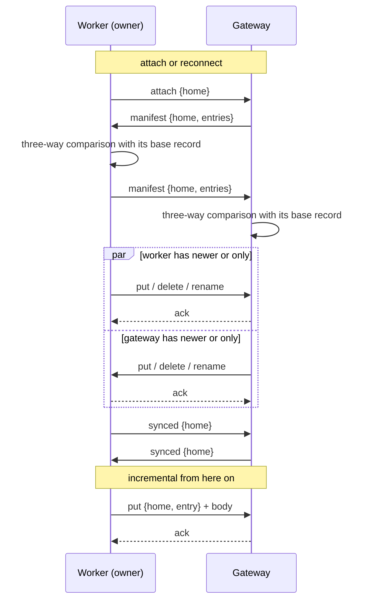
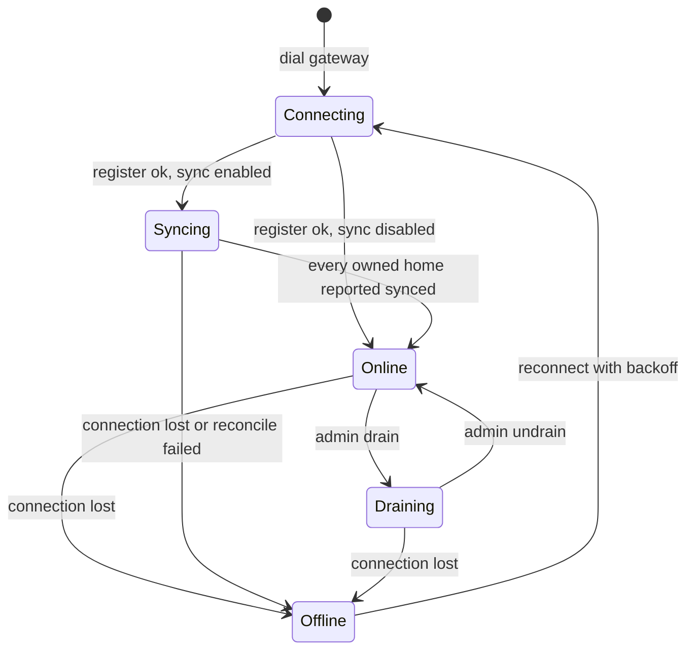

# LLD 12: Workspace synchronization (gateway and owning node)

Status: proposed. Nothing here exists yet; file and type names are the planned ones. Implements [hld/workspace-sync.md](../hld/workspace-sync.md) on top of [LLD 11](11-distributed-execution.md).

Scope today: `src/server/{identity,handlers,gateway,worker}.go`, `src/gateway/{router,remote,workers}.go`, `src/tunnel/{server,client,protocol}.go`, `src/filebrowser/filebrowser.go`, `src/backend/localcommand/local_command.go`, `src/utils/{utils,jobscheduler}.go`, `src/containers/container.go`. New: `src/wsync/`.

## 1. Principles

1. **Off by default.** Without `--workspace-sync` on the gateway nothing in this document runs, and distributed mode behaves as in LLD 11.
2. **The unit is a home**, one directory directly under `utils.HOME_DIR` (`/tmp/home/`). The layout is not changed.
3. **Two copies per home:** the gateway's, and the owning node's. Not every worker.
4. **Every decision compares against a saved base record.** Echoes and deletes never depend on timing. Only the case where both sides changed the same file uses modification times, corrected for the measured clock offset.
5. **Never follow a symbolic link, never leave the home.**
6. **A destructive action needs proof.** A delete is applied only when the base record shows the path existed at the last agreement.

## 2. What exists today and what it means for sync

| Code | Today | Consequence |
|---|---|---|
| `filebrowser.New` | Each terminal and each file request creates its own `fsnotify` watcher on one home, to notify that browser | Sync needs its own single long-lived watcher per node. The per-connection watchers stay; they will see remotely applied changes and refresh the browser's tree, which is wanted. |
| Guest expiry: `handleIndex`, `handleFileBrowser`, `trustedIdentity`, `localcommand.New` and its close path each call `GottyJobs.ResetJob(REMOVE_JOB_KEY+dir, 60 min, RemoveDir)` | Every node runs its own idle timer, reset only by requests it handles itself | With sync, the gateway's timer for a guest who is busy on a worker would fire and the delete would replicate. Expiry must have one authority (section 9). |
| `utils.GottyJobs.LoadJobsFromFile(file, nil)` in `gotty/main.go` | Jobs reloaded after a restart are given no function, so they delete nothing | Guest homes that outlive a restart are never removed today. The new expiry (section 9) does not depend on it. |
| `containers.InitContainers` / `DeleteContainers` | Create and remove `/tmp/home/<command>` at start and stop | These are not homes. Sync works per home, so they are never touched. |
| `tunnel.Client.session` | Rejects every channel type except `openrepl-http` | Add a second type (section 6). |
| `tunnel.Server.ServeConn` | Rejects every channel a worker opens | Sync channels are opened by the gateway, so this stays. |
| `gateway.Router.execute` | A session whose backend is offline gets 503 | File routes fall back to the gateway's copy (section 8). |
| `Router.place` | A signed-in user with a pin is refused when the pinned worker is away | Relaxed once copy-on-placement exists (section 10). |
| Homes on a worker | `trusted.HomeDir`: `guest-<guest id>` or the user's home id | The gateway uses the same function to find its copy. |

## 3. Package `src/wsync`

| File in `src/wsync/` | Purpose |
|---|---|
| `entry.go` | `Entry`, `FileType`, comparison |
| `record.go` | Base record: load, save, update (on disk) |
| `scan.go` | Walk a home without following links |
| `safe.go` | Path validation, safe open, create and rename |
| `diff.go` | Three-way comparison that produces actions |
| `apply.go` | Apply an action to the local disk |
| `watch.go` | `fsnotify` watcher, debounce, change queue |
| `proto.go` | Messages and framing |
| `link.go` | One sync conversation over a stream |
| `manager.go` | Per-node coordinator: homes, links, states |

It imports nothing from `server`, `gateway` or `tunnel`. It is given streams (`io.ReadWriteCloser`) and a root directory, so it is tested against two temporary directories and an in-memory pipe.

### 3.1 Entry and base record

```go
type FileType uint8 // File, Dir, Symlink

type Entry struct {
    Path    string      // relative to the home, slash-separated, cleaned
    Type    FileType
    Size    int64
    ModTime int64       // unix nanoseconds
    Mode    uint32      // permission bits only
    Hash    string      // sha256 of the content, files only; filled when needed
    Link    string      // target, symlinks only
}

// Record is the state both sides last agreed on, for one home and one peer.
type Record struct {
    Home    string
    Peer    string           // node id of the other side
    Entries map[string]Entry
}
```

- Stored at `<state dir>/<peer>/<home>.json`, written to a temporary file and renamed. The state dir is `utils.GOTTY_PATH + "/wsync"` (`/opt/gotty/wsync`), outside `/tmp/home` so it is never synchronized or shown to users.
- The gateway keeps one record per home for its current owner. A worker keeps one per home for the gateway.
- A record is updated only after the peer acknowledges the change, so after a crash the record is never ahead of what both sides have.
- Two entries are equal when type, size, mode and (hash or link) are equal. `ModTime` is carried so that received files get the sender's time (`os.Chtimes`), which makes later scans cheap; it is not used to decide equality.

### 3.2 Scan

`Scan(root, home)` walks with `filepath.Walk` (which uses `Lstat` and does not follow links) and returns the current entries. For a file whose size and mtime equal the base record's, the hash is taken from the record instead of being recomputed. Sockets, FIFOs and devices are skipped. Files larger than `filebrowser.MAXDISKUSAGE_MB` are skipped and logged.

### 3.3 Three-way comparison

For each path, with `B` the base record, `L` the local state and `R` the remote state (absent is a valid state):

| Case | Action |
|---|---|
| `L == R` | Nothing to transfer; set `B = L` |
| `L == B`, `R != B` | Take remote: fetch, or delete locally if `R` is absent |
| `R == B`, `L != B` | Give local: send, or ask the peer to delete if `L` is absent |
| `L != B`, `R != B`, `L != R`, both present | Both changed: latest modification wins (below) |
| One side absent, the other changed since `B` | Keep the changed file; send it to the side that deleted it |
| No `B` at all (first contact for this home) | Union of both sides. Nothing is deleted. Same path with different content: latest modification wins |

**Both sides changed: latest modification wins.** The entry with the later `ModTime` replaces the other, on both sides. `ModTime` is epoch time in nanoseconds, so it names the same instant on every machine. A worker's times are first corrected by its clock offset (section 6): `corrected = ModTime - offset`. On equal times the gateway's version wins. The losing version is overwritten and not kept. The rule is deterministic, so both sides compute the same result without a round trip.

**Renames.** After the comparison, a path to delete and a path to create that have the same hash and size, in the same home and the same batch, are paired into one rename. This is an optimisation only: if it is not detected, delete plus create is still correct.

### 3.4 Safe paths (`safe.go`)

Every path that arrives from a peer goes through `Resolve(root, home, rel)`:

- `rel` must be relative and equal to `path.Clean(rel)`; it must not start with `../` or be `..`.
- `home` must be a single path element.
- Each directory on the way from the home to the target is checked with `Lstat`; a symbolic link in the path is an error. This stops `a/link-to-etc/passwd`.
- Files are opened with `O_NOFOLLOW`. A symlink entry is created with `os.Symlink` and its target is stored as text, never resolved.

### 3.5 Applying a change (`apply.go`)

- **File:** write to `.<name>.wsync-<random>` in the same directory, verify size and hash, `Chmod`, `Chtimes`, then `Rename` over the target. A leftover temporary file from a crash is removed by the next scan (the prefix is reserved and never synchronized).
- **Directory:** `MkdirAll` with the sender's mode.
- **Delete:** `os.Remove` for a file or link; for a directory, remove only what the base record lists, then the directory if it is empty. A directory with unknown content is not removed.
- **Rename:** `os.Rename` after both paths pass `Resolve`.

### 3.6 Watcher (`watch.go`)

One `fsnotify.Watcher` per node, owned by the manager.

- A watch is added for every directory of every attached home (`fsnotify` on Linux is not recursive). When a directory is created, it is watched and scanned at once, because files can be written into it before the watch exists. The file browser does the same today for its own watcher.
- Events are not acted on directly. Each event marks its path dirty in a per-home set. A home is processed when it has been quiet for 300 ms, or after 2 s at the latest, so a burst of writes to one file becomes one transfer.
- Processing a dirty path means: `Lstat` it, compare with the base record, and queue a change only if it differs. A change that was just applied from the peer equals the record and produces nothing. This is the loop prevention; there is no suppression timer.
- `fsnotify.ErrEventOverflow`, any watcher error, or more than a set number of dirty paths marks the whole home for a reconcile instead.
- The event loop only fills the dirty set. Scanning, hashing and sending happen in a separate goroutine per home, so a large transfer never blocks event delivery.

## 4. Homes and ownership

| Question | Answer |
|---|---|
| Which directory is a session's home? | `trusted.HomeDir(utils.HOME_DIR, identity)`, on every node. For a session that runs on the gateway itself in gateway mode, the cookie-based name is kept as today. |
| Who owns it? | The backend in the session's `ExecutionContext`. |
| How does the gateway learn a worker has started using a home? | The worker already announces `route-open {kind:"home", key:<dir>}` (LLD 11, section 7). With sync enabled this is also the signal to attach the home. |
| When is a home attached on a worker? | In `Server.trustedIdentity`, the first time it resolves that home. |

The gateway keeps `owner map[home]backendID` in the sync manager, filled from the router. A change for a home is accepted from a worker only if that worker is its owner.

## 5. Sync conversation (`link.go`, `proto.go`)

One stream per worker connection carries all of that worker's homes. Messages are a 4-byte length, a JSON header, and for file data a body of the stated size sent in 64 KB chunks.

| Message | Direction | Purpose |
|---|---|---|
| `hello {node, version, now}` | both | Open the conversation. `now` is the sender's epoch time, used to measure the clock offset |
| `attach {home}` | either | Start synchronizing a home. The receiver answers with its manifest |
| `manifest {home, entries}` | both | Current state of a home, for a reconcile |
| `want {home, paths}` | both | Ask for file contents after comparing manifests |
| `put {home, entry}` + body | both | A file, directory or symlink |
| `delete {home, path}` | both | Remove a path |
| `rename {home, from, to}` | both | Move a path |
| `ack {seq}` / `error {seq, reason}` | both | Outcome of a `put`, `delete` or `rename`. The sender updates its base record on `ack` |
| `synced {home}` | both | This side has nothing more to send for the home |
| `drop {home}` | gateway to worker | The home expired or moved away: delete the local copy and its record |

Every `put`, `delete` and `rename` carries a sequence number. Unacknowledged changes are simply not recorded as agreed, so they are found again by the next reconcile; nothing is retried blindly.



Both sides run the same comparison with the same deterministic rules, so they agree on which side sends each path.

## 6. Tunnel changes (`src/tunnel`)

- New constant `ChannelSync = "openrepl-sync"`.
- `Worker.DialSync(ctx)` on the gateway opens it, the same way `Dial` opens `openrepl-http`.
- `Client.session` accepts it and hands the stream to a `SyncHandler func(net.Conn)` set in `ClientConfig`.
- `RegisterReply` gains `WorkspaceSync bool`. A worker enables sync only when the gateway says so, so the two cannot disagree.
- **Clock offset.** The `hello` exchange on the sync channel carries each side's current epoch time. The gateway computes `offset = workerTime - gatewayTime`, adjusted by half the round-trip time, and both sides use it for that connection when comparing modification times. It is measured again at every connection. An offset above 2 seconds is logged as a warning, since it points to a machine without time synchronisation.
- `Worker` gains a `syncing` flag. `State()` in `gateway.BindTunnel` returns the new `gateway.Syncing` while it is set.

`gateway.Syncing` is added to the `State` type. `Pool.pick` already takes only `Online` backends, so a syncing worker receives no new sessions without further change. `Router.execute` treats `Syncing` like `Draining` for existing sessions.

## 7. Worker lifecycle



On each registration:

1. The gateway opens the sync channel.
2. The worker sends `attach` for every home it has a base record for. A brand-new worker has none.
3. Both sides reconcile each home (section 5).
4. When all are `synced`, the gateway clears the `syncing` flag and the worker is `ONLINE`.

If the reconcile fails or exceeds its limit (default 5 minutes), the gateway closes the connection. The worker reconnects with the existing backoff and tries again. It is never `ONLINE` with a home it could not reconcile.

A request for a home that is still reconciling waits up to 10 seconds for `synced`, then gets 503 "workspace is synchronizing".

## 8. Gateway fallback for file requests

In `Router.execute`, when the session's backend is missing or `Offline` and sync is enabled:

| Route | Behaviour |
|---|---|
| `ws_filebrowser`, `upload_file` | Served by the local backend from the gateway's copy |
| `ws`, `ws_<command>` | 503 "execution node unavailable", as today: the program is gone |

The local handlers must use the same directory the worker used. The router puts the home's directory in the request context (`gateway.WorkspaceOf(r)`), and `Server.requestIdentity` returns it instead of the cookie's homedir when it is set. The browser's file tree uses absolute paths under `/tmp/home/<home>`, which are the same on both nodes, so the tree stays valid.

Changes made this way land on the gateway's copy, differ from the base record, and are sent to the worker at the next reconcile.

## 9. Guest expiry with one authority

With sync enabled:

- **Workers do not schedule `RemoveDir`.** The four call sites that reset the job are skipped on a worker when sync is on (`trustedIdentity`, `handleFileBrowser`, and the two in `localcommand`, which receive a flag through `params`).
- **The gateway tracks activity per home** in the sync manager: `lastActive[home]`, set by every execution-bound request the router forwards for that home, and `openTerminals[home]`, raised and lowered around each terminal WebSocket (the router already brackets terminals for capacity accounting in `RemoteBackend.Serve`).
- **A guest home expires** when `openTerminals == 0` and `now - lastActive > utils.DEADLINE_MINUTES`. A sweep runs once a minute. On expiry the gateway removes its copy with `utils.RemoveDir`, deletes the base record, and sends `drop {home}` to the owner. If the owner is offline, the home is listed in a small `dropped` file and the `drop` is sent when it reconnects, before its reconcile.
- Signed-in users' homes never expire, as today.

A gateway-owned guest home (a session that runs on the gateway itself) keeps the existing timers, because nothing is replicated for it.

## 10. Copy on placement and relaxing the pin

When `Router.place` puts a session on a worker and the gateway already has files for that home, the gateway sends `attach {home}` and waits for `synced` before forwarding the first request. For a home with no base record on that worker, the comparison is a union, so the worker simply receives the gateway's files.

With this in place:

- `place` for a signed-in user whose pinned worker is missing or not `ONLINE` no longer returns `ErrWorkspaceUnavailable`. It picks a new backend through the pool, rewrites the pin, and sends `drop {home}` to the old owner when it next connects.
- `HasLocalWorkspace` stops forcing a user onto the gateway: their files on the gateway are the copy that is sent to the chosen worker.

Both changes apply only when sync is enabled. Without it, the pin behaves as in LLD 11.

## 11. Configuration

| Flag / HCL key | Default | Where | Meaning |
|---|---|---|---|
| `--workspace-sync` / `workspace_sync` | `false` | gateway | Enables everything in this document. Workers follow the gateway's setting. |
| `--sync-state-dir` / `sync_state_dir` | `/opt/gotty/wsync` | gateway, worker | Where base records are kept. Must be on durable storage and outside `/tmp/home`. |

Losing the state directory is safe: with no base record a reconcile is a union and deletes nothing. The cost is that files deleted on one side while the two were apart come back.

## 12. Failure handling

| Event | Behaviour |
|---|---|
| Connection drops during a transfer | The temporary file is discarded. No `ack`, so the base record is unchanged and the next reconcile transfers it again. |
| Worker crashes during reconcile | Same. It reconciles again after it restarts. |
| Gateway crashes | Workers reconnect and reconcile. Records are consistent because they are written only after `ack`. |
| File deleted while it is being sent | The sender reports `error`; the delete arrives as its own change. |
| File changes while it is being sent | Size or time differs after the copy: the sender discards the transfer and queues the path again. |
| Permission error or disk full on the receiver | `error {reason}`; the home is marked failed and reconciled again with backoff; logged once per home, not per file. |
| Watcher overflow | The home is reconciled instead of processed event by event. |
| A worker sends a change for a home it does not own | Refused and logged; the connection stays up. |
| A path fails validation | Refused and logged. |

## 13. Security

- All paths pass `Resolve` (section 3.4). Absolute paths, `..`, and paths through a symbolic link are refused.
- Symbolic links are stored as text and recreated, never followed, on reading or on writing.
- The gateway accepts changes for a home only from its owner (section 4).
- The sync channel is inside the authenticated tunnel. No new endpoint is exposed.
- The gateway now holds a copy of every home, as a single server does.

## 14. Tests

Unit, in `wsync`, with two temporary directories and an in-memory pipe:

| Area | Cases |
|---|---|
| Comparison table | Every row of section 3.3, including first contact |
| Deletes | Deleted on one side is deleted on the other; with no base record nothing is deleted; delete versus modify keeps the file |
| Both sides changed | The later modification is on both sides afterwards and the older one is gone; equal times favour the gateway; a worker whose clock is ahead does not win against a later gateway change once its offset is applied |
| Renames | Detected as one rename; undetected case still converges |
| Loop prevention | After a change is applied, the receiver sends nothing back; a counter of sent messages stays at zero while idle |
| Paths | `..`, absolute, through a symlink, symlink pointing outside: refused; symlink copied as a link |
| Large files | 200 MB file transferred with bounded memory; sender modified mid-transfer |
| Crash safety | Kill the stream mid-file: no partial file remains, next reconcile completes |
| Watcher | Nested directory created with files inside is fully picked up; burst of writes becomes one transfer; overflow falls back to reconcile |
| Record | Saved atomically; updated only after `ack` |

Integration, extending `gateway/integration_test.go`:

1. A file created on the worker appears on the gateway, and the reverse.
2. A worker disconnects; both sides change files; it reconnects; it is `SYNCING`, then `ONLINE`; both sides agree.
3. A syncing worker receives no new session.
4. While a worker is offline, `ws_filebrowser` is answered by the gateway from its copy and a terminal gets 503.
5. A guest busy on a worker for longer than the idle limit is not expired; an idle one is, on both sides.
6. A user is moved to a second worker and finds their files there.
7. A worker's change for a home it does not own is refused.

Manual, with a gateway and two worker containers: a real program writing files (`gcc`, redirection, `rm`, `mv`) and the results appearing on the gateway.

All with `go test -race`.

## 15. Implementation order

1. **`wsync` engine alone:** entries, record, scan, safe paths, comparison, apply. Two directories, no network. All destructive cases tested here first.
2. **Conversation and watcher:** `link.go` over a pipe, incremental changes, loop prevention.
3. **Tunnel and lifecycle:** `ChannelSync`, `Syncing` state, `--workspace-sync`, attach on first use, reconcile at reconnect.
4. **Gateway fallback and single-authority expiry.**
5. **Copy on placement, then the relaxed pin.**
6. **Docs:** LLD 01 (flags, routes), LLD 04 (files), LLD 11 (states, pin), the operator guide.

Steps 1 and 2 change no existing file. Each later step is behind the flag.

## 16. Open items

- An ignore list (for example build outputs or `node_modules`) if write volume proves to be a problem.
- A cap on how long a home stays on a worker after it has been moved away, if the worker never reconnects to receive `drop`.
