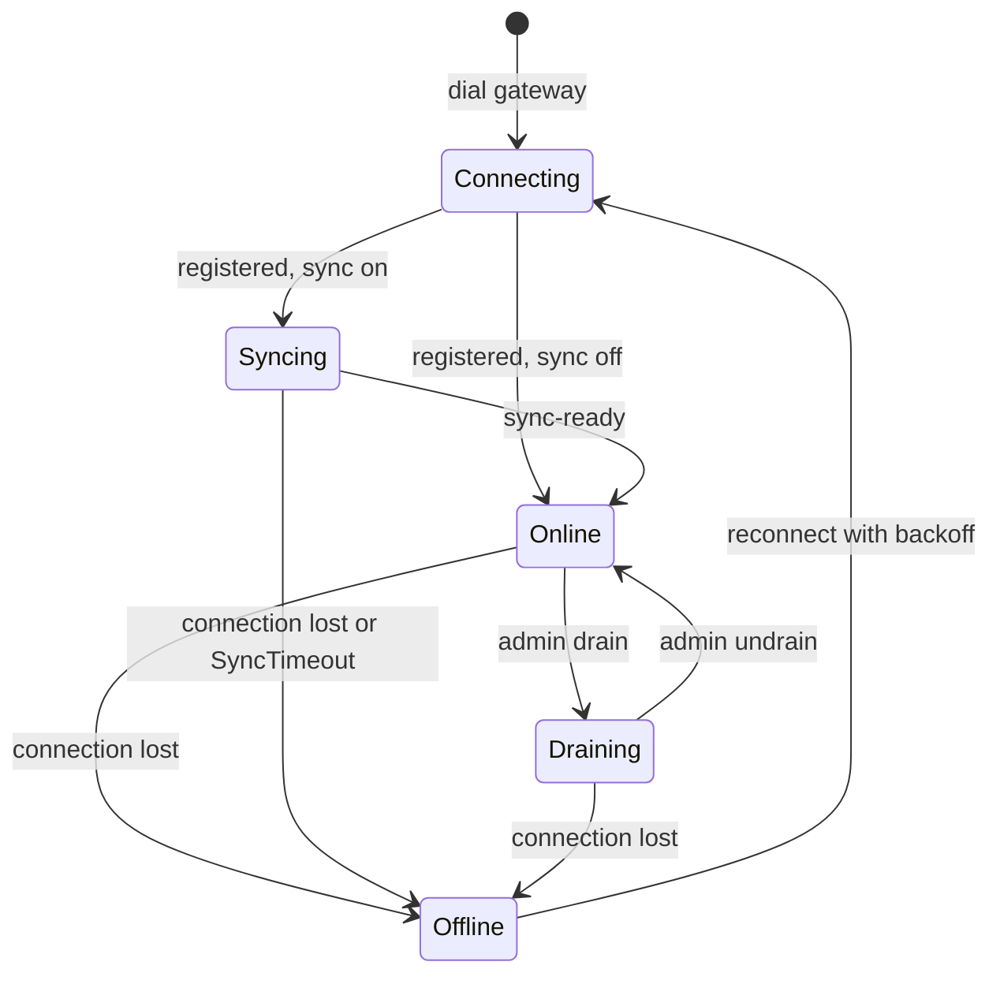

# LLD 12: Workspace synchronization (gateway and owning node)

Status: implemented on the `distributed-execution` branch, behind `--workspace-sync` (off by default). The engine, the file watcher and the conversation are in `src/wsync`; the tunnel channel, the `SYNCING` state, the gateway fallback, guest expiry and copy on placement are in `tunnel`, `gateway` and `server`. Implements [hld/workspace-sync.md](../hld/workspace-sync.md) on top of [LLD 11](11-distributed-execution.md).

Scope today: `src/server/{identity,handlers,gateway,worker}.go`, `src/gateway/{router,remote,workers}.go`, `src/tunnel/{server,client,protocol}.go`, `src/filebrowser/filebrowser.go`, `src/backend/localcommand/local_command.go`, `src/utils/{utils,jobscheduler}.go`, `src/containers/container.go`. New: `src/wsync/`.

## 1. Principles

1. **Off by default.** Without `--workspace-sync` on the gateway nothing in this document runs, and distributed mode behaves as in LLD 11.
2. **The unit is a home**, one directory directly under `utils.HOME_DIR` (`/tmp/home/`). The layout is not changed.
3. **Two copies per home:** the gateway's, and the owning node's. Not every worker.
4. **Every decision compares against a saved base record.** Echoes and deletes never depend on timing. Only the case where both sides changed the same file uses modification times, corrected for the measured clock offset.
5. **Never follow a symbolic link, never leave the home.**
6. **A destructive action needs proof.** A delete is applied only when the base record shows the path existed at the last agreement.

## 2. What exists today and what it means for sync

| Code | Today | Consequence |
|---|---|---|
| `filebrowser.New` | Each terminal and each file request creates its own `fsnotify` watcher on one home, to notify that browser | Sync needs its own single long-lived watcher per node. The per-connection watchers stay; they will see remotely applied changes and refresh the browser's tree, which is wanted. |
| Guest expiry: `handleIndex`, `handleFileBrowser`, `trustedIdentity`, `localcommand.New` and its close path each call `GottyJobs.ResetJob(REMOVE_JOB_KEY+dir, 60 min, RemoveDir)` | Every node runs its own idle timer, reset only by requests it handles itself | With sync, the gateway's timer for a guest who is busy on a worker would fire and the delete would replicate. Expiry must have one authority (section 9). |
| `utils.GottyJobs.LoadJobsFromFile(file, nil)` in `gotty/main.go` | Jobs reloaded after a restart are given no function, so they delete nothing | Guest homes that outlive a restart are never removed today. The new expiry (section 9) does not depend on it. |
| `containers.InitContainers` / `DeleteContainers` | Create and remove `/tmp/home/<command>` at start and stop | These are not homes. Sync works per home, so they are never touched. |
| `tunnel.Client.session` | Rejects every channel type except `openrepl-http` | Add a second type (section 6). |
| `tunnel.Server.ServeConn` | Rejects every channel a worker opens | Sync channels are opened by the gateway, so this stays. |
| `gateway.Router.execute` | A session whose backend is offline gets 503 | File routes fall back to the gateway's copy (section 8). |
| `Router.place` | A signed-in user with a pin is refused when the pinned worker is away | Relaxed once copy-on-placement exists (section 10). |
| Homes on a worker | `trusted.HomeDir`: `guest-<guest id>` or the user's home id | The gateway uses the same function to find its copy. |

## 3. Package `src/wsync`

| File in `src/wsync/` | Purpose | State |
|---|---|---|
| `doc.go` | Package comment | Done |
| `entry.go` | `Entry`, `FileType`, equality, reserved names, errors | Done |
| `record.go` | Base record, digest, atomic save and load | Done |
| `safe.go` | Path validation | Done |
| `home_linux.go` | `Home`: every file operation, walked from a directory descriptor with `O_NOFOLLOW`; atomic file write, directory, symlink, remove, rename, chmod | Done |
| `home_other.go` | The same names for other systems; they report `ErrUnsupported` | Done |
| `scan.go` | Walk a home without following links, with hash reuse | Done |
| `diff.go` | Three-way comparison, ordering, rename pairing | Done |
| `watch.go` | `fsnotify` watcher over every attached home | Done |
| `proto.go` | Messages and framing | Done |
| `link.go` | One sync conversation over a stream: reconcile, incremental changes, applying the peer's changes | Done |
| `manager.go` | Per-node coordinator: one watcher, one conversation per peer, ownership check, drop orders, stale-home listing | Done |

The file operations are Linux-only: they use `openat`, `mkdirat`, `renameat` and the like through `golang.org/x/sys/unix`. A path is walked one component at a time with `O_NOFOLLOW` from the home's own descriptor, so even a program that swaps a directory for a link during a sync cannot lead a read or write out of the home. The package still builds on other systems; `OpenHome` reports `ErrUnsupported` there.

### 3.1 Entry and base record

```go
type FileType uint8 // File, Dir, Symlink

type Entry struct {
    Path    string      // relative to the home, slash-separated, cleaned
    Type    FileType
    Size    int64
    ModTime int64       // unix nanoseconds
    Mode    uint32      // permission bits only
    Hash    string      // sha256 of the content, files only; filled when needed
    Link    string      // target, symlinks only
}

// Record is the state both sides last agreed on, for one home and one peer.
type Record struct {
    Home    string
    Peer    string           // node id of the other side
    Partial bool             // the first reconcile with the peer is not complete yet
    Entries map[string]Entry
}
```

- Stored at `<state dir>/<peer>/<home>.json`, written to a temporary file and renamed. The state dir is `utils.GOTTY_PATH + "/wsync"` (`/opt/gotty/wsync`), outside `/tmp/home` so it is never synchronized or shown to users.
- The gateway keeps one record per home for its current owner. A worker keeps one per home for the gateway.
- A record is updated only after the peer acknowledges the change, so after a crash the record is never ahead of what both sides have.
- A record is written a moment after each change, so one exists before the first reconcile with a peer is complete. `Partial` says so: it is set when a home meets a peer it has no record for and cleared when a round completes. While it is set the copy on this side may be only part of the peer's, and it does not count as a copy that can stand in for the peer's (section 10). A record written before the field existed counts as complete.
- **The two sides' records must agree.** `Record.Digest()` is a hash over every entry, in path order. At `attach` both sides send their digest. If the digests differ (one side lost its record, or a crash left them apart) both fall back to an empty record for that reconcile, which makes it a union that deletes nothing. Without this check the sides could disagree about what was deleted: one would ask to delete a file while the other sent it back.
- Two entries are equal when type, mode and (size and hash, or link target) are equal. `ModTime` is carried so that received files get the sender's time (`os.Chtimes`), which makes later scans cheap; it is not used to decide equality, only to pick a winner when both sides changed a file.
- **Modes.** Only the permission bits (0777) are kept; set-user-id, set-group-id and the sticky bit are never synchronized, on reading or writing. A directory always keeps owner read, write and execute (`mode | 0700`), because without them its contents could not be written on the other side. Ownership is not synchronized.

### 3.2 Scan

`Scan(root, home)` walks with `filepath.Walk` (which uses `Lstat` and does not follow links) and returns the current entries. For a file whose size and mtime equal the base record's, the hash is taken from the record instead of being recomputed. Sockets, FIFOs and devices are skipped. Files larger than `filebrowser.MAXDISKUSAGE_MB` are skipped and logged.

### 3.3 Three-way comparison

For each path, with `B` the base record, `L` the local state and `R` the remote state (absent is a valid state):

| Case | Action |
|---|---|
| `L == R` | Nothing to transfer; set `B = L` |
| `L == B`, `R != B` | Take remote: fetch, or delete locally if `R` is absent |
| `R == B`, `L != B` | Give local: send, or ask the peer to delete if `L` is absent |
| `L != B`, `R != B`, `L != R`, both present | Both changed: latest modification wins (below) |
| One side absent, the other changed since `B` | Keep the changed file; send it to the side that deleted it |
| No `B` at all (first contact for this home) | Union of both sides. Nothing is deleted. Same path with different content: latest modification wins |

**Exception: a directory is never replaced by a non-directory.** If one side has a directory and the other a file or link at the same path, the directory wins whatever the times, because replacing it would delete what is inside. In every other case the rule below applies.

**Both sides changed: latest modification wins.** The entry with the later `ModTime` replaces the other, on both sides. `ModTime` is epoch time in nanoseconds, so it names the same instant on every machine. A worker's times are first corrected by its clock offset (section 6): `corrected = ModTime - offset`. On equal times the gateway's version wins. The losing version is overwritten and not kept. The rule is deterministic, so both sides compute the same result without a round trip.

**Renames.** After the comparison, a delete and a create going the same way with the same size, hash and mode, and a match that is unique, are paired into one `RenameLocal` or `RenameRemote`. Only regular files are paired; a renamed directory is a delete plus a create, and its files are paired one by one. A pair that involves a conflict is never combined. This is an optimisation only: when no pair is found, delete plus create is still correct.

### 3.4 Safe paths (`safe.go`, `home_linux.go`)

Every path that arrives from a peer is checked twice.

1. **By its text (`ValidRel`).** It must be relative, equal to `path.Clean` of itself, made of ordinary names (none empty, `.` or `..`, none longer than 255 bytes, no NUL), and contain no name that starts with the reserved prefix `.wsync-`. A home name (`ValidHomeName`) must be a single element.
2. **By walking it.** Every operation starts from the home's own directory descriptor and opens each component with `O_NOFOLLOW|O_DIRECTORY`. A link, or a file where a directory should be, stops the walk with `ErrUnsafePath`. Final components are handled with the `*at` calls (`fstatat` with `AT_SYMLINK_NOFOLLOW`, `unlinkat`, `renameat`, `symlinkat`, `readlinkat`, `utimensat`), and files are opened with `O_NOFOLLOW` and `O_NONBLOCK` then checked with `fstat`, so a FIFO swapped in for a file cannot block the sync. A permission change goes through an opened descriptor (`fchmod`), never through a path that could be a link.
3. **A home that is itself a link** is refused by `OpenHome`.

The text check cannot see a link in the middle of a path; the walk does, and it does not depend on the state of the directory at an earlier moment, so there is no gap for a program to exploit. A symbolic link entry is created with its target as plain text and is never resolved. Absolute targets such as `/etc/passwd` are stored as they are and are harmless, because nothing ever follows them.

### 3.5 Applying a change (`home_linux.go`)

- **File (`WriteFile`):** parents are created; an empty directory in the way is replaced and one with content is refused (`ErrIsDirectory`). The content goes to `.wsync-<random>` in the same directory, read only up to the declared size, hashed while it is written, and compared with the declared size and hash. Then `fchmod` (permission bits only), the sender's modification time, `fsync`, and `renameat` over the target. On any failure the temporary file is removed and the existing file is untouched. A file over `MaxFileSize` is refused before anything is written.
- **Directory (`PutDir`):** created with the sender's permissions (plus owner access); an existing directory gets its permissions updated; a file or link in the way is replaced.
- **Symbolic link (`PutSymlink`):** created under a temporary name and renamed over the target, so a link is replaced atomically.
- **Delete (`Remove`):** a file or link is unlinked, an empty directory is removed, a directory with content is refused (`ErrNotEmpty`), and a path that is already gone is not an error. The caller removes contents first, which the order of the actions from `Compare` guarantees.
- **Rename (`Rename`):** `renameat`; missing parents of the new path are created.
- **`Chmod`, `SetTime`:** for a mode-only change and to give a renamed file the sender's time.
- **Leftovers:** a scan removes a temporary file older than 10 minutes; a younger one may still be in progress and is ignored.

### 3.6 Watcher (`watch.go`)

One `Watcher` per node, created once, not per request. `AddHome(name)` opens the home and watches every directory in it; `RemoveHome` stops. It only says that a path changed, as `notify(home, rel)`; the decision whether that is a real change, an echo of one just applied from the peer, or nothing, is made later by comparing the path with the record.

- A home is watched from the moment its conversation starts, before its first scan (`Config.OnAttach`), so a change made between the scan and the first event cannot be missed. What the watcher reports while the first reconcile runs only marks paths to look at afterwards; a path that matches the agreed state sends nothing.
- A watch is added for every directory (`fsnotify` on Linux is not recursive). Directories are found by walking from the home's descriptor, so no link is followed and nothing outside the home is watched.
- When a directory is created it is watched at once and every path already inside it is reported, because files can be written there before the watch exists (unpacking an archive does exactly that).
- Names that start with `.wsync-` (files being received by the sync itself) are ignored, as are events outside the watched homes.
- `fsnotify.ErrEventOverflow` or any watcher error calls `notify("", "")`, which the caller turns into `Link.NotifyAll()`: events may be missing, so every home is reconciled in full.
- The watcher does no hashing and no sending. Its goroutine only calls `notify`, which takes a small lock of its own and never waits for a transfer.

Coalescing happens in the link (section 5): a home is processed when it has been quiet for 300 ms, or after 2 s at the latest, so a burst of writes to one file becomes one transfer.

## 4. Homes and ownership

| Question | Answer |
|---|---|
| Which directory is a session's home? | The name `trusted.HomeDir` gives: `guest-<guest id>` for a guest, the user's home id for a signed-in user. The gateway computes it for every session (`Config.HomeOf`) and stores it in the execution context, so it can tell which worker owns which home. |
| Who owns it? | The backend in the session's execution context (`Router.OwnerOf(home)`). |
| What home does a session the gateway runs itself use? | The same name, in the gateway's own `/tmp/home`. The router marks such a request (`withOwnWorkspace`, read with `gateway.OwnWorkspace`) and `requestIdentity` then uses `gateway.WorkspaceOf(r)` instead of the cookie's home. This is what lets a session placed on the gateway after its worker was lost find the files the gateway already holds. A request that names a `jid` or `homedir` itself (a fork link or a shared session) keeps that name. |
| When does a worker start synchronizing a home? | The first request for it. `Server.waitWorkspace` calls `Manager.EnsureHome`, which attaches the home and waits until it is reconciled, before the request runs. A request that cannot wait that long gets 503 "workspace is synchronizing". |
| Who may change a home on the gateway? | Only its owner. `Manager.accept` checks the owner on every `attach`: a known owner must be the connecting worker. An unknown owner (the gateway has just restarted) is accepted only from a worker that has synchronized the home before, which the gateway's own records show. Anything else is refused and nothing is created. A refusal lasts only as long as its reason: the refused side forgets the home, so the next request for it asks again (section 5.5). |
| Shared sandbox directories | `/tmp/home/<command>` is not a home (it has no session) and is never attached. |

## 5. Sync conversation (`link.go`, `proto.go`)

A `Link` is one conversation with one peer over any `io.ReadWriteCloser` (in the tunnel, an SSH channel). It carries every home attached to that peer. `Run(ctx)` runs it; `Attach(home)`, `Notify(home, rel)`, `NotifyAll()`, `WaitSynced`, `Synced`, `Drop` and `Stats` are the calls the manager makes.

### 5.1 Messages

A frame is a 4-byte length, a JSON header, and, for file data, exactly the number of raw bytes the header declares in `body`. A file is streamed from disk into the frame and from the frame into the temporary file; it is never held whole in memory. If a file shrinks while it is being sent, the frame is padded with zeros so the framing stays intact, and the receiver's hash check rejects it.

| Message | Direction | Purpose |
|---|---|---|
| `hello {node, v, now}` | both | Open the conversation. An unsupported version ends it |
| `ping {t0}` / `pong {t0, now}` | gateway to worker, back | Three round trips to measure the clock offset; the one with the shortest delay is kept |
| `offset {offset}` | gateway to worker | The measured offset (worker clock minus gateway clock), so both sides use the same number. An offset over 2 s is logged |
| `attach {home, digest, entries}` | both | Start or repeat a reconcile of a home. It carries this side's manifest and the digest of its record |
| `put {seq, home, entry}` + body | both | A file, directory or symbolic link |
| `delete {seq, home, path}` | both | Remove a path |
| `rename {seq, home, from, entry}` | both | Move a file; `entry` is the file at its new path |
| `ack {seq, status, reason}` | both | `ok`, `skipped` (not applied and nothing is wrong) or `error` |
| `synced {home}` | both | This side has sent everything the reconcile needs |
| `drop {home}` | gateway to worker | The home expired or moved away. Reported to `OnDrop`; the manager deletes it |
| `refuse {home, reason}` | either | The home cannot be synchronized with this peer now (for example the gateway's ownership check failed). The receiver forgets the home and reports it to `OnRefused`; attaching it again asks again |
| `fatal {reason}` | either | The conversation ends |

There is no `want` message: both sides run the same comparison on the same three inputs and reach mirror-image results, so each already knows what it has to send.

### 5.2 Reconcile (a round)

```mermaid
sequenceDiagram
    participant W as Worker
    participant G as Gateway
    Note over W,G: hello, then the gateway measures the clock offset
    W->>W: scan the home, freeze the record
    G->>G: scan the home, freeze the record
    W->>G: attach {digest, manifest}
    G->>W: attach {digest, manifest}
    W->>W: digests equal? compare with the frozen record, else with none
    G->>G: the same comparison, mirror result
    par each side sends what the other must take
        W->>G: put / delete / rename
        G-->>W: ack
    and
        G->>W: put / delete / rename
        W-->>G: ack
    end
    W->>G: synced
    G->>W: synced
    Note over W,G: a side is synced when the peer's synced has arrived and all its own changes are acknowledged; the record is then saved
```

- **Frozen inputs.** The scan, the copy of the record and its digest are taken together under the home's lock. The peer decides what to send from exactly these, so this side must decide from the same ones even if changes from the peer are applied to the live record before it gets to compare. (Comparing against the live record made a worker delete a file the gateway had just sent it; a test caught this.)
- **Digests.** If the two digests differ, both sides compare against an empty record: a union that deletes nothing. Only entries that still equal the frozen record are forgotten; what was agreed since stays.
- **Order.** Each side sends in the order `Compare` returns: creations, shortest path first, then deletions, longest path first. One writer goroutine and one ordered stream keep it.
- **Another round** is started by sending `attach` again, from either side (a full reconcile requested by an overflow, a rename that did not fit, or the periodic safety net).

### 5.3 Incremental changes

After a home is synced, a change on disk marks its path dirty. When the home has been quiet for 300 ms (2 s at most) the link takes the dirty paths and scans only them, plus anything recorded under them. It then runs the same `Compare`, with the record, counting changes already sent, as both the agreed state and the peer's state. Nothing the peer changed can appear, so the result is only the local creates, edits, deletes and renames. This reuses every rule of the reconcile, including rename pairing, instead of a second set.

- **Echoes.** A change just applied from the peer is already in the record, so the file matches it and nothing is sent. There is no suppression timer. A test checks that no message is sent after the peer's changes have settled.
- **In flight.** A change that was sent and is not yet acknowledged is kept in a `pending` overlay and counts as agreed, so the next pass does not send it again.
- **Acknowledgements.** The sender updates its record only on `ok`. On `error` the path is marked dirty again and retried after 5 s. On `skipped` nothing changes, except that a rename the receiver could not apply asks for a full reconcile.
- **Window.** At most `Window` (default 8) changes wait for an acknowledgement; the sender blocks when it is full.

### 5.4 Applying a change from the peer

The receiver applies a change only if it has no newer change of its own to the same path, using the same `decide` rule as the reconcile on the current disk, the record and the clock offset:

| Receiver's state of the path | Result |
|---|---|
| Same as the incoming one | Record updated, `ok` |
| Unchanged since the record | Applied, `ok` |
| Changed here, the incoming change is later | Applied, `ok` |
| Changed here, the local change is later | Not applied, `skipped`. This side's own change is sent through the normal path and wins on the peer for the same reason |
| Delete, and the file was changed here | Not applied, `skipped` |
| Delete of a directory with content | Not applied, `skipped` |
| A rename whose old path is no longer as recorded | `skipped` with a request for a full reconcile |

A path, a home name or a manifest entry that fails validation is refused. The checks in `home_linux.go` apply again below this level, so a bug here still cannot leave the home.

### 5.5 Concurrency

- One reader goroutine applies the peer's changes and processes acknowledgements. One writer goroutine owns the stream and takes frames from an unbounded queue, so the reader can always answer with an acknowledgement and never waits on the writer. This is what lets both sides send large files at the same time over an unbuffered stream without deadlock (a test does exactly that).
- One goroutine per home sends that home's changes and runs its rounds, so the order is kept.
- **A change from the peer waits for the receiver's base.** When the two records differ, a round drops the paths they disagree on from the live record and reconciles those as new. A peer's change for such a path can reach the reader before the round has done that, and judged against the stale record it would be skipped as "deleted here, unchanged there". So once the peer's manifest has arrived (`homeSync.manifestArrived`) the reader holds every incoming change for that home until the round has settled its base (`waitSettled`, `settleLocked`). Before the manifest arrives nothing is held, because the peer sends a round's changes only after it has our manifest, and ours is sent by the round itself; waiting for a message queued behind the change would be a deadlock. A round that ends early still releases the reader.
- **A dropped home is never written back.** `Detach` sets `detached`, and `saveLocked` ignores a detached home, so a round that was already running cannot recreate the record that the drop removed.
- **A refused home is forgotten, not kept as failed.** On `refuse` the receiver takes the home out of the conversation the same way (`Link.forget`): its round ends, whoever waits for it gets a `RefusedError`, and neither its files nor its record on disk are touched. The next `Attach`, from either side, starts from nothing and sends a manifest again. The reason is that a refusal can stop being true while the connection lasts. A gateway that has just started on an empty disk refuses the homes a worker offers when it connects, because it has neither a session nor a record for them, and it has a session a moment later, when the user arrives. If the worker kept the refused state, every request for that home would fail until the worker reconnected, and a home the gateway then tried to send would never be answered, since the worker's round would be waiting for a manifest the gateway had already declined to send. The manager stops watching a refused home (`Manager.homeRefused`), unless a request has attached it again meanwhile.
- A per-home lock protects the record and the pending overlay while changes are applied or planned. The set of changed paths has its own lock, so the watcher is never held up by a transfer.
- A file handle is held open from just before its frame is queued until it has been written; a failed read or write closes it.

### 5.6 Safety nets

- **Periodic reconcile**, every 10 minutes by default (`ReconcileEvery`), for a change that was never reported or a disagreement that built up.
- **Interrupted transfer.** A partly received file is removed and nothing is renamed into place. Neither side marked it agreed, so the next reconcile sends it again.
- **A file changing while it is sent** gets a hash mismatch at the receiver, an `error` acknowledgement, and is sent again once it settles.

## 6. Tunnel changes (`src/tunnel`)

- New channel type `openrepl-sync` (`tunnel.ChannelSync`). The gateway opens it with `Worker.DialSync` right after a worker registers; the worker's `ClientConfig.OnSyncStream` receives it. One channel per worker connection carries every home. A worker that has no handler refuses the channel.
- `ServerConfig.WorkspaceSync` and `RegisterReply.WorkspaceSync`: the gateway tells each worker at registration whether sync is on, so a worker follows the gateway's setting and needs no flag.
- A new global request `sync-ready@openrepl`, sent by the worker when its homes are reconciled (`Client.SyncReady`). `Worker.Syncing()` is true from registration until it arrives.
- `ServerConfig.SyncTimeout` (5 minutes): a worker still `SYNCING` after that is disconnected, so that it reconnects and tries again.
- When the sync conversation with a worker ends while the worker is still connected, `Server.syncWithWorker` calls `tunnel.Worker.Disconnect`, so the worker reconnects at once and a new conversation starts. Without this a worker whose conversation failed would stay out of rotation until `SyncTimeout`, or, if it was already ready, run without its files being copied.
- `gateway.Syncing` is a new backend state (`SYNCING`). The pool takes only `ONLINE` backends, so a syncing worker receives no new session. A request for a session the worker already has is still forwarded, and the worker itself waits for that session's home to be in step.
- The clock offset is measured inside the conversation (section 5.1), not at registration.

## 7. Worker lifecycle



On each registration:

1. The gateway marks the worker `SYNCING` and opens the sync channel (`syncWithWorker` in `server/gateway.go`).
2. The worker's handler runs `Manager.Serve`. `reconcileOwned` attaches every home the worker has a record for and waits for all of them. A new worker has none and is ready at once.
3. A home the gateway refuses (it was dropped while the worker was away, or the gateway started on an empty disk and has no session for it yet) or drops during the reconcile is skipped, not treated as a failure. A refused home keeps its files and its record on the worker and is asked for again by the first request that needs it. The gateway sends its pending drop orders as soon as a worker connects, so the drop can arrive while the worker waits for that very home; `WaitSynced` then reports `errNotAttached` (or `errDetached`), and `droppedMeanwhile` classifies both as a skip. Any other failure, or taking longer than `ReadyTimeout` (5 minutes), closes the conversation, so the worker reconnects and tries again with the existing backoff. It is never `ONLINE` with a home it could not reconcile.
4. When all homes are in step the worker sends `sync-ready`, the gateway clears `SYNCING`, and the worker is `ONLINE`.

Records are written a moment after the last change and when the conversation ends, and a new conversation with a peer waits for the previous one to finish writing them. A record that is only slightly behind (a change was in flight when a connection dropped) costs nothing worse than treating those paths as a union; see section 5.2.

## 8. Gateway fallback for file requests

In `Router.execute`, when the session's backend is not connected (or is `OFFLINE`), `HomeOf` is set, and the path is `ws_filebrowser` or `upload_file`, the router serves the request with the local backend and puts the session's home name in the request context (`gateway.WorkspaceOf`). Terminals (`ws`, `ws_<command>`) still get 503 "execution node unavailable": the programs went with the worker.

While the session waits for `RelocateAfter`, the 503 says when to try again (`gateway/notice.go`). Every such answer carries `Retry-After`. For a terminal's WebSocket the router calls `Config.TerminalNotice(w, r, retryIn)` (`Server.terminalNotice`), which upgrades the connection with the server's own upgrader, so the origin rules are the usual ones, and closes it normally with the reason `execution node is away: retry in 80s` (`awayReason`; whole seconds, rounded up, never 0). That string is a contract with the page. The same reason is given at the moment a worker drops under a terminal that is already open. The browser's WebSocket is bridged to the worker through a reverse proxy, and the worker's end of that bridge is a `closeGuard` (`gateway/closeguard.go`): it follows the WebSocket frames the worker sends, just far enough to know whether a close frame has gone by and whether the stream is at a frame boundary, and when the stream ends without a close frame, at a boundary, and the worker turns out to be away (it waits up to 2 seconds for the gateway to notice, since the stream ends a moment before the worker is marked away), it adds a close frame with `AwayReason`. A worker that closes properly keeps its own reason, a stream cut in the middle of a frame or a drop that nothing will follow up is left as it was, and only WebSocket upgrades get a guard, each on a transport of its own with no connection reuse. `webtty.ts` parses the reason into a close of kind `away` with `retryIn`, and `11-terminal-state.js` turns it into a countdown: the banner reads "Your execution node is away. Your files are safe. Reconnect in 1:20.", the footer reads "Node away · reconnect in 1:20", and the controls that would start a terminal (`#play-button`, `#debug-play-button`, `#redo-button`, `#tabrefresh`, the run menu items and the banner's button) are disabled until it reaches zero, when the banner says "You can reconnect now." The functions behind them (`ToggleReconnect`, `CompileandRun`, `RunandDebug`) also return at once while `awayWaitMs()` is above zero, so the keyboard shortcut and the command palette are held back too. Only controls the countdown disabled are enabled again. A page without the banner prints one line in the terminal instead. The time is what is left of `RelocateAfter` for that worker. It is given only when a placement is going to happen, that is with `HomeOf` set, for a worker that is away and not the gateway itself, and not once the period is over. A signed-in user whose gateway restarted and who has only the pin to the worker gets the same answer, through the placement error. If the countdown ends a moment before the gateway agrees, the next attempt is told a new, short wait and the countdown starts again.

`Server.requestIdentity` returns `utils.HOME_DIR + home` when `WorkspaceOf` is set, instead of the home the cookie names, and creates the directory if needed. The browser's file tree uses absolute paths under `/tmp/home/<home>`, which are the same on both nodes, so the tree stays valid. Saves, uploads and deletes made this way change the gateway's copy and reach the worker at its next reconcile.

The fallback applies only to a session's own home. A request that names another session's home or process (`homedir=` or `jid=`) and is routed to a worker that is away gets 503.

## 9. Guest expiry with one authority

- **Nodes never delete synchronized homes on their own idle timers.** `utils.RemoveDir` asks `utils.RemoveDirGuard` first. On a worker with sync on the guard keeps every home that has a record (`Manager.HasRecord`); a home without one, such as one made for a visitor of the worker's own port, is not synchronized and expires on the worker's own timer. On the gateway it keeps homes owned by a worker, and homes any worker has synchronized (a gateway that has just restarted does not know the owners). `utils.RemoveDirNow` bypasses it. A session the gateway runs itself has no replica to guard; its home expires through the sweep below, like any other (section 4).
- **The router tracks activity** per home: the time of the last request and the number of open terminals (`gateway/activity.go`). Every execution-bound request and every entry page touches it; a terminal's WebSocket holds it open for as long as it lasts, because the router brackets the whole request.
- **`Router.ExpireGuests(now, ttl)`** ends a guest session whose home has had no request and no open terminal for `utils.DEADLINE_MINUTES` (60). It releases the execution context and returns the home and its backend. Signed-in users never expire. With sync on the registry does not expire guest contexts by itself (their TTL is off), so a context never disappears while its files still exist.
- **A sweep runs once a minute** (`Server.expireGuests`). For a guest on a worker it calls `Manager.Drop(worker, home)`, which sends `drop` (or, if the worker is away, writes an order that is delivered when it reconnects, before its reconcile), forgets the record, and detaches the home; the gateway then removes its own copy with `RemoveDirNow`. The worker's handler removes the home and its record.
- **Guest homes the gateway forgot** (it restarted) are found by `Manager.StaleHomes`: a record that has not changed for the guest lifetime means the home has been idle that long. Only `guest-` homes are expired this way.

## 10. Copy on placement and moving a user

- **Placement.** When the pool places a session on a worker, the first execution-bound request calls `Config.PrepareHome` (`Manager.EnsureHome(worker, home)`) before it is forwarded. The gateway attaches the home to the worker and waits until it is in step, so a user placed on a worker that has never seen their files finds them. A home the gateway has no files for is skipped (the worker creates it). If preparation fails the request gets 503 and is tried again next time; nothing is forwarded to a worker whose home is not ready. It runs once per session (`ExecutionContext.Prepared`) and never for a session on the gateway itself.
- **A session whose worker never returns.** If a session's worker has been gone for `RelocateAfter` (2 minutes; after a gateway restart every worker gets the whole period to reconnect), the next request releases the session and places it again. This applies to guests and signed-in users alike, and only with sync on. A session on a `DRAINING` worker is not moved: draining means existing sessions carry on.
- **The pin.** Without sync, a signed-in user whose pinned worker is away gets 503 and is never placed elsewhere. With sync, a user with no live session is placed on a new worker, and the pin is rewritten, when the pinned worker is `DRAINING` (at once) or has been gone for `RelocateAfter`, and the gateway's copy of the home can stand in for that worker's (next point). A worker that is only `SYNCING` keeps its users waiting. Existing files on the gateway no longer force a user onto the gateway.
- **The gateway's copy must be able to stand in.** Everything that takes a home away from a worker rests on the gateway holding the files. That is not a given: a gateway on a host that keeps no files between deploys starts with an empty `/tmp/home` and no records, while the pins, which are in the user database, still name the workers. So before a home leaves a worker the router asks `Config.SecureHome(home, worker)`, which is `Manager.SecureCopy`. With the worker connected it brings the two copies in step now (`EnsureHome` from the gateway's side, at most 30 seconds). With the worker away it needs a record of that worker for the home that is not `Partial`, and the home's directory on the gateway; what the worker changed after it was last seen is not in that copy. If the answer is no, a pinned user is not placed elsewhere and gets "workspace node unavailable" until the worker is back, because another node would show an empty workspace and the files would be left behind. The gateway's own backend is never asked: a session there works in the gateway's copy.
- **The old copy.** When a session moves, `Config.OnMoved` calls `Manager.DropMoved(old worker, home)`: `SecureCopy` once more, then `Drop`. The gateway's copy stays, and is what the new node receives. If the old worker comes back it is told to remove the home. Without a copy that can stand in, nothing is dropped and the log says that the worker's copy is kept; this is the case for a guest whose worker never returns to a gateway that has no record of the home. Nothing is dropped either when the old node is the gateway itself. **Changes the old worker had made but not yet sent are lost this way**; the gateway's copy is authoritative once a session has moved. `Drop` itself does not check for another copy: it is for a home that is to be deleted everywhere (guest expiry, section 9).
- **A move by an admin** (`Router.MoveSession`) asks `SecureHome` for the node the session leaves before anything else. If the gateway's copy cannot be brought in step with that node, the move is refused with 409, the terminals stay open, and the session stays where it is.

## 11. Configuration

| Flag / HCL key | Default | Where | Meaning |
|---|---|---|---|
| `--workspace-sync` / `workspace_sync` | `false` | gateway | Turns on everything in this document. Workers follow the gateway's setting; the option is an error in other modes. |
| `--relocate-after` / `relocate_after` | `2m` | gateway | How long a worker may be away before its sessions are placed elsewhere (`Config.RelocateAfter`). A Go duration of at least one second, checked at start-up (`Options.RelocateAfterDuration`); it only matters with `--workspace-sync`. |
| `--sync-state-dir` / `sync_state_dir` | `/opt/gotty/wsync` | gateway, worker | Where records and pending drop orders are kept: `<dir>/<peer>/<home>.json` and `.drop`. Keep it on durable storage and outside `/tmp/home`. |

Losing the state directory is safe: with no records a reconcile is a union and deletes nothing. The cost is that files deleted while the two sides were apart come back.

Tunables that are not flags (`Config` in `wsync`): debounce 300 ms, longest delay 2 s, window 8, periodic reconcile 10 minutes, ready timeout 5 minutes, `SyncTimeout` 5 minutes.

## 12. Failure handling

| Event | Behaviour |
|---|---|
| Connection drops during a transfer | The temporary file is discarded. No `ack`, so the base record is unchanged and the next reconcile transfers it again. |
| Worker crashes during reconcile | Same. It reconciles again after it restarts. |
| Gateway crashes | Workers reconnect and reconcile. Records are consistent because they are written only after `ack`. |
| Gateway starts on an empty disk (no homes, no records) | Workers reconnect and the homes they offer are refused, since no session uses them yet; the workers keep them. A user's first request reaches their worker through the pin, the worker asks for the home again, the gateway now knows the owner, and the reconcile is a union: the worker's files are copied to the gateway and nothing is deleted. Until then the gateway's copy does not count for moving the user (section 10). |
| File deleted while it is being sent | The sender reports `error`; the delete arrives as its own change. |
| File changes while it is being sent | Size or time differs after the copy: the sender discards the transfer and queues the path again. |
| Permission error or disk full on the receiver | `error {reason}`; the home is marked failed and reconciled again with backoff; logged once per home, not per file. |
| Watcher overflow | The home is reconciled instead of processed event by event. |
| A worker sends a change for a home it does not own | Refused and logged; the connection stays up. |
| A path fails validation | Refused and logged. |

## 13. Security

- All paths pass `Resolve` (section 3.4). Absolute paths, `..`, and paths through a symbolic link are refused.
- Symbolic links are stored as text and recreated, never followed, on reading or on writing.
- The gateway accepts changes for a home only from its owner (section 4).
- The sync channel is inside the authenticated tunnel. No new endpoint is exposed.
- The gateway now holds a copy of every home, as a single server does.

## 14. Tests

Unit, in `wsync`, with two temporary directories and an in-memory pipe:

| Area | Cases |
|---|---|
| Comparison table | Every row of section 3.3, including first contact |
| Deletes | Deleted on one side is deleted on the other; with no base record nothing is deleted; delete versus modify keeps the file |
| Both sides changed | The later modification is on both sides afterwards and the older one is gone; equal times favour the gateway; a worker whose clock is ahead does not win against a later gateway change once its offset is applied |
| Renames | Detected as one rename; undetected case still converges |
| Loop prevention | After a change is applied, the receiver sends nothing back; a counter of sent messages stays at zero while idle |
| Paths | `..`, absolute, through a symlink, symlink pointing outside: refused; symlink copied as a link |
| Large files | 200 MB file transferred with bounded memory; sender modified mid-transfer |
| Crash safety | Kill the stream mid-file: no partial file remains, next reconcile completes |
| Watcher | Nested directory created with files inside is fully picked up; burst of writes becomes one transfer; overflow falls back to reconcile |
| Record | Saved atomically; updated only after `ack` |

Integration, extending `gateway/integration_test.go`:

1. A file created on the worker appears on the gateway, and the reverse.
2. A worker disconnects; both sides change files; it reconnects; it is `SYNCING`, then `ONLINE`; both sides agree.
3. A syncing worker receives no new session.
4. While a worker is offline, `ws_filebrowser` is answered by the gateway from its copy and a terminal gets 503.
5. A guest busy on a worker for longer than the idle limit is not expired; an idle one is, on both sides.
6. A user is moved to a second worker and finds their files there.
7. A worker's change for a home it does not own is refused.

Manual, with a gateway and two worker containers: a real program writing files (`gcc`, redirection, `rm`, `mv`) and the results appearing on the gateway.

All with `go test -race`.

About 230 tests cover the feature (123 in `src/wsync`, 80 in `src/gateway`, 23 in `src/tunnel`), all run with `go test -race`.

**`src/wsync`, the engine:** every row of the comparison table; mirror-image decisions from the two sides; ordering of actions; every escape attempt through `..`, absolute paths and links (and a directory swapped for a link while a path is being walked); atomic writes and their failure cases; a 40 MB file stored and scanned, and a 64 MB file sent between two nodes, with bounded memory; 150 random histories that must converge, lose no change and then find nothing more to do.

**`src/wsync`, the conversation and manager:** first contact; offline changes on both sides reconciled; latest modification wins, with a clock offset; applied changes are never echoed; a rename moves no content; a burst of writes is sent as one transfer; both sides sending large files at once over an unbuffered stream; a file changing while it is sent; an interrupted transfer leaves no partial file; records that disagree, entirely or in one path, including a peer's change that reaches a slow receiver before its base is settled; a change noticed during the first reconcile; a hostile peer that sends `..`, absolute paths, links and privilege bits; a home the peer does not own; a missed event recovered by a full reconcile and by the periodic one; random edits on both sides at once; the watcher, including trees created at once and links; drop orders, including one that waits for a worker that is away; stale homes; a worker that meets a gateway with an empty disk (`emptygateway_test.go`): a home refused at reconnect is taken once its session exists and refused again while it does not, the gateway can send a home it refused before, `SecureCopy` with the peer connected and away (a complete record, a partial one, none, files gone), `DropMoved` never orders the only copy away, and a record is partial until the first reconcile is complete.

**`src/tunnel`:** the sync channel, `SYNCING` from registration to `sync-ready`, no `SYNCING` when sync is off, a worker that never finishes is dropped and tries again.

**`src/gateway`:** the page is told how long to wait while a session's worker is away (only with sync, only for a terminal's WebSocket, never for the gateway's own backend or after the period, with `Retry-After` on every such 503, and a plain 503 when the notice cannot be shown) and the server closes with the contract reason and refuses another origin (`notice_test.go`), and a worker that drops under an open terminal gives the browser the same close, from the frame-following guard in every way the stream can be cut (`closeguard_test.go`); a session the gateway runs itself works in the synced home, and one placed on the gateway after its worker was lost finds its files and tells the old worker to drop its copy, while a cross-session request keeps the name it asks for and a router without sync leaves the home alone (`ownhome_test.go`); a `SYNCING` worker takes no new session but keeps its own; file routes served from the gateway's copy while the worker is away (guests and signed-in users) and terminals refused; guest expiry with open terminals, requests and signed-in users; a user pinned to a worker that is only briefly away, gone for good, draining or syncing; a session on a worker that never returns placed again; preparation once per session, retried on failure, never for local sessions; a full cluster in one process where a worker's files reach the gateway, are served from there when it is away, are reconciled when it returns, and follow a user to another worker; a user who finds their files on their worker after the gateway lost its disk, and who is not started on another worker while only theirs has the files; a pinned user and a draining worker's user who stay put while the gateway holds no copy, an admin move that is refused for the same reason, and a move off the gateway that needs no check.

**Checked by hand** with a real gateway and workers in containers: a program creating, copying, deleting and renaming files and directories; an upload and a save; the worker stopped (the file browser, a download, a save and an upload still work from the gateway; a terminal gets 503) and restarted with a change of its own; a guest placed again on a second worker after the first stayed away, receiving all files; the old worker told to drop its copy when it returned; standalone mode and a gateway without the flag unchanged.

Nine deliberate bugs in the engine and five in the conversation were introduced one at a time to confirm the tests fail for each; one of the five (removing the path check in the apply step) is not caught on its own because the file operations below it check the same thing again.

## 15. Implementation order

All six steps are done: the engine alone, the conversation and watcher, the tunnel channel and `SYNCING` state, the gateway fallback with single-authority expiry, copy on placement with the relaxed pin, and an end-to-end check with a real gateway and workers in containers.

## 16. Known limits

- Linux only (section 3).
- A file over 50 MB is not synchronized; a socket, FIFO or device is skipped.
- A name that starts with `.wsync-` is reserved.
- Ownership and the set-user-id, set-group-id and sticky bits are not synchronized.
- A renamed directory is a delete plus a create of its contents' paths; its files are paired into renames one by one.
- Changes a worker made while disconnected are lost if its session is moved before it returns (section 10).
- A gateway that keeps neither `/tmp/home` nor the state dir between restarts gets every home back from the workers, one by one, as their users return. Until a home is back, its user can only be served by the worker that has it: if that worker is away they wait for it, however long, and are not placed elsewhere.
- A home that stays on a worker because the gateway had no copy to stand in for it is not removed later by the gateway, which has no record of it.
- A drain set through the admin API is lost when the gateway restarts.
- A program still running when its worker dies is lost; only files are kept.
- Time between a change and its arrival on the other side is the debounce (300 ms) plus transfer; a worker that dies in that window loses it.

## 17. Open items

- An ignore list (for example build outputs or `node_modules`) if write volume proves to be a problem.
- A cap on how long a home stays on a worker that never reconnects to receive `drop`.
- Persisting the drain flag across gateway restarts.
